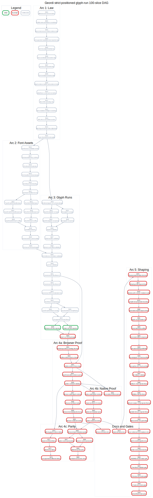

# Geordi Bearing

**Date**: 2026-05-25
**Branch baseline**: <code>main</code> at <code>6773bbc</code>
**Active milestone**: Strict Positioned Glyph-Run Text
**Active profile under design**: <code>geordi-strict-positioned-glyph-run/1</code>
**Active design doc**: [docs/design/2026-05-strict-positioned-glyph-run-plan.md](./docs/design/2026-05-strict-positioned-glyph-run-plan.md)
**Active DAG SVG**: [docs/design/2026-05-strict-positioned-glyph-run-dag.svg](./docs/design/2026-05-strict-positioned-glyph-run-dag.svg)

This file is the short-term operating map. Product laws remain in [docs/V0_DESIGN_LAWS.md](./docs/V0_DESIGN_LAWS.md). The active execution plan is the 100-slice strict positioned glyph-run plan below.

## Current Position

The rectangle render-everywhere proof and Stanford bunny mesh milestone are complete for their stated claim boundaries. The current exact pixel-probe rendering claim remains rectangle-only. The bunny proof establishes shared mesh identity, parser validation, sampled transform metadata, and visible browser/native rotation, not pixel-identical 3D rasterization.

Text remains deferred as a broad feature. The next credibility milestone is not general text support. It is a strict positioned glyph-run proof.

## Milestone Law

Strict Geordi text is not strings. Strict Geordi text is positioned glyph evidence backed by content-addressed font assets.

The first profile name is:

~~~text
geordi-strict-positioned-glyph-run/1
~~~

The first proof must preserve these nonclaims:

- no CSS text;
- no platform-native text as a compliant path;
- no host font fallback;
- no runtime shaping in strict mode;
- no runtime kerning, ligature substitution, glyph substitution, wrapping, or fallback;
- no multiline wrapping;
- no bidi or complex-script support;
- no variable font axes;
- no text editing/caret/selection semantics;
- no README-level broad text claim until all gates pass.

The first proof starts as a separate render-everywhere strict text fixture artifact. It graduates into
`geordi-ir/1` only after the evidence model, validators, browser renderer, native renderer, parity
metadata, and failure fixtures prove the contract.

Initial glyph coordinates use `geordi-fixed-26.6/1`: px units, scale `64`, top-left origin, positive
x rightward, positive y downward, and explicit baselines. Renderers do not infer hidden rounding,
baselines, line boxes, kerning, shaping, or fallback from platform APIs.

## DAG Operating Rule

To choose the next slice:

1. Read the DAG and this checklist.
2. A slice is OPEN when every parent in **Blocked By** is complete.
3. Pick an OPEN node, preferably the lowest-numbered OPEN node unless the user reprioritizes.
4. After completing a slice, mark its checklist item complete, update the DOT node status, regenerate the SVG, and commit both implementation and planning-state updates.
5. Do not mark a slice complete until acceptance criteria, tests, docs, and commit are done.

Regenerate the graph with:

~~~bash
dot -Tsvg docs/design/2026-05-strict-positioned-glyph-run-dag.dot \
  -o docs/design/2026-05-strict-positioned-glyph-run-dag.svg
~~~

Current OPEN node: **S008**.

## Slice Checklist And Dependency Ledger

### S001: Milestone law and nonclaims

- [x] **S001: Milestone law and nonclaims** (COMPLETE)
- **User Stories**: As a renderer implementer, I need unambiguous text laws before code exists so I can reject unsupported typography instead of guessing.
- **Acceptance Criteria**: The slice lands with milestone law and nonclaims documented or implemented, custom failure vocabulary where applicable, and no broadened text-support claim.
- **Requirements**: No implementation surface may be added until the law names the profile, nonclaims, evidence, and failure semantics. Slice-specific requirement: Milestone law and nonclaims.
- **Test Plan**: Goldens: Design excerpts, feature strings, profile names, and nonclaim examples stay stable in docs review. Known Fails: Raw runtime text, host font fallback, CSS line breaking, platform metrics, and broad text-support claims remain rejected. Edges: Ambiguous source strings, empty text evidence, missing profile names, and undocumented nonclaims are called out. Fuzz/Stress: Review generated examples for malformed profile strings, circular dependency claims, and inconsistent terminology.
- **API/CLI/MCP Surface**: API: feature/profile constants only when later implementation slices add them. CLI: none. MCP: agents read BEARING, design doc, DOT, and SVG through filesystem/search tools only.
- **Blocks**: S002
- **Blocked By**: none

### S002: Profile name and feature vocabulary

- [x] **S002: Profile name and feature vocabulary** (COMPLETE)
- **User Stories**: As a renderer implementer, I need unambiguous text laws before code exists so I can reject unsupported typography instead of guessing.
- **Acceptance Criteria**: The slice lands with profile name and feature vocabulary documented or implemented, custom failure vocabulary where applicable, and no broadened text-support claim.
- **Requirements**: No implementation surface may be added until the law names the profile, nonclaims, evidence, and failure semantics. Slice-specific requirement: Profile name and feature vocabulary.
- **Test Plan**: Goldens: Design excerpts, feature strings, profile names, and nonclaim examples stay stable in docs review. Known Fails: Raw runtime text, host font fallback, CSS line breaking, platform metrics, and broad text-support claims remain rejected. Edges: Ambiguous source strings, empty text evidence, missing profile names, and undocumented nonclaims are called out. Fuzz/Stress: Review generated examples for malformed profile strings, circular dependency claims, and inconsistent terminology.
- **API/CLI/MCP Surface**: API: feature/profile constants only when later implementation slices add them. CLI: none. MCP: agents read BEARING, design doc, DOT, and SVG through filesystem/search tools only.
- **Blocks**: S003
- **Blocked By**: S001

### S003: Source text versus render evidence law

- [x] **S003: Source text versus render evidence law** (COMPLETE)
- **User Stories**: As a renderer implementer, I need unambiguous text laws before code exists so I can reject unsupported typography instead of guessing.
- **Acceptance Criteria**: The slice lands with source text versus render evidence law documented or implemented, custom failure vocabulary where applicable, and no broadened text-support claim.
- **Requirements**: No implementation surface may be added until the law names the profile, nonclaims, evidence, and failure semantics. Slice-specific requirement: Source text versus render evidence law.
- **Test Plan**: Goldens: Design excerpts, feature strings, profile names, and nonclaim examples stay stable in docs review. Known Fails: Raw runtime text, host font fallback, CSS line breaking, platform metrics, and broad text-support claims remain rejected. Edges: Ambiguous source strings, empty text evidence, missing profile names, and undocumented nonclaims are called out. Fuzz/Stress: Review generated examples for malformed profile strings, circular dependency claims, and inconsistent terminology.
- **API/CLI/MCP Surface**: API: feature/profile constants only when later implementation slices add them. CLI: none. MCP: agents read BEARING, design doc, DOT, and SVG through filesystem/search tools only.
- **Blocks**: S004
- **Blocked By**: S002

### S004: Unsupported raw/platform text rejection law

- [x] **S004: Unsupported raw/platform text rejection law** (COMPLETE)
- **User Stories**: As a renderer implementer, I need unambiguous text laws before code exists so I can reject unsupported typography instead of guessing.
- **Acceptance Criteria**: The slice lands with unsupported raw/platform text rejection law documented or implemented, custom failure vocabulary where applicable, and no broadened text-support claim.
- **Requirements**: No implementation surface may be added until the law names the profile, nonclaims, evidence, and failure semantics. Slice-specific requirement: Unsupported raw/platform text rejection law.
- **Test Plan**: Goldens: Design excerpts, feature strings, profile names, and nonclaim examples stay stable in docs review. Known Fails: Raw runtime text, host font fallback, CSS line breaking, platform metrics, and broad text-support claims remain rejected. Edges: Ambiguous source strings, empty text evidence, missing profile names, and undocumented nonclaims are called out. Fuzz/Stress: Review generated examples for malformed profile strings, circular dependency claims, and inconsistent terminology.
- **API/CLI/MCP Surface**: API: feature/profile constants only when later implementation slices add them. CLI: none. MCP: agents read BEARING, design doc, DOT, and SVG through filesystem/search tools only.
- **Blocks**: S005
- **Blocked By**: S003

### S005: Font-local glyph identity law

- [x] **S005: Font-local glyph identity law** (COMPLETE)
- **User Stories**: As a renderer implementer, I need unambiguous text laws before code exists so I can reject unsupported typography instead of guessing.
- **Acceptance Criteria**: The slice lands with font-local glyph identity law documented or implemented, custom failure vocabulary where applicable, and no broadened text-support claim.
- **Requirements**: No implementation surface may be added until the law names the profile, nonclaims, evidence, and failure semantics. Slice-specific requirement: Font-local glyph identity law.
- **Test Plan**: Goldens: Design excerpts, feature strings, profile names, and nonclaim examples stay stable in docs review. Known Fails: Raw runtime text, host font fallback, CSS line breaking, platform metrics, and broad text-support claims remain rejected. Edges: Ambiguous source strings, empty text evidence, missing profile names, and undocumented nonclaims are called out. Fuzz/Stress: Review generated examples for malformed profile strings, circular dependency claims, and inconsistent terminology.
- **API/CLI/MCP Surface**: API: feature/profile constants only when later implementation slices add them. CLI: none. MCP: agents read BEARING, design doc, DOT, and SVG through filesystem/search tools only.
- **Blocks**: S006
- **Blocked By**: S004

### S006: Text coordinate and numeric law

- [x] **S006: Text coordinate and numeric law** (COMPLETE)
- **User Stories**: As a renderer implementer, I need unambiguous text laws before code exists so I can reject unsupported typography instead of guessing.
- **Acceptance Criteria**: The slice lands with text coordinate and numeric law documented or implemented, custom failure vocabulary where applicable, and no broadened text-support claim.
- **Requirements**: No implementation surface may be added until the law names the profile, nonclaims, evidence, and failure semantics. Slice-specific requirement: Text coordinate and numeric law.
- **Test Plan**: Goldens: Design excerpts, feature strings, profile names, and nonclaim examples stay stable in docs review. Known Fails: Raw runtime text, host font fallback, CSS line breaking, platform metrics, and broad text-support claims remain rejected. Edges: Ambiguous source strings, empty text evidence, missing profile names, and undocumented nonclaims are called out. Fuzz/Stress: Review generated examples for malformed profile strings, circular dependency claims, and inconsistent terminology.
- **API/CLI/MCP Surface**: API: feature/profile constants only when later implementation slices add them. CLI: none. MCP: agents read BEARING, design doc, DOT, and SVG through filesystem/search tools only.
- **Blocks**: S007
- **Blocked By**: S005

### S007: Line box and baseline law

- [x] **S007: Line box and baseline law** (COMPLETE)
- **User Stories**: As a renderer implementer, I need unambiguous text laws before code exists so I can reject unsupported typography instead of guessing.
- **Acceptance Criteria**: The slice lands with line box and baseline law documented or implemented, custom failure vocabulary where applicable, and no broadened text-support claim.
- **Requirements**: No implementation surface may be added until the law names the profile, nonclaims, evidence, and failure semantics. Slice-specific requirement: Line box and baseline law.
- **Test Plan**: Goldens: Design excerpts, feature strings, profile names, and nonclaim examples stay stable in docs review. Known Fails: Raw runtime text, host font fallback, CSS line breaking, platform metrics, and broad text-support claims remain rejected. Edges: Ambiguous source strings, empty text evidence, missing profile names, and undocumented nonclaims are called out. Fuzz/Stress: Review generated examples for malformed profile strings, circular dependency claims, and inconsistent terminology.
- **API/CLI/MCP Surface**: API: feature/profile constants only when later implementation slices add them. CLI: none. MCP: agents read BEARING, design doc, DOT, and SVG through filesystem/search tools only.
- **Blocks**: S008
- **Blocked By**: S006

### S008: Text receipt provenance law

- [ ] **S008: Text receipt provenance law** (OPEN)
- **User Stories**: As a renderer implementer, I need unambiguous text laws before code exists so I can reject unsupported typography instead of guessing.
- **Acceptance Criteria**: The slice lands with text receipt provenance law documented or implemented, custom failure vocabulary where applicable, and no broadened text-support claim.
- **Requirements**: No implementation surface may be added until the law names the profile, nonclaims, evidence, and failure semantics. Slice-specific requirement: Text receipt provenance law.
- **Test Plan**: Goldens: Design excerpts, feature strings, profile names, and nonclaim examples stay stable in docs review. Known Fails: Raw runtime text, host font fallback, CSS line breaking, platform metrics, and broad text-support claims remain rejected. Edges: Ambiguous source strings, empty text evidence, missing profile names, and undocumented nonclaims are called out. Fuzz/Stress: Review generated examples for malformed profile strings, circular dependency claims, and inconsistent terminology.
- **API/CLI/MCP Surface**: API: feature/profile constants only when later implementation slices add them. CLI: none. MCP: agents read BEARING, design doc, DOT, and SVG through filesystem/search tools only.
- **Blocks**: S009
- **Blocked By**: S007

### S009: Glyph evidence ladder and evidence kinds

- [ ] **S009: Glyph evidence ladder and evidence kinds** (BLOCKED)
- **User Stories**: As a renderer implementer, I need unambiguous text laws before code exists so I can reject unsupported typography instead of guessing.
- **Acceptance Criteria**: The slice lands with glyph evidence ladder and evidence kinds documented or implemented, custom failure vocabulary where applicable, and no broadened text-support claim.
- **Requirements**: No implementation surface may be added until the law names the profile, nonclaims, evidence, and failure semantics. Slice-specific requirement: Glyph evidence ladder and evidence kinds.
- **Test Plan**: Goldens: Design excerpts, feature strings, profile names, and nonclaim examples stay stable in docs review. Known Fails: Raw runtime text, host font fallback, CSS line breaking, platform metrics, and broad text-support claims remain rejected. Edges: Ambiguous source strings, empty text evidence, missing profile names, and undocumented nonclaims are called out. Fuzz/Stress: Review generated examples for malformed profile strings, circular dependency claims, and inconsistent terminology.
- **API/CLI/MCP Surface**: API: feature/profile constants only when later implementation slices add them. CLI: none. MCP: agents read BEARING, design doc, DOT, and SVG through filesystem/search tools only.
- **Blocks**: S010
- **Blocked By**: S008

### S010: Initial fixture scope and nonclaims

- [ ] **S010: Initial fixture scope and nonclaims** (BLOCKED)
- **User Stories**: As a renderer implementer, I need unambiguous text laws before code exists so I can reject unsupported typography instead of guessing.
- **Acceptance Criteria**: The slice lands with initial fixture scope and nonclaims documented or implemented, custom failure vocabulary where applicable, and no broadened text-support claim.
- **Requirements**: No implementation surface may be added until the law names the profile, nonclaims, evidence, and failure semantics. Slice-specific requirement: Initial fixture scope and nonclaims.
- **Test Plan**: Goldens: Design excerpts, feature strings, profile names, and nonclaim examples stay stable in docs review. Known Fails: Raw runtime text, host font fallback, CSS line breaking, platform metrics, and broad text-support claims remain rejected. Edges: Ambiguous source strings, empty text evidence, missing profile names, and undocumented nonclaims are called out. Fuzz/Stress: Review generated examples for malformed profile strings, circular dependency claims, and inconsistent terminology.
- **API/CLI/MCP Surface**: API: feature/profile constants only when later implementation slices add them. CLI: none. MCP: agents read BEARING, design doc, DOT, and SVG through filesystem/search tools only.
- **Blocks**: S011
- **Blocked By**: S009

### S011: Slice DAG operating rule

- [ ] **S011: Slice DAG operating rule** (BLOCKED)
- **User Stories**: As a renderer implementer, I need unambiguous text laws before code exists so I can reject unsupported typography instead of guessing.
- **Acceptance Criteria**: The slice lands with slice dag operating rule documented or implemented, custom failure vocabulary where applicable, and no broadened text-support claim.
- **Requirements**: No implementation surface may be added until the law names the profile, nonclaims, evidence, and failure semantics. Slice-specific requirement: Slice DAG operating rule.
- **Test Plan**: Goldens: Design excerpts, feature strings, profile names, and nonclaim examples stay stable in docs review. Known Fails: Raw runtime text, host font fallback, CSS line breaking, platform metrics, and broad text-support claims remain rejected. Edges: Ambiguous source strings, empty text evidence, missing profile names, and undocumented nonclaims are called out. Fuzz/Stress: Review generated examples for malformed profile strings, circular dependency claims, and inconsistent terminology.
- **API/CLI/MCP Surface**: API: feature/profile constants only when later implementation slices add them. CLI: none. MCP: agents read BEARING, design doc, DOT, and SVG through filesystem/search tools only.
- **Blocks**: S012
- **Blocked By**: S010

### S012: Text compliance badge vocabulary

- [ ] **S012: Text compliance badge vocabulary** (BLOCKED)
- **User Stories**: As a renderer implementer, I need unambiguous text laws before code exists so I can reject unsupported typography instead of guessing.
- **Acceptance Criteria**: The slice lands with text compliance badge vocabulary documented or implemented, custom failure vocabulary where applicable, and no broadened text-support claim.
- **Requirements**: No implementation surface may be added until the law names the profile, nonclaims, evidence, and failure semantics. Slice-specific requirement: Text compliance badge vocabulary.
- **Test Plan**: Goldens: Design excerpts, feature strings, profile names, and nonclaim examples stay stable in docs review. Known Fails: Raw runtime text, host font fallback, CSS line breaking, platform metrics, and broad text-support claims remain rejected. Edges: Ambiguous source strings, empty text evidence, missing profile names, and undocumented nonclaims are called out. Fuzz/Stress: Review generated examples for malformed profile strings, circular dependency claims, and inconsistent terminology.
- **API/CLI/MCP Surface**: API: feature/profile constants only when later implementation slices add them. CLI: none. MCP: agents read BEARING, design doc, DOT, and SVG through filesystem/search tools only.
- **Blocks**: S013
- **Blocked By**: S011

### S013: Why this is not CSS text section

- [ ] **S013: Why this is not CSS text section** (BLOCKED)
- **User Stories**: As a renderer implementer, I need unambiguous text laws before code exists so I can reject unsupported typography instead of guessing.
- **Acceptance Criteria**: The slice lands with why this is not css text section documented or implemented, custom failure vocabulary where applicable, and no broadened text-support claim.
- **Requirements**: No implementation surface may be added until the law names the profile, nonclaims, evidence, and failure semantics. Slice-specific requirement: Why this is not CSS text section.
- **Test Plan**: Goldens: Design excerpts, feature strings, profile names, and nonclaim examples stay stable in docs review. Known Fails: Raw runtime text, host font fallback, CSS line breaking, platform metrics, and broad text-support claims remain rejected. Edges: Ambiguous source strings, empty text evidence, missing profile names, and undocumented nonclaims are called out. Fuzz/Stress: Review generated examples for malformed profile strings, circular dependency claims, and inconsistent terminology.
- **API/CLI/MCP Surface**: API: feature/profile constants only when later implementation slices add them. CLI: none. MCP: agents read BEARING, design doc, DOT, and SVG through filesystem/search tools only.
- **Blocks**: S014
- **Blocked By**: S012

### S014: Backlog and design index alignment

- [ ] **S014: Backlog and design index alignment** (BLOCKED)
- **User Stories**: As a renderer implementer, I need unambiguous text laws before code exists so I can reject unsupported typography instead of guessing.
- **Acceptance Criteria**: The slice lands with backlog and design index alignment documented or implemented, custom failure vocabulary where applicable, and no broadened text-support claim.
- **Requirements**: No implementation surface may be added until the law names the profile, nonclaims, evidence, and failure semantics. Slice-specific requirement: Backlog and design index alignment.
- **Test Plan**: Goldens: Design excerpts, feature strings, profile names, and nonclaim examples stay stable in docs review. Known Fails: Raw runtime text, host font fallback, CSS line breaking, platform metrics, and broad text-support claims remain rejected. Edges: Ambiguous source strings, empty text evidence, missing profile names, and undocumented nonclaims are called out. Fuzz/Stress: Review generated examples for malformed profile strings, circular dependency claims, and inconsistent terminology.
- **API/CLI/MCP Surface**: API: feature/profile constants only when later implementation slices add them. CLI: none. MCP: agents read BEARING, design doc, DOT, and SVG through filesystem/search tools only.
- **Blocks**: S015
- **Blocked By**: S013

### S015: Law checkpoint review gate

- [ ] **S015: Law checkpoint review gate** (BLOCKED)
- **User Stories**: As a renderer implementer, I need unambiguous text laws before code exists so I can reject unsupported typography instead of guessing.
- **Acceptance Criteria**: The slice lands with law checkpoint review gate documented or implemented, custom failure vocabulary where applicable, and no broadened text-support claim. A checkpoint note states current claims, nonclaims, and next OPEN nodes.
- **Requirements**: No implementation surface may be added until the law names the profile, nonclaims, evidence, and failure semantics. Slice-specific requirement: Law checkpoint review gate.
- **Test Plan**: Goldens: Design excerpts, feature strings, profile names, and nonclaim examples stay stable in docs review. Known Fails: Raw runtime text, host font fallback, CSS line breaking, platform metrics, and broad text-support claims remain rejected. Edges: Ambiguous source strings, empty text evidence, missing profile names, and undocumented nonclaims are called out. Fuzz/Stress: Review generated examples for malformed profile strings, circular dependency claims, and inconsistent terminology.
- **API/CLI/MCP Surface**: API: feature/profile constants only when later implementation slices add them. CLI: none. MCP: agents read BEARING, design doc, DOT, and SVG through filesystem/search tools only.
- **Blocks**: S016, S031
- **Blocked By**: S014

### S016: Font license candidate review

- [ ] **S016: Font license candidate review** (BLOCKED)
- **User Stories**: As a fixture author, I need fonts to be explicit content-addressed assets so every runtime sees the same bytes.
- **Acceptance Criteria**: The slice lands with font license candidate review documented or implemented, custom failure vocabulary where applicable, and no broadened text-support claim.
- **Requirements**: All font bytes and metadata must be fixture-local, content-addressed, license-recorded, and parsed through typed boundaries. Slice-specific requirement: Font license candidate review.
- **Test Plan**: Goldens: Font manifest JSON, hash receipts, license records, and fixture-local asset paths are canonical. Known Fails: Missing font, bad hash, unsupported format, disallowed license, absolute path, and host font lookup fail loudly. Edges: Face index, family/style metadata, weight/stretch bounds, duplicate ids, and path traversal are covered. Fuzz/Stress: Random manifest values, oversized metadata, malformed hashes, and repeated ids are rejected without ambient fallback.
- **API/CLI/MCP Surface**: API: render-fixture font manifest types/parsers. CLI: fixture validation and hash-report hooks. MCP: no public server; docs/DAG are the coordination surface.
- **Blocks**: S017
- **Blocked By**: S015

### S017: Font asset directory contract

- [ ] **S017: Font asset directory contract** (BLOCKED)
- **User Stories**: As a fixture author, I need fonts to be explicit content-addressed assets so every runtime sees the same bytes.
- **Acceptance Criteria**: The slice lands with font asset directory contract documented or implemented, custom failure vocabulary where applicable, and no broadened text-support claim.
- **Requirements**: All font bytes and metadata must be fixture-local, content-addressed, license-recorded, and parsed through typed boundaries. Slice-specific requirement: Font asset directory contract.
- **Test Plan**: Goldens: Font manifest JSON, hash receipts, license records, and fixture-local asset paths are canonical. Known Fails: Missing font, bad hash, unsupported format, disallowed license, absolute path, and host font lookup fail loudly. Edges: Face index, family/style metadata, weight/stretch bounds, duplicate ids, and path traversal are covered. Fuzz/Stress: Random manifest values, oversized metadata, malformed hashes, and repeated ids are rejected without ambient fallback.
- **API/CLI/MCP Surface**: API: render-fixture font manifest types/parsers. CLI: fixture validation and hash-report hooks. MCP: no public server; docs/DAG are the coordination surface.
- **Blocks**: S018
- **Blocked By**: S016

### S018: First font asset selection

- [ ] **S018: First font asset selection** (BLOCKED)
- **User Stories**: As a fixture author, I need fonts to be explicit content-addressed assets so every runtime sees the same bytes.
- **Acceptance Criteria**: The slice lands with first font asset selection documented or implemented, custom failure vocabulary where applicable, and no broadened text-support claim.
- **Requirements**: All font bytes and metadata must be fixture-local, content-addressed, license-recorded, and parsed through typed boundaries. Slice-specific requirement: First font asset selection.
- **Test Plan**: Goldens: Font manifest JSON, hash receipts, license records, and fixture-local asset paths are canonical. Known Fails: Missing font, bad hash, unsupported format, disallowed license, absolute path, and host font lookup fail loudly. Edges: Face index, family/style metadata, weight/stretch bounds, duplicate ids, and path traversal are covered. Fuzz/Stress: Random manifest values, oversized metadata, malformed hashes, and repeated ids are rejected without ambient fallback.
- **API/CLI/MCP Surface**: API: render-fixture font manifest types/parsers. CLI: fixture validation and hash-report hooks. MCP: no public server; docs/DAG are the coordination surface.
- **Blocks**: S019
- **Blocked By**: S017

### S019: Font manifest schema design

- [ ] **S019: Font manifest schema design** (BLOCKED)
- **User Stories**: As a fixture author, I need fonts to be explicit content-addressed assets so every runtime sees the same bytes.
- **Acceptance Criteria**: The slice lands with font manifest schema design documented or implemented, custom failure vocabulary where applicable, and no broadened text-support claim.
- **Requirements**: All font bytes and metadata must be fixture-local, content-addressed, license-recorded, and parsed through typed boundaries. Slice-specific requirement: Font manifest schema design.
- **Test Plan**: Goldens: Font manifest JSON, hash receipts, license records, and fixture-local asset paths are canonical. Known Fails: Missing font, bad hash, unsupported format, disallowed license, absolute path, and host font lookup fail loudly. Edges: Face index, family/style metadata, weight/stretch bounds, duplicate ids, and path traversal are covered. Fuzz/Stress: Random manifest values, oversized metadata, malformed hashes, and repeated ids are rejected without ambient fallback.
- **API/CLI/MCP Surface**: API: render-fixture font manifest types/parsers. CLI: fixture validation and hash-report hooks. MCP: no public server; docs/DAG are the coordination surface.
- **Blocks**: S020
- **Blocked By**: S018

### S020: Font fixture asset landing

- [ ] **S020: Font fixture asset landing** (BLOCKED)
- **User Stories**: As a fixture author, I need fonts to be explicit content-addressed assets so every runtime sees the same bytes.
- **Acceptance Criteria**: The slice lands with font fixture asset landing documented or implemented, custom failure vocabulary where applicable, and no broadened text-support claim.
- **Requirements**: All font bytes and metadata must be fixture-local, content-addressed, license-recorded, and parsed through typed boundaries. Slice-specific requirement: Font fixture asset landing.
- **Test Plan**: Goldens: Font manifest JSON, hash receipts, license records, and fixture-local asset paths are canonical. Known Fails: Missing font, bad hash, unsupported format, disallowed license, absolute path, and host font lookup fail loudly. Edges: Face index, family/style metadata, weight/stretch bounds, duplicate ids, and path traversal are covered. Fuzz/Stress: Random manifest values, oversized metadata, malformed hashes, and repeated ids are rejected without ambient fallback.
- **API/CLI/MCP Surface**: API: render-fixture font manifest types/parsers. CLI: fixture validation and hash-report hooks. MCP: no public server; docs/DAG are the coordination surface.
- **Blocks**: S021
- **Blocked By**: S019

### S021: Font hash manifest record

- [ ] **S021: Font hash manifest record** (BLOCKED)
- **User Stories**: As a fixture author, I need fonts to be explicit content-addressed assets so every runtime sees the same bytes.
- **Acceptance Criteria**: The slice lands with font hash manifest record documented or implemented, custom failure vocabulary where applicable, and no broadened text-support claim.
- **Requirements**: All font bytes and metadata must be fixture-local, content-addressed, license-recorded, and parsed through typed boundaries. Slice-specific requirement: Font hash manifest record.
- **Test Plan**: Goldens: Font manifest JSON, hash receipts, license records, and fixture-local asset paths are canonical. Known Fails: Missing font, bad hash, unsupported format, disallowed license, absolute path, and host font lookup fail loudly. Edges: Face index, family/style metadata, weight/stretch bounds, duplicate ids, and path traversal are covered. Fuzz/Stress: Random manifest values, oversized metadata, malformed hashes, and repeated ids are rejected without ambient fallback.
- **API/CLI/MCP Surface**: API: render-fixture font manifest types/parsers. CLI: fixture validation and hash-report hooks. MCP: no public server; docs/DAG are the coordination surface.
- **Blocks**: S022, S023
- **Blocked By**: S020

### S022: TypeScript font manifest type

- [ ] **S022: TypeScript font manifest type** (BLOCKED)
- **User Stories**: As a fixture author, I need fonts to be explicit content-addressed assets so every runtime sees the same bytes.
- **Acceptance Criteria**: The slice lands with typescript font manifest type documented or implemented, custom failure vocabulary where applicable, and no broadened text-support claim.
- **Requirements**: All font bytes and metadata must be fixture-local, content-addressed, license-recorded, and parsed through typed boundaries. Slice-specific requirement: TypeScript font manifest type.
- **Test Plan**: Goldens: Font manifest JSON, hash receipts, license records, and fixture-local asset paths are canonical. Known Fails: Missing font, bad hash, unsupported format, disallowed license, absolute path, and host font lookup fail loudly. Edges: Face index, family/style metadata, weight/stretch bounds, duplicate ids, and path traversal are covered. Fuzz/Stress: Random manifest values, oversized metadata, malformed hashes, and repeated ids are rejected without ambient fallback.
- **API/CLI/MCP Surface**: API: render-fixture font manifest types/parsers. CLI: fixture validation and hash-report hooks. MCP: no public server; docs/DAG are the coordination surface.
- **Blocks**: S024
- **Blocked By**: S021

### S023: Rust font manifest type

- [ ] **S023: Rust font manifest type** (BLOCKED)
- **User Stories**: As a fixture author, I need fonts to be explicit content-addressed assets so every runtime sees the same bytes.
- **Acceptance Criteria**: The slice lands with rust font manifest type documented or implemented, custom failure vocabulary where applicable, and no broadened text-support claim.
- **Requirements**: All font bytes and metadata must be fixture-local, content-addressed, license-recorded, and parsed through typed boundaries. Slice-specific requirement: Rust font manifest type.
- **Test Plan**: Goldens: Font manifest JSON, hash receipts, license records, and fixture-local asset paths are canonical. Known Fails: Missing font, bad hash, unsupported format, disallowed license, absolute path, and host font lookup fail loudly. Edges: Face index, family/style metadata, weight/stretch bounds, duplicate ids, and path traversal are covered. Fuzz/Stress: Random manifest values, oversized metadata, malformed hashes, and repeated ids are rejected without ambient fallback.
- **API/CLI/MCP Surface**: API: render-fixture font manifest types/parsers. CLI: fixture validation and hash-report hooks. MCP: no public server; docs/DAG are the coordination surface.
- **Blocks**: S025
- **Blocked By**: S021

### S024: TypeScript font manifest parser

- [ ] **S024: TypeScript font manifest parser** (BLOCKED)
- **User Stories**: As a fixture author, I need fonts to be explicit content-addressed assets so every runtime sees the same bytes.
- **Acceptance Criteria**: The slice lands with typescript font manifest parser documented or implemented, custom failure vocabulary where applicable, and no broadened text-support claim.
- **Requirements**: All font bytes and metadata must be fixture-local, content-addressed, license-recorded, and parsed through typed boundaries. Slice-specific requirement: TypeScript font manifest parser.
- **Test Plan**: Goldens: Font manifest JSON, hash receipts, license records, and fixture-local asset paths are canonical. Known Fails: Missing font, bad hash, unsupported format, disallowed license, absolute path, and host font lookup fail loudly. Edges: Face index, family/style metadata, weight/stretch bounds, duplicate ids, and path traversal are covered. Fuzz/Stress: Random manifest values, oversized metadata, malformed hashes, and repeated ids are rejected without ambient fallback.
- **API/CLI/MCP Surface**: API: render-fixture font manifest types/parsers. CLI: fixture validation and hash-report hooks. MCP: no public server; docs/DAG are the coordination surface.
- **Blocks**: S026
- **Blocked By**: S022

### S025: Rust font manifest parser

- [ ] **S025: Rust font manifest parser** (BLOCKED)
- **User Stories**: As a fixture author, I need fonts to be explicit content-addressed assets so every runtime sees the same bytes.
- **Acceptance Criteria**: The slice lands with rust font manifest parser documented or implemented, custom failure vocabulary where applicable, and no broadened text-support claim.
- **Requirements**: All font bytes and metadata must be fixture-local, content-addressed, license-recorded, and parsed through typed boundaries. Slice-specific requirement: Rust font manifest parser.
- **Test Plan**: Goldens: Font manifest JSON, hash receipts, license records, and fixture-local asset paths are canonical. Known Fails: Missing font, bad hash, unsupported format, disallowed license, absolute path, and host font lookup fail loudly. Edges: Face index, family/style metadata, weight/stretch bounds, duplicate ids, and path traversal are covered. Fuzz/Stress: Random manifest values, oversized metadata, malformed hashes, and repeated ids are rejected without ambient fallback.
- **API/CLI/MCP Surface**: API: render-fixture font manifest types/parsers. CLI: fixture validation and hash-report hooks. MCP: no public server; docs/DAG are the coordination surface.
- **Blocks**: S027
- **Blocked By**: S023

### S026: TypeScript font hash verifier

- [ ] **S026: TypeScript font hash verifier** (BLOCKED)
- **User Stories**: As a fixture author, I need fonts to be explicit content-addressed assets so every runtime sees the same bytes.
- **Acceptance Criteria**: The slice lands with typescript font hash verifier documented or implemented, custom failure vocabulary where applicable, and no broadened text-support claim.
- **Requirements**: All font bytes and metadata must be fixture-local, content-addressed, license-recorded, and parsed through typed boundaries. Slice-specific requirement: TypeScript font hash verifier.
- **Test Plan**: Goldens: Font manifest JSON, hash receipts, license records, and fixture-local asset paths are canonical. Known Fails: Missing font, bad hash, unsupported format, disallowed license, absolute path, and host font lookup fail loudly. Edges: Face index, family/style metadata, weight/stretch bounds, duplicate ids, and path traversal are covered. Fuzz/Stress: Random manifest values, oversized metadata, malformed hashes, and repeated ids are rejected without ambient fallback.
- **API/CLI/MCP Surface**: API: render-fixture font manifest types/parsers. CLI: fixture validation and hash-report hooks. MCP: no public server; docs/DAG are the coordination surface.
- **Blocks**: S028
- **Blocked By**: S024

### S027: Rust font hash verifier

- [ ] **S027: Rust font hash verifier** (BLOCKED)
- **User Stories**: As a fixture author, I need fonts to be explicit content-addressed assets so every runtime sees the same bytes.
- **Acceptance Criteria**: The slice lands with rust font hash verifier documented or implemented, custom failure vocabulary where applicable, and no broadened text-support claim.
- **Requirements**: All font bytes and metadata must be fixture-local, content-addressed, license-recorded, and parsed through typed boundaries. Slice-specific requirement: Rust font hash verifier.
- **Test Plan**: Goldens: Font manifest JSON, hash receipts, license records, and fixture-local asset paths are canonical. Known Fails: Missing font, bad hash, unsupported format, disallowed license, absolute path, and host font lookup fail loudly. Edges: Face index, family/style metadata, weight/stretch bounds, duplicate ids, and path traversal are covered. Fuzz/Stress: Random manifest values, oversized metadata, malformed hashes, and repeated ids are rejected without ambient fallback.
- **API/CLI/MCP Surface**: API: render-fixture font manifest types/parsers. CLI: fixture validation and hash-report hooks. MCP: no public server; docs/DAG are the coordination surface.
- **Blocks**: S028
- **Blocked By**: S025

### S028: Font failure fixtures

- [ ] **S028: Font failure fixtures** (BLOCKED)
- **User Stories**: As a fixture author, I need fonts to be explicit content-addressed assets so every runtime sees the same bytes.
- **Acceptance Criteria**: The slice lands with font failure fixtures documented or implemented, custom failure vocabulary where applicable, and no broadened text-support claim.
- **Requirements**: All font bytes and metadata must be fixture-local, content-addressed, license-recorded, and parsed through typed boundaries. Slice-specific requirement: Font failure fixtures.
- **Test Plan**: Goldens: Font manifest JSON, hash receipts, license records, and fixture-local asset paths are canonical. Known Fails: Missing font, bad hash, unsupported format, disallowed license, absolute path, and host font lookup fail loudly. Edges: Face index, family/style metadata, weight/stretch bounds, duplicate ids, and path traversal are covered. Fuzz/Stress: Random manifest values, oversized metadata, malformed hashes, and repeated ids are rejected without ambient fallback.
- **API/CLI/MCP Surface**: API: render-fixture font manifest types/parsers. CLI: fixture validation and hash-report hooks. MCP: no public server; docs/DAG are the coordination surface.
- **Blocks**: S029
- **Blocked By**: S026, S027

### S029: Font asset docs and receipts

- [ ] **S029: Font asset docs and receipts** (BLOCKED)
- **User Stories**: As a fixture author, I need fonts to be explicit content-addressed assets so every runtime sees the same bytes.
- **Acceptance Criteria**: The slice lands with font asset docs and receipts documented or implemented, custom failure vocabulary where applicable, and no broadened text-support claim.
- **Requirements**: All font bytes and metadata must be fixture-local, content-addressed, license-recorded, and parsed through typed boundaries. Slice-specific requirement: Font asset docs and receipts.
- **Test Plan**: Goldens: Font manifest JSON, hash receipts, license records, and fixture-local asset paths are canonical. Known Fails: Missing font, bad hash, unsupported format, disallowed license, absolute path, and host font lookup fail loudly. Edges: Face index, family/style metadata, weight/stretch bounds, duplicate ids, and path traversal are covered. Fuzz/Stress: Random manifest values, oversized metadata, malformed hashes, and repeated ids are rejected without ambient fallback.
- **API/CLI/MCP Surface**: API: render-fixture font manifest types/parsers. CLI: fixture validation and hash-report hooks. MCP: no public server; docs/DAG are the coordination surface.
- **Blocks**: S030
- **Blocked By**: S028

### S030: Font asset checkpoint gate

- [ ] **S030: Font asset checkpoint gate** (BLOCKED)
- **User Stories**: As a fixture author, I need fonts to be explicit content-addressed assets so every runtime sees the same bytes.
- **Acceptance Criteria**: The slice lands with font asset checkpoint gate documented or implemented, custom failure vocabulary where applicable, and no broadened text-support claim. A checkpoint note states current claims, nonclaims, and next OPEN nodes.
- **Requirements**: All font bytes and metadata must be fixture-local, content-addressed, license-recorded, and parsed through typed boundaries. Slice-specific requirement: Font asset checkpoint gate.
- **Test Plan**: Goldens: Font manifest JSON, hash receipts, license records, and fixture-local asset paths are canonical. Known Fails: Missing font, bad hash, unsupported format, disallowed license, absolute path, and host font lookup fail loudly. Edges: Face index, family/style metadata, weight/stretch bounds, duplicate ids, and path traversal are covered. Fuzz/Stress: Random manifest values, oversized metadata, malformed hashes, and repeated ids are rejected without ambient fallback.
- **API/CLI/MCP Surface**: API: render-fixture font manifest types/parsers. CLI: fixture validation and hash-report hooks. MCP: no public server; docs/DAG are the coordination surface.
- **Blocks**: S039
- **Blocked By**: S029

### S031: Positioned glyph-run schema design

- [ ] **S031: Positioned glyph-run schema design** (BLOCKED)
- **User Stories**: As a compiler/runtime boundary owner, I need positioned glyph evidence to be validated before rendering so strings never determine pixels in strict mode.
- **Acceptance Criteria**: The slice lands with positioned glyph-run schema design documented or implemented, custom failure vocabulary where applicable, and no broadened text-support claim.
- **Requirements**: All positioned glyph-run data must be schema-validated, finite, font-local, and detached from source strings as pixel authority. Slice-specific requirement: Positioned glyph-run schema design.
- **Test Plan**: Goldens: Glyph-run fixture JSON, line box JSON, receipt fragments, and parser diagnostics stay stable. Known Fails: Unresolved font refs, missing line boxes, missing glyph evidence, unsafe glyph ids, and invalid positions fail loudly. Edges: Zero glyphs, spaces, descenders, repeated glyphs, baseline extremes, fixed-point bounds, and checksum mismatch are covered. Fuzz/Stress: Random glyph ids, finite-number abuse, huge glyph arrays, shuffled keys, and malformed evidence packs are rejected deterministically.
- **API/CLI/MCP Surface**: API: positioned glyph-run, line-box, and glyph-evidence types/parsers. CLI: fixture validation and explanation hooks. MCP: no runtime protocol change.
- **Blocks**: S032, S033
- **Blocked By**: S015

### S032: TypeScript glyph-run type

- [ ] **S032: TypeScript glyph-run type** (BLOCKED)
- **User Stories**: As a compiler/runtime boundary owner, I need positioned glyph evidence to be validated before rendering so strings never determine pixels in strict mode.
- **Acceptance Criteria**: The slice lands with typescript glyph-run type documented or implemented, custom failure vocabulary where applicable, and no broadened text-support claim.
- **Requirements**: All positioned glyph-run data must be schema-validated, finite, font-local, and detached from source strings as pixel authority. Slice-specific requirement: TypeScript glyph-run type.
- **Test Plan**: Goldens: Glyph-run fixture JSON, line box JSON, receipt fragments, and parser diagnostics stay stable. Known Fails: Unresolved font refs, missing line boxes, missing glyph evidence, unsafe glyph ids, and invalid positions fail loudly. Edges: Zero glyphs, spaces, descenders, repeated glyphs, baseline extremes, fixed-point bounds, and checksum mismatch are covered. Fuzz/Stress: Random glyph ids, finite-number abuse, huge glyph arrays, shuffled keys, and malformed evidence packs are rejected deterministically.
- **API/CLI/MCP Surface**: API: positioned glyph-run, line-box, and glyph-evidence types/parsers. CLI: fixture validation and explanation hooks. MCP: no runtime protocol change.
- **Blocks**: S034
- **Blocked By**: S031

### S033: Rust glyph-run type

- [ ] **S033: Rust glyph-run type** (BLOCKED)
- **User Stories**: As a compiler/runtime boundary owner, I need positioned glyph evidence to be validated before rendering so strings never determine pixels in strict mode.
- **Acceptance Criteria**: The slice lands with rust glyph-run type documented or implemented, custom failure vocabulary where applicable, and no broadened text-support claim.
- **Requirements**: All positioned glyph-run data must be schema-validated, finite, font-local, and detached from source strings as pixel authority. Slice-specific requirement: Rust glyph-run type.
- **Test Plan**: Goldens: Glyph-run fixture JSON, line box JSON, receipt fragments, and parser diagnostics stay stable. Known Fails: Unresolved font refs, missing line boxes, missing glyph evidence, unsafe glyph ids, and invalid positions fail loudly. Edges: Zero glyphs, spaces, descenders, repeated glyphs, baseline extremes, fixed-point bounds, and checksum mismatch are covered. Fuzz/Stress: Random glyph ids, finite-number abuse, huge glyph arrays, shuffled keys, and malformed evidence packs are rejected deterministically.
- **API/CLI/MCP Surface**: API: positioned glyph-run, line-box, and glyph-evidence types/parsers. CLI: fixture validation and explanation hooks. MCP: no runtime protocol change.
- **Blocks**: S035
- **Blocked By**: S031

### S034: TypeScript glyph-run parser

- [ ] **S034: TypeScript glyph-run parser** (BLOCKED)
- **User Stories**: As a compiler/runtime boundary owner, I need positioned glyph evidence to be validated before rendering so strings never determine pixels in strict mode.
- **Acceptance Criteria**: The slice lands with typescript glyph-run parser documented or implemented, custom failure vocabulary where applicable, and no broadened text-support claim.
- **Requirements**: All positioned glyph-run data must be schema-validated, finite, font-local, and detached from source strings as pixel authority. Slice-specific requirement: TypeScript glyph-run parser.
- **Test Plan**: Goldens: Glyph-run fixture JSON, line box JSON, receipt fragments, and parser diagnostics stay stable. Known Fails: Unresolved font refs, missing line boxes, missing glyph evidence, unsafe glyph ids, and invalid positions fail loudly. Edges: Zero glyphs, spaces, descenders, repeated glyphs, baseline extremes, fixed-point bounds, and checksum mismatch are covered. Fuzz/Stress: Random glyph ids, finite-number abuse, huge glyph arrays, shuffled keys, and malformed evidence packs are rejected deterministically.
- **API/CLI/MCP Surface**: API: positioned glyph-run, line-box, and glyph-evidence types/parsers. CLI: fixture validation and explanation hooks. MCP: no runtime protocol change.
- **Blocks**: S036
- **Blocked By**: S032

### S035: Rust glyph-run parser

- [ ] **S035: Rust glyph-run parser** (BLOCKED)
- **User Stories**: As a compiler/runtime boundary owner, I need positioned glyph evidence to be validated before rendering so strings never determine pixels in strict mode.
- **Acceptance Criteria**: The slice lands with rust glyph-run parser documented or implemented, custom failure vocabulary where applicable, and no broadened text-support claim.
- **Requirements**: All positioned glyph-run data must be schema-validated, finite, font-local, and detached from source strings as pixel authority. Slice-specific requirement: Rust glyph-run parser.
- **Test Plan**: Goldens: Glyph-run fixture JSON, line box JSON, receipt fragments, and parser diagnostics stay stable. Known Fails: Unresolved font refs, missing line boxes, missing glyph evidence, unsafe glyph ids, and invalid positions fail loudly. Edges: Zero glyphs, spaces, descenders, repeated glyphs, baseline extremes, fixed-point bounds, and checksum mismatch are covered. Fuzz/Stress: Random glyph ids, finite-number abuse, huge glyph arrays, shuffled keys, and malformed evidence packs are rejected deterministically.
- **API/CLI/MCP Surface**: API: positioned glyph-run, line-box, and glyph-evidence types/parsers. CLI: fixture validation and explanation hooks. MCP: no runtime protocol change.
- **Blocks**: S036
- **Blocked By**: S033

### S036: Glyph id validation

- [ ] **S036: Glyph id validation** (BLOCKED)
- **User Stories**: As a compiler/runtime boundary owner, I need positioned glyph evidence to be validated before rendering so strings never determine pixels in strict mode.
- **Acceptance Criteria**: The slice lands with glyph id validation documented or implemented, custom failure vocabulary where applicable, and no broadened text-support claim.
- **Requirements**: All positioned glyph-run data must be schema-validated, finite, font-local, and detached from source strings as pixel authority. Slice-specific requirement: Glyph id validation.
- **Test Plan**: Goldens: Glyph-run fixture JSON, line box JSON, receipt fragments, and parser diagnostics stay stable. Known Fails: Unresolved font refs, missing line boxes, missing glyph evidence, unsafe glyph ids, and invalid positions fail loudly. Edges: Zero glyphs, spaces, descenders, repeated glyphs, baseline extremes, fixed-point bounds, and checksum mismatch are covered. Fuzz/Stress: Random glyph ids, finite-number abuse, huge glyph arrays, shuffled keys, and malformed evidence packs are rejected deterministically.
- **API/CLI/MCP Surface**: API: positioned glyph-run, line-box, and glyph-evidence types/parsers. CLI: fixture validation and explanation hooks. MCP: no runtime protocol change.
- **Blocks**: S037
- **Blocked By**: S034, S035

### S037: Glyph position validation

- [ ] **S037: Glyph position validation** (BLOCKED)
- **User Stories**: As a compiler/runtime boundary owner, I need positioned glyph evidence to be validated before rendering so strings never determine pixels in strict mode.
- **Acceptance Criteria**: The slice lands with glyph position validation documented or implemented, custom failure vocabulary where applicable, and no broadened text-support claim.
- **Requirements**: All positioned glyph-run data must be schema-validated, finite, font-local, and detached from source strings as pixel authority. Slice-specific requirement: Glyph position validation.
- **Test Plan**: Goldens: Glyph-run fixture JSON, line box JSON, receipt fragments, and parser diagnostics stay stable. Known Fails: Unresolved font refs, missing line boxes, missing glyph evidence, unsafe glyph ids, and invalid positions fail loudly. Edges: Zero glyphs, spaces, descenders, repeated glyphs, baseline extremes, fixed-point bounds, and checksum mismatch are covered. Fuzz/Stress: Random glyph ids, finite-number abuse, huge glyph arrays, shuffled keys, and malformed evidence packs are rejected deterministically.
- **API/CLI/MCP Surface**: API: positioned glyph-run, line-box, and glyph-evidence types/parsers. CLI: fixture validation and explanation hooks. MCP: no runtime protocol change.
- **Blocks**: S038
- **Blocked By**: S036

### S038: Advance and offset validation

- [ ] **S038: Advance and offset validation** (BLOCKED)
- **User Stories**: As a compiler/runtime boundary owner, I need positioned glyph evidence to be validated before rendering so strings never determine pixels in strict mode.
- **Acceptance Criteria**: The slice lands with advance and offset validation documented or implemented, custom failure vocabulary where applicable, and no broadened text-support claim.
- **Requirements**: All positioned glyph-run data must be schema-validated, finite, font-local, and detached from source strings as pixel authority. Slice-specific requirement: Advance and offset validation.
- **Test Plan**: Goldens: Glyph-run fixture JSON, line box JSON, receipt fragments, and parser diagnostics stay stable. Known Fails: Unresolved font refs, missing line boxes, missing glyph evidence, unsafe glyph ids, and invalid positions fail loudly. Edges: Zero glyphs, spaces, descenders, repeated glyphs, baseline extremes, fixed-point bounds, and checksum mismatch are covered. Fuzz/Stress: Random glyph ids, finite-number abuse, huge glyph arrays, shuffled keys, and malformed evidence packs are rejected deterministically.
- **API/CLI/MCP Surface**: API: positioned glyph-run, line-box, and glyph-evidence types/parsers. CLI: fixture validation and explanation hooks. MCP: no runtime protocol change.
- **Blocks**: S039
- **Blocked By**: S037

### S039: Font reference resolution validation

- [ ] **S039: Font reference resolution validation** (BLOCKED)
- **User Stories**: As a compiler/runtime boundary owner, I need positioned glyph evidence to be validated before rendering so strings never determine pixels in strict mode.
- **Acceptance Criteria**: The slice lands with font reference resolution validation documented or implemented, custom failure vocabulary where applicable, and no broadened text-support claim.
- **Requirements**: All positioned glyph-run data must be schema-validated, finite, font-local, and detached from source strings as pixel authority. Slice-specific requirement: Font reference resolution validation.
- **Test Plan**: Goldens: Glyph-run fixture JSON, line box JSON, receipt fragments, and parser diagnostics stay stable. Known Fails: Unresolved font refs, missing line boxes, missing glyph evidence, unsafe glyph ids, and invalid positions fail loudly. Edges: Zero glyphs, spaces, descenders, repeated glyphs, baseline extremes, fixed-point bounds, and checksum mismatch are covered. Fuzz/Stress: Random glyph ids, finite-number abuse, huge glyph arrays, shuffled keys, and malformed evidence packs are rejected deterministically.
- **API/CLI/MCP Surface**: API: positioned glyph-run, line-box, and glyph-evidence types/parsers. CLI: fixture validation and explanation hooks. MCP: no runtime protocol change.
- **Blocks**: S040
- **Blocked By**: S038, S030

### S040: Line box validation

- [ ] **S040: Line box validation** (BLOCKED)
- **User Stories**: As a compiler/runtime boundary owner, I need positioned glyph evidence to be validated before rendering so strings never determine pixels in strict mode.
- **Acceptance Criteria**: The slice lands with line box validation documented or implemented, custom failure vocabulary where applicable, and no broadened text-support claim.
- **Requirements**: All positioned glyph-run data must be schema-validated, finite, font-local, and detached from source strings as pixel authority. Slice-specific requirement: Line box validation.
- **Test Plan**: Goldens: Glyph-run fixture JSON, line box JSON, receipt fragments, and parser diagnostics stay stable. Known Fails: Unresolved font refs, missing line boxes, missing glyph evidence, unsafe glyph ids, and invalid positions fail loudly. Edges: Zero glyphs, spaces, descenders, repeated glyphs, baseline extremes, fixed-point bounds, and checksum mismatch are covered. Fuzz/Stress: Random glyph ids, finite-number abuse, huge glyph arrays, shuffled keys, and malformed evidence packs are rejected deterministically.
- **API/CLI/MCP Surface**: API: positioned glyph-run, line-box, and glyph-evidence types/parsers. CLI: fixture validation and explanation hooks. MCP: no runtime protocol change.
- **Blocks**: S041
- **Blocked By**: S039

### S041: Canonical strict text fixture A

- [ ] **S041: Canonical strict text fixture A** (BLOCKED)
- **User Stories**: As a compiler/runtime boundary owner, I need positioned glyph evidence to be validated before rendering so strings never determine pixels in strict mode.
- **Acceptance Criteria**: The slice lands with canonical strict text fixture a documented or implemented, custom failure vocabulary where applicable, and no broadened text-support claim.
- **Requirements**: All positioned glyph-run data must be schema-validated, finite, font-local, and detached from source strings as pixel authority. Slice-specific requirement: Canonical strict text fixture A.
- **Test Plan**: Goldens: Glyph-run fixture JSON, line box JSON, receipt fragments, and parser diagnostics stay stable. Known Fails: Unresolved font refs, missing line boxes, missing glyph evidence, unsafe glyph ids, and invalid positions fail loudly. Edges: Zero glyphs, spaces, descenders, repeated glyphs, baseline extremes, fixed-point bounds, and checksum mismatch are covered. Fuzz/Stress: Random glyph ids, finite-number abuse, huge glyph arrays, shuffled keys, and malformed evidence packs are rejected deterministically.
- **API/CLI/MCP Surface**: API: positioned glyph-run, line-box, and glyph-evidence types/parsers. CLI: fixture validation and explanation hooks. MCP: no runtime protocol change.
- **Blocks**: S042, S053
- **Blocked By**: S040

### S042: Canonical strict text fixture B

- [ ] **S042: Canonical strict text fixture B** (BLOCKED)
- **User Stories**: As a compiler/runtime boundary owner, I need positioned glyph evidence to be validated before rendering so strings never determine pixels in strict mode.
- **Acceptance Criteria**: The slice lands with canonical strict text fixture b documented or implemented, custom failure vocabulary where applicable, and no broadened text-support claim.
- **Requirements**: All positioned glyph-run data must be schema-validated, finite, font-local, and detached from source strings as pixel authority. Slice-specific requirement: Canonical strict text fixture B.
- **Test Plan**: Goldens: Glyph-run fixture JSON, line box JSON, receipt fragments, and parser diagnostics stay stable. Known Fails: Unresolved font refs, missing line boxes, missing glyph evidence, unsafe glyph ids, and invalid positions fail loudly. Edges: Zero glyphs, spaces, descenders, repeated glyphs, baseline extremes, fixed-point bounds, and checksum mismatch are covered. Fuzz/Stress: Random glyph ids, finite-number abuse, huge glyph arrays, shuffled keys, and malformed evidence packs are rejected deterministically.
- **API/CLI/MCP Surface**: API: positioned glyph-run, line-box, and glyph-evidence types/parsers. CLI: fixture validation and explanation hooks. MCP: no runtime protocol change.
- **Blocks**: S043
- **Blocked By**: S041

### S043: Canonical JSON normalization test

- [ ] **S043: Canonical JSON normalization test** (BLOCKED)
- **User Stories**: As a compiler/runtime boundary owner, I need positioned glyph evidence to be validated before rendering so strings never determine pixels in strict mode.
- **Acceptance Criteria**: The slice lands with canonical json normalization test documented or implemented, custom failure vocabulary where applicable, and no broadened text-support claim.
- **Requirements**: All positioned glyph-run data must be schema-validated, finite, font-local, and detached from source strings as pixel authority. Slice-specific requirement: Canonical JSON normalization test.
- **Test Plan**: Goldens: Glyph-run fixture JSON, line box JSON, receipt fragments, and parser diagnostics stay stable. Known Fails: Unresolved font refs, missing line boxes, missing glyph evidence, unsafe glyph ids, and invalid positions fail loudly. Edges: Zero glyphs, spaces, descenders, repeated glyphs, baseline extremes, fixed-point bounds, and checksum mismatch are covered. Fuzz/Stress: Random glyph ids, finite-number abuse, huge glyph arrays, shuffled keys, and malformed evidence packs are rejected deterministically.
- **API/CLI/MCP Surface**: API: positioned glyph-run, line-box, and glyph-evidence types/parsers. CLI: fixture validation and explanation hooks. MCP: no runtime protocol change.
- **Blocks**: S044
- **Blocked By**: S042

### S044: Text fixture receipt design

- [ ] **S044: Text fixture receipt design** (BLOCKED)
- **User Stories**: As a compiler/runtime boundary owner, I need positioned glyph evidence to be validated before rendering so strings never determine pixels in strict mode.
- **Acceptance Criteria**: The slice lands with text fixture receipt design documented or implemented, custom failure vocabulary where applicable, and no broadened text-support claim.
- **Requirements**: All positioned glyph-run data must be schema-validated, finite, font-local, and detached from source strings as pixel authority. Slice-specific requirement: Text fixture receipt design.
- **Test Plan**: Goldens: Glyph-run fixture JSON, line box JSON, receipt fragments, and parser diagnostics stay stable. Known Fails: Unresolved font refs, missing line boxes, missing glyph evidence, unsafe glyph ids, and invalid positions fail loudly. Edges: Zero glyphs, spaces, descenders, repeated glyphs, baseline extremes, fixed-point bounds, and checksum mismatch are covered. Fuzz/Stress: Random glyph ids, finite-number abuse, huge glyph arrays, shuffled keys, and malformed evidence packs are rejected deterministically.
- **API/CLI/MCP Surface**: API: positioned glyph-run, line-box, and glyph-evidence types/parsers. CLI: fixture validation and explanation hooks. MCP: no runtime protocol change.
- **Blocks**: S045, S046
- **Blocked By**: S043

### S045: TypeScript text fixture receipt

- [ ] **S045: TypeScript text fixture receipt** (BLOCKED)
- **User Stories**: As a compiler/runtime boundary owner, I need positioned glyph evidence to be validated before rendering so strings never determine pixels in strict mode.
- **Acceptance Criteria**: The slice lands with typescript text fixture receipt documented or implemented, custom failure vocabulary where applicable, and no broadened text-support claim.
- **Requirements**: All positioned glyph-run data must be schema-validated, finite, font-local, and detached from source strings as pixel authority. Slice-specific requirement: TypeScript text fixture receipt.
- **Test Plan**: Goldens: Glyph-run fixture JSON, line box JSON, receipt fragments, and parser diagnostics stay stable. Known Fails: Unresolved font refs, missing line boxes, missing glyph evidence, unsafe glyph ids, and invalid positions fail loudly. Edges: Zero glyphs, spaces, descenders, repeated glyphs, baseline extremes, fixed-point bounds, and checksum mismatch are covered. Fuzz/Stress: Random glyph ids, finite-number abuse, huge glyph arrays, shuffled keys, and malformed evidence packs are rejected deterministically.
- **API/CLI/MCP Surface**: API: positioned glyph-run, line-box, and glyph-evidence types/parsers. CLI: fixture validation and explanation hooks. MCP: no runtime protocol change.
- **Blocks**: S047
- **Blocked By**: S044

### S046: Rust text fixture receipt/report

- [ ] **S046: Rust text fixture receipt/report** (BLOCKED)
- **User Stories**: As a compiler/runtime boundary owner, I need positioned glyph evidence to be validated before rendering so strings never determine pixels in strict mode.
- **Acceptance Criteria**: The slice lands with rust text fixture receipt/report documented or implemented, custom failure vocabulary where applicable, and no broadened text-support claim.
- **Requirements**: All positioned glyph-run data must be schema-validated, finite, font-local, and detached from source strings as pixel authority. Slice-specific requirement: Rust text fixture receipt/report.
- **Test Plan**: Goldens: Glyph-run fixture JSON, line box JSON, receipt fragments, and parser diagnostics stay stable. Known Fails: Unresolved font refs, missing line boxes, missing glyph evidence, unsafe glyph ids, and invalid positions fail loudly. Edges: Zero glyphs, spaces, descenders, repeated glyphs, baseline extremes, fixed-point bounds, and checksum mismatch are covered. Fuzz/Stress: Random glyph ids, finite-number abuse, huge glyph arrays, shuffled keys, and malformed evidence packs are rejected deterministically.
- **API/CLI/MCP Surface**: API: positioned glyph-run, line-box, and glyph-evidence types/parsers. CLI: fixture validation and explanation hooks. MCP: no runtime protocol change.
- **Blocks**: S047
- **Blocked By**: S044

### S047: Unsupported strict text fixture

- [ ] **S047: Unsupported strict text fixture** (BLOCKED)
- **User Stories**: As a compiler/runtime boundary owner, I need positioned glyph evidence to be validated before rendering so strings never determine pixels in strict mode.
- **Acceptance Criteria**: The slice lands with unsupported strict text fixture documented or implemented, custom failure vocabulary where applicable, and no broadened text-support claim.
- **Requirements**: All positioned glyph-run data must be schema-validated, finite, font-local, and detached from source strings as pixel authority. Slice-specific requirement: Unsupported strict text fixture.
- **Test Plan**: Goldens: Glyph-run fixture JSON, line box JSON, receipt fragments, and parser diagnostics stay stable. Known Fails: Unresolved font refs, missing line boxes, missing glyph evidence, unsafe glyph ids, and invalid positions fail loudly. Edges: Zero glyphs, spaces, descenders, repeated glyphs, baseline extremes, fixed-point bounds, and checksum mismatch are covered. Fuzz/Stress: Random glyph ids, finite-number abuse, huge glyph arrays, shuffled keys, and malformed evidence packs are rejected deterministically.
- **API/CLI/MCP Surface**: API: positioned glyph-run, line-box, and glyph-evidence types/parsers. CLI: fixture validation and explanation hooks. MCP: no runtime protocol change.
- **Blocks**: S048, S049
- **Blocked By**: S045, S046

### S048: Browser strict text rejection

- [ ] **S048: Browser strict text rejection** (BLOCKED)
- **User Stories**: As a compiler/runtime boundary owner, I need positioned glyph evidence to be validated before rendering so strings never determine pixels in strict mode.
- **Acceptance Criteria**: The slice lands with browser strict text rejection documented or implemented, custom failure vocabulary where applicable, and no broadened text-support claim.
- **Requirements**: All positioned glyph-run data must be schema-validated, finite, font-local, and detached from source strings as pixel authority. Slice-specific requirement: Browser strict text rejection.
- **Test Plan**: Goldens: Glyph-run fixture JSON, line box JSON, receipt fragments, and parser diagnostics stay stable. Known Fails: Unresolved font refs, missing line boxes, missing glyph evidence, unsafe glyph ids, and invalid positions fail loudly. Edges: Zero glyphs, spaces, descenders, repeated glyphs, baseline extremes, fixed-point bounds, and checksum mismatch are covered. Fuzz/Stress: Random glyph ids, finite-number abuse, huge glyph arrays, shuffled keys, and malformed evidence packs are rejected deterministically.
- **API/CLI/MCP Surface**: API: positioned glyph-run, line-box, and glyph-evidence types/parsers. CLI: fixture validation and explanation hooks. MCP: no runtime protocol change.
- **Blocks**: S050
- **Blocked By**: S047

### S049: Native strict text rejection

- [ ] **S049: Native strict text rejection** (BLOCKED)
- **User Stories**: As a compiler/runtime boundary owner, I need positioned glyph evidence to be validated before rendering so strings never determine pixels in strict mode.
- **Acceptance Criteria**: The slice lands with native strict text rejection documented or implemented, custom failure vocabulary where applicable, and no broadened text-support claim.
- **Requirements**: All positioned glyph-run data must be schema-validated, finite, font-local, and detached from source strings as pixel authority. Slice-specific requirement: Native strict text rejection.
- **Test Plan**: Goldens: Glyph-run fixture JSON, line box JSON, receipt fragments, and parser diagnostics stay stable. Known Fails: Unresolved font refs, missing line boxes, missing glyph evidence, unsafe glyph ids, and invalid positions fail loudly. Edges: Zero glyphs, spaces, descenders, repeated glyphs, baseline extremes, fixed-point bounds, and checksum mismatch are covered. Fuzz/Stress: Random glyph ids, finite-number abuse, huge glyph arrays, shuffled keys, and malformed evidence packs are rejected deterministically.
- **API/CLI/MCP Surface**: API: positioned glyph-run, line-box, and glyph-evidence types/parsers. CLI: fixture validation and explanation hooks. MCP: no runtime protocol change.
- **Blocks**: S050
- **Blocked By**: S047

### S050: Glyph-run checkpoint gate

- [ ] **S050: Glyph-run checkpoint gate** (BLOCKED)
- **User Stories**: As a compiler/runtime boundary owner, I need positioned glyph evidence to be validated before rendering so strings never determine pixels in strict mode.
- **Acceptance Criteria**: The slice lands with glyph-run checkpoint gate documented or implemented, custom failure vocabulary where applicable, and no broadened text-support claim. A checkpoint note states current claims, nonclaims, and next OPEN nodes.
- **Requirements**: All positioned glyph-run data must be schema-validated, finite, font-local, and detached from source strings as pixel authority. Slice-specific requirement: Glyph-run checkpoint gate.
- **Test Plan**: Goldens: Glyph-run fixture JSON, line box JSON, receipt fragments, and parser diagnostics stay stable. Known Fails: Unresolved font refs, missing line boxes, missing glyph evidence, unsafe glyph ids, and invalid positions fail loudly. Edges: Zero glyphs, spaces, descenders, repeated glyphs, baseline extremes, fixed-point bounds, and checksum mismatch are covered. Fuzz/Stress: Random glyph ids, finite-number abuse, huge glyph arrays, shuffled keys, and malformed evidence packs are rejected deterministically.
- **API/CLI/MCP Surface**: API: positioned glyph-run, line-box, and glyph-evidence types/parsers. CLI: fixture validation and explanation hooks. MCP: no runtime protocol change.
- **Blocks**: S051
- **Blocked By**: S048, S049

### S051: Rendering evidence strategy decision

- [ ] **S051: Rendering evidence strategy decision** (BLOCKED)
- **User Stories**: As a browser demo user, I need strict text to render from evidence without platform text APIs so browser output demonstrates the Geordi contract.
- **Acceptance Criteria**: The slice lands with rendering evidence strategy decision documented or implemented, custom failure vocabulary where applicable, and no broadened text-support claim.
- **Requirements**: Browser rendering must consume positioned glyph evidence and never call platform text APIs in the strict path. Slice-specific requirement: Rendering evidence strategy decision.
- **Test Plan**: Goldens: Browser report text, fixture metadata, first-frame screenshots, and probe fixtures remain stable. Known Fails: Unsupported profile, missing evidence, runtime shaping request, fallback request, and canvas/context failure fail loudly. Edges: High DPI canvas, dark/light shell, clipped glyph bounds, space glyphs, and no-antialias debug mode are exercised. Fuzz/Stress: Stress glyph count, degenerate outlines, malformed commands, and repeated browser fixture reloads without state leakage.
- **API/CLI/MCP Surface**: API: browser harness fixture loader/render mode. CLI: pnpm browser test scripts. MCP: no protocol change; status is visible through docs and test output.
- **Blocks**: S052
- **Blocked By**: S050

### S052: Outline evidence pack schema

- [ ] **S052: Outline evidence pack schema** (BLOCKED)
- **User Stories**: As a browser demo user, I need strict text to render from evidence without platform text APIs so browser output demonstrates the Geordi contract.
- **Acceptance Criteria**: The slice lands with outline evidence pack schema documented or implemented, custom failure vocabulary where applicable, and no broadened text-support claim.
- **Requirements**: Browser rendering must consume positioned glyph evidence and never call platform text APIs in the strict path. Slice-specific requirement: Outline evidence pack schema.
- **Test Plan**: Goldens: Browser report text, fixture metadata, first-frame screenshots, and probe fixtures remain stable. Known Fails: Unsupported profile, missing evidence, runtime shaping request, fallback request, and canvas/context failure fail loudly. Edges: High DPI canvas, dark/light shell, clipped glyph bounds, space glyphs, and no-antialias debug mode are exercised. Fuzz/Stress: Stress glyph count, degenerate outlines, malformed commands, and repeated browser fixture reloads without state leakage.
- **API/CLI/MCP Surface**: API: browser harness fixture loader/render mode. CLI: pnpm browser test scripts. MCP: no protocol change; status is visible through docs and test output.
- **Blocks**: S053
- **Blocked By**: S051

### S053: Outline evidence fixture data

- [ ] **S053: Outline evidence fixture data** (BLOCKED)
- **User Stories**: As a browser demo user, I need strict text to render from evidence without platform text APIs so browser output demonstrates the Geordi contract.
- **Acceptance Criteria**: The slice lands with outline evidence fixture data documented or implemented, custom failure vocabulary where applicable, and no broadened text-support claim.
- **Requirements**: Browser rendering must consume positioned glyph evidence and never call platform text APIs in the strict path. Slice-specific requirement: Outline evidence fixture data.
- **Test Plan**: Goldens: Browser report text, fixture metadata, first-frame screenshots, and probe fixtures remain stable. Known Fails: Unsupported profile, missing evidence, runtime shaping request, fallback request, and canvas/context failure fail loudly. Edges: High DPI canvas, dark/light shell, clipped glyph bounds, space glyphs, and no-antialias debug mode are exercised. Fuzz/Stress: Stress glyph count, degenerate outlines, malformed commands, and repeated browser fixture reloads without state leakage.
- **API/CLI/MCP Surface**: API: browser harness fixture loader/render mode. CLI: pnpm browser test scripts. MCP: no protocol change; status is visible through docs and test output.
- **Blocks**: S054, S055
- **Blocked By**: S052, S041

### S054: TypeScript outline evidence parser

- [ ] **S054: TypeScript outline evidence parser** (BLOCKED)
- **User Stories**: As a browser demo user, I need strict text to render from evidence without platform text APIs so browser output demonstrates the Geordi contract.
- **Acceptance Criteria**: The slice lands with typescript outline evidence parser documented or implemented, custom failure vocabulary where applicable, and no broadened text-support claim.
- **Requirements**: Browser rendering must consume positioned glyph evidence and never call platform text APIs in the strict path. Slice-specific requirement: TypeScript outline evidence parser.
- **Test Plan**: Goldens: Browser report text, fixture metadata, first-frame screenshots, and probe fixtures remain stable. Known Fails: Unsupported profile, missing evidence, runtime shaping request, fallback request, and canvas/context failure fail loudly. Edges: High DPI canvas, dark/light shell, clipped glyph bounds, space glyphs, and no-antialias debug mode are exercised. Fuzz/Stress: Stress glyph count, degenerate outlines, malformed commands, and repeated browser fixture reloads without state leakage.
- **API/CLI/MCP Surface**: API: browser harness fixture loader/render mode. CLI: pnpm browser test scripts. MCP: no protocol change; status is visible through docs and test output.
- **Blocks**: S056
- **Blocked By**: S053

### S055: Rust outline evidence parser

- [ ] **S055: Rust outline evidence parser** (BLOCKED)
- **User Stories**: As a native runtime user, I need the Rust path to consume the same evidence and report the same metadata so native is an independent proof.
- **Acceptance Criteria**: The slice lands with rust outline evidence parser documented or implemented, custom failure vocabulary where applicable, and no broadened text-support claim.
- **Requirements**: Native rendering must consume the same fixture/evidence model and use custom error types for every failure. Slice-specific requirement: Rust outline evidence parser.
- **Test Plan**: Goldens: Native CLI summary, offscreen output, fixture metadata, and selected probe reports remain stable. Known Fails: Missing font/evidence, unsupported profile, bad outline command, fallback request, and hash mismatch fail loudly. Edges: Small image buffer, clipped glyph bounds, negative baseline rejection, and explicit no-window smoke mode are covered. Fuzz/Stress: Stress outline path command counts, glyph count, malformed fixture inputs, and repeated native smoke runs.
- **API/CLI/MCP Surface**: API: Rust fixture structs/parsers/render mode. CLI: native harness text smoke arguments. MCP: no protocol change.
- **Blocks**: S056
- **Blocked By**: S053

### S056: Outline command validation

- [ ] **S056: Outline command validation** (BLOCKED)
- **User Stories**: As a browser demo user, I need strict text to render from evidence without platform text APIs so browser output demonstrates the Geordi contract.
- **Acceptance Criteria**: The slice lands with outline command validation documented or implemented, custom failure vocabulary where applicable, and no broadened text-support claim.
- **Requirements**: Browser rendering must consume positioned glyph evidence and never call platform text APIs in the strict path. Slice-specific requirement: Outline command validation.
- **Test Plan**: Goldens: Browser report text, fixture metadata, first-frame screenshots, and probe fixtures remain stable. Known Fails: Unsupported profile, missing evidence, runtime shaping request, fallback request, and canvas/context failure fail loudly. Edges: High DPI canvas, dark/light shell, clipped glyph bounds, space glyphs, and no-antialias debug mode are exercised. Fuzz/Stress: Stress glyph count, degenerate outlines, malformed commands, and repeated browser fixture reloads without state leakage.
- **API/CLI/MCP Surface**: API: browser harness fixture loader/render mode. CLI: pnpm browser test scripts. MCP: no protocol change; status is visible through docs and test output.
- **Blocks**: S057, S061, S070
- **Blocked By**: S054, S055

### S057: Browser outline glyph renderer

- [ ] **S057: Browser outline glyph renderer** (BLOCKED)
- **User Stories**: As a browser demo user, I need strict text to render from evidence without platform text APIs so browser output demonstrates the Geordi contract.
- **Acceptance Criteria**: The slice lands with browser outline glyph renderer documented or implemented, custom failure vocabulary where applicable, and no broadened text-support claim.
- **Requirements**: Browser rendering must consume positioned glyph evidence and never call platform text APIs in the strict path. Slice-specific requirement: Browser outline glyph renderer.
- **Test Plan**: Goldens: Browser report text, fixture metadata, first-frame screenshots, and probe fixtures remain stable. Known Fails: Unsupported profile, missing evidence, runtime shaping request, fallback request, and canvas/context failure fail loudly. Edges: High DPI canvas, dark/light shell, clipped glyph bounds, space glyphs, and no-antialias debug mode are exercised. Fuzz/Stress: Stress glyph count, degenerate outlines, malformed commands, and repeated browser fixture reloads without state leakage.
- **API/CLI/MCP Surface**: API: browser harness fixture loader/render mode. CLI: pnpm browser test scripts. MCP: no protocol change; status is visible through docs and test output.
- **Blocks**: S058
- **Blocked By**: S056

### S058: Browser text fixture mode

- [ ] **S058: Browser text fixture mode** (BLOCKED)
- **User Stories**: As a browser demo user, I need strict text to render from evidence without platform text APIs so browser output demonstrates the Geordi contract.
- **Acceptance Criteria**: The slice lands with browser text fixture mode documented or implemented, custom failure vocabulary where applicable, and no broadened text-support claim.
- **Requirements**: Browser rendering must consume positioned glyph evidence and never call platform text APIs in the strict path. Slice-specific requirement: Browser text fixture mode.
- **Test Plan**: Goldens: Browser report text, fixture metadata, first-frame screenshots, and probe fixtures remain stable. Known Fails: Unsupported profile, missing evidence, runtime shaping request, fallback request, and canvas/context failure fail loudly. Edges: High DPI canvas, dark/light shell, clipped glyph bounds, space glyphs, and no-antialias debug mode are exercised. Fuzz/Stress: Stress glyph count, degenerate outlines, malformed commands, and repeated browser fixture reloads without state leakage.
- **API/CLI/MCP Surface**: API: browser harness fixture loader/render mode. CLI: pnpm browser test scripts. MCP: no protocol change; status is visible through docs and test output.
- **Blocks**: S059
- **Blocked By**: S057

### S059: Browser text metadata disclosure

- [ ] **S059: Browser text metadata disclosure** (BLOCKED)
- **User Stories**: As a browser demo user, I need strict text to render from evidence without platform text APIs so browser output demonstrates the Geordi contract.
- **Acceptance Criteria**: The slice lands with browser text metadata disclosure documented or implemented, custom failure vocabulary where applicable, and no broadened text-support claim.
- **Requirements**: Browser rendering must consume positioned glyph evidence and never call platform text APIs in the strict path. Slice-specific requirement: Browser text metadata disclosure.
- **Test Plan**: Goldens: Browser report text, fixture metadata, first-frame screenshots, and probe fixtures remain stable. Known Fails: Unsupported profile, missing evidence, runtime shaping request, fallback request, and canvas/context failure fail loudly. Edges: High DPI canvas, dark/light shell, clipped glyph bounds, space glyphs, and no-antialias debug mode are exercised. Fuzz/Stress: Stress glyph count, degenerate outlines, malformed commands, and repeated browser fixture reloads without state leakage.
- **API/CLI/MCP Surface**: API: browser harness fixture loader/render mode. CLI: pnpm browser test scripts. MCP: no protocol change; status is visible through docs and test output.
- **Blocks**: S060
- **Blocked By**: S058

### S060: Browser visible text smoke

- [ ] **S060: Browser visible text smoke** (BLOCKED)
- **User Stories**: As a browser demo user, I need strict text to render from evidence without platform text APIs so browser output demonstrates the Geordi contract.
- **Acceptance Criteria**: The slice lands with browser visible text smoke documented or implemented, custom failure vocabulary where applicable, and no broadened text-support claim.
- **Requirements**: Browser rendering must consume positioned glyph evidence and never call platform text APIs in the strict path. Slice-specific requirement: Browser visible text smoke.
- **Test Plan**: Goldens: Browser report text, fixture metadata, first-frame screenshots, and probe fixtures remain stable. Known Fails: Unsupported profile, missing evidence, runtime shaping request, fallback request, and canvas/context failure fail loudly. Edges: High DPI canvas, dark/light shell, clipped glyph bounds, space glyphs, and no-antialias debug mode are exercised. Fuzz/Stress: Stress glyph count, degenerate outlines, malformed commands, and repeated browser fixture reloads without state leakage.
- **API/CLI/MCP Surface**: API: browser harness fixture loader/render mode. CLI: pnpm browser test scripts. MCP: no protocol change; status is visible through docs and test output.
- **Blocks**: S065, S074
- **Blocked By**: S059

### S061: Native outline glyph renderer

- [ ] **S061: Native outline glyph renderer** (BLOCKED)
- **User Stories**: As a native runtime user, I need the Rust path to consume the same evidence and report the same metadata so native is an independent proof.
- **Acceptance Criteria**: The slice lands with native outline glyph renderer documented or implemented, custom failure vocabulary where applicable, and no broadened text-support claim.
- **Requirements**: Native rendering must consume the same fixture/evidence model and use custom error types for every failure. Slice-specific requirement: Native outline glyph renderer.
- **Test Plan**: Goldens: Native CLI summary, offscreen output, fixture metadata, and selected probe reports remain stable. Known Fails: Missing font/evidence, unsupported profile, bad outline command, fallback request, and hash mismatch fail loudly. Edges: Small image buffer, clipped glyph bounds, negative baseline rejection, and explicit no-window smoke mode are covered. Fuzz/Stress: Stress outline path command counts, glyph count, malformed fixture inputs, and repeated native smoke runs.
- **API/CLI/MCP Surface**: API: Rust fixture structs/parsers/render mode. CLI: native harness text smoke arguments. MCP: no protocol change.
- **Blocks**: S062
- **Blocked By**: S056

### S062: Native text fixture CLI mode

- [ ] **S062: Native text fixture CLI mode** (BLOCKED)
- **User Stories**: As a native runtime user, I need the Rust path to consume the same evidence and report the same metadata so native is an independent proof.
- **Acceptance Criteria**: The slice lands with native text fixture cli mode documented or implemented, custom failure vocabulary where applicable, and no broadened text-support claim.
- **Requirements**: Native rendering must consume the same fixture/evidence model and use custom error types for every failure. Slice-specific requirement: Native text fixture CLI mode.
- **Test Plan**: Goldens: Native CLI summary, offscreen output, fixture metadata, and selected probe reports remain stable. Known Fails: Missing font/evidence, unsupported profile, bad outline command, fallback request, and hash mismatch fail loudly. Edges: Small image buffer, clipped glyph bounds, negative baseline rejection, and explicit no-window smoke mode are covered. Fuzz/Stress: Stress outline path command counts, glyph count, malformed fixture inputs, and repeated native smoke runs.
- **API/CLI/MCP Surface**: API: Rust fixture structs/parsers/render mode. CLI: native harness text smoke arguments. MCP: no protocol change.
- **Blocks**: S063
- **Blocked By**: S061

### S063: Native text metadata report

- [ ] **S063: Native text metadata report** (BLOCKED)
- **User Stories**: As a native runtime user, I need the Rust path to consume the same evidence and report the same metadata so native is an independent proof.
- **Acceptance Criteria**: The slice lands with native text metadata report documented or implemented, custom failure vocabulary where applicable, and no broadened text-support claim.
- **Requirements**: Native rendering must consume the same fixture/evidence model and use custom error types for every failure. Slice-specific requirement: Native text metadata report.
- **Test Plan**: Goldens: Native CLI summary, offscreen output, fixture metadata, and selected probe reports remain stable. Known Fails: Missing font/evidence, unsupported profile, bad outline command, fallback request, and hash mismatch fail loudly. Edges: Small image buffer, clipped glyph bounds, negative baseline rejection, and explicit no-window smoke mode are covered. Fuzz/Stress: Stress outline path command counts, glyph count, malformed fixture inputs, and repeated native smoke runs.
- **API/CLI/MCP Surface**: API: Rust fixture structs/parsers/render mode. CLI: native harness text smoke arguments. MCP: no protocol change.
- **Blocks**: S064
- **Blocked By**: S062

### S064: Native visible text smoke

- [ ] **S064: Native visible text smoke** (BLOCKED)
- **User Stories**: As a native runtime user, I need the Rust path to consume the same evidence and report the same metadata so native is an independent proof.
- **Acceptance Criteria**: The slice lands with native visible text smoke documented or implemented, custom failure vocabulary where applicable, and no broadened text-support claim.
- **Requirements**: Native rendering must consume the same fixture/evidence model and use custom error types for every failure. Slice-specific requirement: Native visible text smoke.
- **Test Plan**: Goldens: Native CLI summary, offscreen output, fixture metadata, and selected probe reports remain stable. Known Fails: Missing font/evidence, unsupported profile, bad outline command, fallback request, and hash mismatch fail loudly. Edges: Small image buffer, clipped glyph bounds, negative baseline rejection, and explicit no-window smoke mode are covered. Fuzz/Stress: Stress outline path command counts, glyph count, malformed fixture inputs, and repeated native smoke runs.
- **API/CLI/MCP Surface**: API: Rust fixture structs/parsers/render mode. CLI: native harness text smoke arguments. MCP: no protocol change.
- **Blocks**: S065, S075
- **Blocked By**: S063

### S065: Browser/native metadata equality

- [ ] **S065: Browser/native metadata equality** (BLOCKED)
- **User Stories**: As a release reviewer, I need exact metadata equality and modest visual probes so the claim boundary is measurable and honest.
- **Acceptance Criteria**: The slice lands with browser/native metadata equality documented or implemented, custom failure vocabulary where applicable, and no broadened text-support claim.
- **Requirements**: Parity checks must compare metadata exactly and visual probes modestly without overclaiming antialiasing identity. Slice-specific requirement: Browser/native metadata equality.
- **Test Plan**: Goldens: Browser/native metadata equality report, probe report, and receipt fields remain stable. Known Fails: Mismatched font hash, glyph count, line box, baseline, evidence hash, or unsupported runtime capability fails loudly. Edges: Probe points on fills, holes, bounds edges, empty regions, and dark/light backgrounds are covered. Fuzz/Stress: Stress fixture ordering, canonical JSON stability, repeated parity runs, and near-boundary probe coordinates.
- **API/CLI/MCP Surface**: API: shared metadata report shape. CLI: browser/native parity smoke scripts. MCP: no protocol change; machine-readable reports are local artifacts.
- **Blocks**: S066, S067
- **Blocked By**: S060, S064

### S066: Browser coarse pixel probes

- [ ] **S066: Browser coarse pixel probes** (BLOCKED)
- **User Stories**: As a release reviewer, I need exact metadata equality and modest visual probes so the claim boundary is measurable and honest.
- **Acceptance Criteria**: The slice lands with browser coarse pixel probes documented or implemented, custom failure vocabulary where applicable, and no broadened text-support claim.
- **Requirements**: Parity checks must compare metadata exactly and visual probes modestly without overclaiming antialiasing identity. Slice-specific requirement: Browser coarse pixel probes.
- **Test Plan**: Goldens: Browser/native metadata equality report, probe report, and receipt fields remain stable. Known Fails: Mismatched font hash, glyph count, line box, baseline, evidence hash, or unsupported runtime capability fails loudly. Edges: Probe points on fills, holes, bounds edges, empty regions, and dark/light backgrounds are covered. Fuzz/Stress: Stress fixture ordering, canonical JSON stability, repeated parity runs, and near-boundary probe coordinates.
- **API/CLI/MCP Surface**: API: shared metadata report shape. CLI: browser/native parity smoke scripts. MCP: no protocol change; machine-readable reports are local artifacts.
- **Blocks**: S068
- **Blocked By**: S065

### S067: Native coarse pixel probes

- [ ] **S067: Native coarse pixel probes** (BLOCKED)
- **User Stories**: As a release reviewer, I need exact metadata equality and modest visual probes so the claim boundary is measurable and honest.
- **Acceptance Criteria**: The slice lands with native coarse pixel probes documented or implemented, custom failure vocabulary where applicable, and no broadened text-support claim.
- **Requirements**: Parity checks must compare metadata exactly and visual probes modestly without overclaiming antialiasing identity. Slice-specific requirement: Native coarse pixel probes.
- **Test Plan**: Goldens: Browser/native metadata equality report, probe report, and receipt fields remain stable. Known Fails: Mismatched font hash, glyph count, line box, baseline, evidence hash, or unsupported runtime capability fails loudly. Edges: Probe points on fills, holes, bounds edges, empty regions, and dark/light backgrounds are covered. Fuzz/Stress: Stress fixture ordering, canonical JSON stability, repeated parity runs, and near-boundary probe coordinates.
- **API/CLI/MCP Surface**: API: shared metadata report shape. CLI: browser/native parity smoke scripts. MCP: no protocol change; machine-readable reports are local artifacts.
- **Blocks**: S068
- **Blocked By**: S065

### S068: Stable text probe policy

- [ ] **S068: Stable text probe policy** (BLOCKED)
- **User Stories**: As a release reviewer, I need exact metadata equality and modest visual probes so the claim boundary is measurable and honest.
- **Acceptance Criteria**: The slice lands with stable text probe policy documented or implemented, custom failure vocabulary where applicable, and no broadened text-support claim.
- **Requirements**: Parity checks must compare metadata exactly and visual probes modestly without overclaiming antialiasing identity. Slice-specific requirement: Stable text probe policy.
- **Test Plan**: Goldens: Browser/native metadata equality report, probe report, and receipt fields remain stable. Known Fails: Mismatched font hash, glyph count, line box, baseline, evidence hash, or unsupported runtime capability fails loudly. Edges: Probe points on fills, holes, bounds edges, empty regions, and dark/light backgrounds are covered. Fuzz/Stress: Stress fixture ordering, canonical JSON stability, repeated parity runs, and near-boundary probe coordinates.
- **API/CLI/MCP Surface**: API: shared metadata report shape. CLI: browser/native parity smoke scripts. MCP: no protocol change; machine-readable reports are local artifacts.
- **Blocks**: S069
- **Blocked By**: S066, S067

### S069: Nonblank text bounds check

- [ ] **S069: Nonblank text bounds check** (BLOCKED)
- **User Stories**: As a release reviewer, I need exact metadata equality and modest visual probes so the claim boundary is measurable and honest.
- **Acceptance Criteria**: The slice lands with nonblank text bounds check documented or implemented, custom failure vocabulary where applicable, and no broadened text-support claim.
- **Requirements**: Parity checks must compare metadata exactly and visual probes modestly without overclaiming antialiasing identity. Slice-specific requirement: Nonblank text bounds check.
- **Test Plan**: Goldens: Browser/native metadata equality report, probe report, and receipt fields remain stable. Known Fails: Mismatched font hash, glyph count, line box, baseline, evidence hash, or unsupported runtime capability fails loudly. Edges: Probe points on fills, holes, bounds edges, empty regions, and dark/light backgrounds are covered. Fuzz/Stress: Stress fixture ordering, canonical JSON stability, repeated parity runs, and near-boundary probe coordinates.
- **API/CLI/MCP Surface**: API: shared metadata report shape. CLI: browser/native parity smoke scripts. MCP: no protocol change; machine-readable reports are local artifacts.
- **Blocks**: none
- **Blocked By**: S068

### S070: Missing glyph evidence failure

- [ ] **S070: Missing glyph evidence failure** (BLOCKED)
- **User Stories**: As a release reviewer, I need exact metadata equality and modest visual probes so the claim boundary is measurable and honest.
- **Acceptance Criteria**: The slice lands with missing glyph evidence failure documented or implemented, custom failure vocabulary where applicable, and no broadened text-support claim.
- **Requirements**: Parity checks must compare metadata exactly and visual probes modestly without overclaiming antialiasing identity. Slice-specific requirement: Missing glyph evidence failure.
- **Test Plan**: Goldens: Browser/native metadata equality report, probe report, and receipt fields remain stable. Known Fails: Mismatched font hash, glyph count, line box, baseline, evidence hash, or unsupported runtime capability fails loudly. Edges: Probe points on fills, holes, bounds edges, empty regions, and dark/light backgrounds are covered. Fuzz/Stress: Stress fixture ordering, canonical JSON stability, repeated parity runs, and near-boundary probe coordinates.
- **API/CLI/MCP Surface**: API: shared metadata report shape. CLI: browser/native parity smoke scripts. MCP: no protocol change; machine-readable reports are local artifacts.
- **Blocks**: S071
- **Blocked By**: S056

### S071: Glyph id not found failure

- [ ] **S071: Glyph id not found failure** (BLOCKED)
- **User Stories**: As a release reviewer, I need exact metadata equality and modest visual probes so the claim boundary is measurable and honest.
- **Acceptance Criteria**: The slice lands with glyph id not found failure documented or implemented, custom failure vocabulary where applicable, and no broadened text-support claim.
- **Requirements**: Parity checks must compare metadata exactly and visual probes modestly without overclaiming antialiasing identity. Slice-specific requirement: Glyph id not found failure.
- **Test Plan**: Goldens: Browser/native metadata equality report, probe report, and receipt fields remain stable. Known Fails: Mismatched font hash, glyph count, line box, baseline, evidence hash, or unsupported runtime capability fails loudly. Edges: Probe points on fills, holes, bounds edges, empty regions, and dark/light backgrounds are covered. Fuzz/Stress: Stress fixture ordering, canonical JSON stability, repeated parity runs, and near-boundary probe coordinates.
- **API/CLI/MCP Surface**: API: shared metadata report shape. CLI: browser/native parity smoke scripts. MCP: no protocol change; machine-readable reports are local artifacts.
- **Blocks**: S072
- **Blocked By**: S070

### S072: Bad line box failure

- [ ] **S072: Bad line box failure** (BLOCKED)
- **User Stories**: As a release reviewer, I need exact metadata equality and modest visual probes so the claim boundary is measurable and honest.
- **Acceptance Criteria**: The slice lands with bad line box failure documented or implemented, custom failure vocabulary where applicable, and no broadened text-support claim.
- **Requirements**: Parity checks must compare metadata exactly and visual probes modestly without overclaiming antialiasing identity. Slice-specific requirement: Bad line box failure.
- **Test Plan**: Goldens: Browser/native metadata equality report, probe report, and receipt fields remain stable. Known Fails: Mismatched font hash, glyph count, line box, baseline, evidence hash, or unsupported runtime capability fails loudly. Edges: Probe points on fills, holes, bounds edges, empty regions, and dark/light backgrounds are covered. Fuzz/Stress: Stress fixture ordering, canonical JSON stability, repeated parity runs, and near-boundary probe coordinates.
- **API/CLI/MCP Surface**: API: shared metadata report shape. CLI: browser/native parity smoke scripts. MCP: no protocol change; machine-readable reports are local artifacts.
- **Blocks**: S073
- **Blocked By**: S071

### S073: Unsupported text fill/stroke failure

- [ ] **S073: Unsupported text fill/stroke failure** (BLOCKED)
- **User Stories**: As a release reviewer, I need exact metadata equality and modest visual probes so the claim boundary is measurable and honest.
- **Acceptance Criteria**: The slice lands with unsupported text fill/stroke failure documented or implemented, custom failure vocabulary where applicable, and no broadened text-support claim.
- **Requirements**: Parity checks must compare metadata exactly and visual probes modestly without overclaiming antialiasing identity. Slice-specific requirement: Unsupported text fill/stroke failure.
- **Test Plan**: Goldens: Browser/native metadata equality report, probe report, and receipt fields remain stable. Known Fails: Mismatched font hash, glyph count, line box, baseline, evidence hash, or unsupported runtime capability fails loudly. Edges: Probe points on fills, holes, bounds edges, empty regions, and dark/light backgrounds are covered. Fuzz/Stress: Stress fixture ordering, canonical JSON stability, repeated parity runs, and near-boundary probe coordinates.
- **API/CLI/MCP Surface**: API: shared metadata report shape. CLI: browser/native parity smoke scripts. MCP: no protocol change; machine-readable reports are local artifacts.
- **Blocks**: none
- **Blocked By**: S072

### S074: Browser text demo docs

- [ ] **S074: Browser text demo docs** (BLOCKED)
- **User Stories**: As a contributor, I need the public docs, DAG, and gates to agree so the next slice can be chosen mechanically.
- **Acceptance Criteria**: The slice lands with browser text demo docs documented or implemented, custom failure vocabulary where applicable, and no broadened text-support claim.
- **Requirements**: Public docs must advertise only completed claims and preserve explicit nonclaims for unsupported typography. Slice-specific requirement: Browser text demo docs.
- **Test Plan**: Goldens: README, render-everywhere docs, end-to-end diagrams, BEARING, checklist, DOT, and SVG agree. Known Fails: Any broad text-support claim, stale open-node status, missing DAG update, or missing nonclaim fails review. Edges: Historical bunny references, raw text wording, and text evidence ladder wording remain precise. Fuzz/Stress: Run docs checks and search for banned broad claims, stale slice status, and inconsistent profile names.
- **API/CLI/MCP Surface**: API: none unless status constants are implemented. CLI: docs tests and graphviz regeneration command. MCP: agents use the BEARING open-node rule.
- **Blocks**: none
- **Blocked By**: S060

### S075: Native text demo docs

- [ ] **S075: Native text demo docs** (BLOCKED)
- **User Stories**: As a contributor, I need the public docs, DAG, and gates to agree so the next slice can be chosen mechanically.
- **Acceptance Criteria**: The slice lands with native text demo docs documented or implemented, custom failure vocabulary where applicable, and no broadened text-support claim. A checkpoint note states current claims, nonclaims, and next OPEN nodes.
- **Requirements**: Public docs must advertise only completed claims and preserve explicit nonclaims for unsupported typography. Slice-specific requirement: Native text demo docs.
- **Test Plan**: Goldens: README, render-everywhere docs, end-to-end diagrams, BEARING, checklist, DOT, and SVG agree. Known Fails: Any broad text-support claim, stale open-node status, missing DAG update, or missing nonclaim fails review. Edges: Historical bunny references, raw text wording, and text evidence ladder wording remain precise. Fuzz/Stress: Run docs checks and search for banned broad claims, stale slice status, and inconsistent profile names.
- **API/CLI/MCP Surface**: API: none unless status constants are implemented. CLI: docs tests and graphviz regeneration command. MCP: agents use the BEARING open-node rule.
- **Blocks**: S076
- **Blocked By**: S064

### S076: Shaping implementation decision

- [ ] **S076: Shaping implementation decision** (BLOCKED)
- **User Stories**: As a compiler author, I need shaping to enter only after receivers are strict so generated text artifacts are explainable and reproducible.
- **Acceptance Criteria**: The slice lands with shaping implementation decision documented or implemented, custom failure vocabulary where applicable, and no broadened text-support claim.
- **Requirements**: Shaping must be introduced only after receivers are strict, and every shaper input/output must be fingerprinted. Slice-specific requirement: Shaping implementation decision.
- **Test Plan**: Goldens: Generated glyph-run artifact, shaping provenance, and receipt hashes stay stable. Known Fails: Unfingerprinted shaper, fallback, multiline, bidi, complex script, variable axes, and host shaping fail loudly. Edges: Normalization form, feature toggles, language/script/direction metadata, and face index are explicit. Fuzz/Stress: Stress random source strings within supported subset, shaper input hashes, and generated fixture comparison.
- **API/CLI/MCP Surface**: API: text-prep/shaping boundary and receipt fields. CLI: glyph-run generation/explain command. MCP: optional future read-only reporting only after local CLI exists.
- **Blocks**: S077
- **Blocked By**: S075

### S077: Shaping profile fingerprint law

- [ ] **S077: Shaping profile fingerprint law** (BLOCKED)
- **User Stories**: As a compiler author, I need shaping to enter only after receivers are strict so generated text artifacts are explainable and reproducible.
- **Acceptance Criteria**: The slice lands with shaping profile fingerprint law documented or implemented, custom failure vocabulary where applicable, and no broadened text-support claim.
- **Requirements**: Shaping must be introduced only after receivers are strict, and every shaper input/output must be fingerprinted. Slice-specific requirement: Shaping profile fingerprint law.
- **Test Plan**: Goldens: Generated glyph-run artifact, shaping provenance, and receipt hashes stay stable. Known Fails: Unfingerprinted shaper, fallback, multiline, bidi, complex script, variable axes, and host shaping fail loudly. Edges: Normalization form, feature toggles, language/script/direction metadata, and face index are explicit. Fuzz/Stress: Stress random source strings within supported subset, shaper input hashes, and generated fixture comparison.
- **API/CLI/MCP Surface**: API: text-prep/shaping boundary and receipt fields. CLI: glyph-run generation/explain command. MCP: optional future read-only reporting only after local CLI exists.
- **Blocks**: S078
- **Blocked By**: S076

### S078: Shaping spike outside compliance path

- [ ] **S078: Shaping spike outside compliance path** (BLOCKED)
- **User Stories**: As a compiler author, I need shaping to enter only after receivers are strict so generated text artifacts are explainable and reproducible.
- **Acceptance Criteria**: The slice lands with shaping spike outside compliance path documented or implemented, custom failure vocabulary where applicable, and no broadened text-support claim.
- **Requirements**: Shaping must be introduced only after receivers are strict, and every shaper input/output must be fingerprinted. Slice-specific requirement: Shaping spike outside compliance path.
- **Test Plan**: Goldens: Generated glyph-run artifact, shaping provenance, and receipt hashes stay stable. Known Fails: Unfingerprinted shaper, fallback, multiline, bidi, complex script, variable axes, and host shaping fail loudly. Edges: Normalization form, feature toggles, language/script/direction metadata, and face index are explicit. Fuzz/Stress: Stress random source strings within supported subset, shaper input hashes, and generated fixture comparison.
- **API/CLI/MCP Surface**: API: text-prep/shaping boundary and receipt fields. CLI: glyph-run generation/explain command. MCP: optional future read-only reporting only after local CLI exists.
- **Blocks**: S079
- **Blocked By**: S077

### S079: Compiler text preparation boundary

- [ ] **S079: Compiler text preparation boundary** (BLOCKED)
- **User Stories**: As a compiler author, I need shaping to enter only after receivers are strict so generated text artifacts are explainable and reproducible.
- **Acceptance Criteria**: The slice lands with compiler text preparation boundary documented or implemented, custom failure vocabulary where applicable, and no broadened text-support claim.
- **Requirements**: Shaping must be introduced only after receivers are strict, and every shaper input/output must be fingerprinted. Slice-specific requirement: Compiler text preparation boundary.
- **Test Plan**: Goldens: Generated glyph-run artifact, shaping provenance, and receipt hashes stay stable. Known Fails: Unfingerprinted shaper, fallback, multiline, bidi, complex script, variable axes, and host shaping fail loudly. Edges: Normalization form, feature toggles, language/script/direction metadata, and face index are explicit. Fuzz/Stress: Stress random source strings within supported subset, shaper input hashes, and generated fixture comparison.
- **API/CLI/MCP Surface**: API: text-prep/shaping boundary and receipt fields. CLI: glyph-run generation/explain command. MCP: optional future read-only reporting only after local CLI exists.
- **Blocks**: S080
- **Blocked By**: S078

### S080: Generated shaped output schema

- [ ] **S080: Generated shaped output schema** (BLOCKED)
- **User Stories**: As a compiler author, I need shaping to enter only after receivers are strict so generated text artifacts are explainable and reproducible.
- **Acceptance Criteria**: The slice lands with generated shaped output schema documented or implemented, custom failure vocabulary where applicable, and no broadened text-support claim.
- **Requirements**: Shaping must be introduced only after receivers are strict, and every shaper input/output must be fingerprinted. Slice-specific requirement: Generated shaped output schema.
- **Test Plan**: Goldens: Generated glyph-run artifact, shaping provenance, and receipt hashes stay stable. Known Fails: Unfingerprinted shaper, fallback, multiline, bidi, complex script, variable axes, and host shaping fail loudly. Edges: Normalization form, feature toggles, language/script/direction metadata, and face index are explicit. Fuzz/Stress: Stress random source strings within supported subset, shaper input hashes, and generated fixture comparison.
- **API/CLI/MCP Surface**: API: text-prep/shaping boundary and receipt fields. CLI: glyph-run generation/explain command. MCP: optional future read-only reporting only after local CLI exists.
- **Blocks**: S081
- **Blocked By**: S079

### S081: Glyph-run generation CLI

- [ ] **S081: Glyph-run generation CLI** (BLOCKED)
- **User Stories**: As a compiler author, I need shaping to enter only after receivers are strict so generated text artifacts are explainable and reproducible.
- **Acceptance Criteria**: The slice lands with glyph-run generation cli documented or implemented, custom failure vocabulary where applicable, and no broadened text-support claim.
- **Requirements**: Shaping must be introduced only after receivers are strict, and every shaper input/output must be fingerprinted. Slice-specific requirement: Glyph-run generation CLI.
- **Test Plan**: Goldens: Generated glyph-run artifact, shaping provenance, and receipt hashes stay stable. Known Fails: Unfingerprinted shaper, fallback, multiline, bidi, complex script, variable axes, and host shaping fail loudly. Edges: Normalization form, feature toggles, language/script/direction metadata, and face index are explicit. Fuzz/Stress: Stress random source strings within supported subset, shaper input hashes, and generated fixture comparison.
- **API/CLI/MCP Surface**: API: text-prep/shaping boundary and receipt fields. CLI: glyph-run generation/explain command. MCP: optional future read-only reporting only after local CLI exists.
- **Blocks**: S082
- **Blocked By**: S080

### S082: Generated fixture artifact

- [ ] **S082: Generated fixture artifact** (BLOCKED)
- **User Stories**: As a compiler author, I need shaping to enter only after receivers are strict so generated text artifacts are explainable and reproducible.
- **Acceptance Criteria**: The slice lands with generated fixture artifact documented or implemented, custom failure vocabulary where applicable, and no broadened text-support claim.
- **Requirements**: Shaping must be introduced only after receivers are strict, and every shaper input/output must be fingerprinted. Slice-specific requirement: Generated fixture artifact.
- **Test Plan**: Goldens: Generated glyph-run artifact, shaping provenance, and receipt hashes stay stable. Known Fails: Unfingerprinted shaper, fallback, multiline, bidi, complex script, variable axes, and host shaping fail loudly. Edges: Normalization form, feature toggles, language/script/direction metadata, and face index are explicit. Fuzz/Stress: Stress random source strings within supported subset, shaper input hashes, and generated fixture comparison.
- **API/CLI/MCP Surface**: API: text-prep/shaping boundary and receipt fields. CLI: glyph-run generation/explain command. MCP: optional future read-only reporting only after local CLI exists.
- **Blocks**: S083
- **Blocked By**: S081

### S083: Generated artifact comparison

- [ ] **S083: Generated artifact comparison** (BLOCKED)
- **User Stories**: As a compiler author, I need shaping to enter only after receivers are strict so generated text artifacts are explainable and reproducible.
- **Acceptance Criteria**: The slice lands with generated artifact comparison documented or implemented, custom failure vocabulary where applicable, and no broadened text-support claim.
- **Requirements**: Shaping must be introduced only after receivers are strict, and every shaper input/output must be fingerprinted. Slice-specific requirement: Generated artifact comparison.
- **Test Plan**: Goldens: Generated glyph-run artifact, shaping provenance, and receipt hashes stay stable. Known Fails: Unfingerprinted shaper, fallback, multiline, bidi, complex script, variable axes, and host shaping fail loudly. Edges: Normalization form, feature toggles, language/script/direction metadata, and face index are explicit. Fuzz/Stress: Stress random source strings within supported subset, shaper input hashes, and generated fixture comparison.
- **API/CLI/MCP Surface**: API: text-prep/shaping boundary and receipt fields. CLI: glyph-run generation/explain command. MCP: optional future read-only reporting only after local CLI exists.
- **Blocks**: S084
- **Blocked By**: S082

### S084: Receipt shaping profile field

- [ ] **S084: Receipt shaping profile field** (BLOCKED)
- **User Stories**: As a compiler author, I need shaping to enter only after receivers are strict so generated text artifacts are explainable and reproducible.
- **Acceptance Criteria**: The slice lands with receipt shaping profile field documented or implemented, custom failure vocabulary where applicable, and no broadened text-support claim.
- **Requirements**: Shaping must be introduced only after receivers are strict, and every shaper input/output must be fingerprinted. Slice-specific requirement: Receipt shaping profile field.
- **Test Plan**: Goldens: Generated glyph-run artifact, shaping provenance, and receipt hashes stay stable. Known Fails: Unfingerprinted shaper, fallback, multiline, bidi, complex script, variable axes, and host shaping fail loudly. Edges: Normalization form, feature toggles, language/script/direction metadata, and face index are explicit. Fuzz/Stress: Stress random source strings within supported subset, shaper input hashes, and generated fixture comparison.
- **API/CLI/MCP Surface**: API: text-prep/shaping boundary and receipt fields. CLI: glyph-run generation/explain command. MCP: optional future read-only reporting only after local CLI exists.
- **Blocks**: S085
- **Blocked By**: S083

### S085: Receipt glyph-run checksum field

- [ ] **S085: Receipt glyph-run checksum field** (BLOCKED)
- **User Stories**: As a compiler author, I need shaping to enter only after receivers are strict so generated text artifacts are explainable and reproducible.
- **Acceptance Criteria**: The slice lands with receipt glyph-run checksum field documented or implemented, custom failure vocabulary where applicable, and no broadened text-support claim.
- **Requirements**: Shaping must be introduced only after receivers are strict, and every shaper input/output must be fingerprinted. Slice-specific requirement: Receipt glyph-run checksum field.
- **Test Plan**: Goldens: Generated glyph-run artifact, shaping provenance, and receipt hashes stay stable. Known Fails: Unfingerprinted shaper, fallback, multiline, bidi, complex script, variable axes, and host shaping fail loudly. Edges: Normalization form, feature toggles, language/script/direction metadata, and face index are explicit. Fuzz/Stress: Stress random source strings within supported subset, shaper input hashes, and generated fixture comparison.
- **API/CLI/MCP Surface**: API: text-prep/shaping boundary and receipt fields. CLI: glyph-run generation/explain command. MCP: optional future read-only reporting only after local CLI exists.
- **Blocks**: S086
- **Blocked By**: S084

### S086: Receipt line-box checksum field

- [ ] **S086: Receipt line-box checksum field** (BLOCKED)
- **User Stories**: As a compiler author, I need shaping to enter only after receivers are strict so generated text artifacts are explainable and reproducible.
- **Acceptance Criteria**: The slice lands with receipt line-box checksum field documented or implemented, custom failure vocabulary where applicable, and no broadened text-support claim.
- **Requirements**: Shaping must be introduced only after receivers are strict, and every shaper input/output must be fingerprinted. Slice-specific requirement: Receipt line-box checksum field.
- **Test Plan**: Goldens: Generated glyph-run artifact, shaping provenance, and receipt hashes stay stable. Known Fails: Unfingerprinted shaper, fallback, multiline, bidi, complex script, variable axes, and host shaping fail loudly. Edges: Normalization form, feature toggles, language/script/direction metadata, and face index are explicit. Fuzz/Stress: Stress random source strings within supported subset, shaper input hashes, and generated fixture comparison.
- **API/CLI/MCP Surface**: API: text-prep/shaping boundary and receipt fields. CLI: glyph-run generation/explain command. MCP: optional future read-only reporting only after local CLI exists.
- **Blocks**: S087
- **Blocked By**: S085

### S087: No-fallback validator

- [ ] **S087: No-fallback validator** (BLOCKED)
- **User Stories**: As a compiler author, I need shaping to enter only after receivers are strict so generated text artifacts are explainable and reproducible.
- **Acceptance Criteria**: The slice lands with no-fallback validator documented or implemented, custom failure vocabulary where applicable, and no broadened text-support claim.
- **Requirements**: Shaping must be introduced only after receivers are strict, and every shaper input/output must be fingerprinted. Slice-specific requirement: No-fallback validator.
- **Test Plan**: Goldens: Generated glyph-run artifact, shaping provenance, and receipt hashes stay stable. Known Fails: Unfingerprinted shaper, fallback, multiline, bidi, complex script, variable axes, and host shaping fail loudly. Edges: Normalization form, feature toggles, language/script/direction metadata, and face index are explicit. Fuzz/Stress: Stress random source strings within supported subset, shaper input hashes, and generated fixture comparison.
- **API/CLI/MCP Surface**: API: text-prep/shaping boundary and receipt fields. CLI: glyph-run generation/explain command. MCP: optional future read-only reporting only after local CLI exists.
- **Blocks**: S088
- **Blocked By**: S086

### S088: Fallback-chain rejection fixture

- [ ] **S088: Fallback-chain rejection fixture** (BLOCKED)
- **User Stories**: As a compiler author, I need shaping to enter only after receivers are strict so generated text artifacts are explainable and reproducible.
- **Acceptance Criteria**: The slice lands with fallback-chain rejection fixture documented or implemented, custom failure vocabulary where applicable, and no broadened text-support claim.
- **Requirements**: Shaping must be introduced only after receivers are strict, and every shaper input/output must be fingerprinted. Slice-specific requirement: Fallback-chain rejection fixture.
- **Test Plan**: Goldens: Generated glyph-run artifact, shaping provenance, and receipt hashes stay stable. Known Fails: Unfingerprinted shaper, fallback, multiline, bidi, complex script, variable axes, and host shaping fail loudly. Edges: Normalization form, feature toggles, language/script/direction metadata, and face index are explicit. Fuzz/Stress: Stress random source strings within supported subset, shaper input hashes, and generated fixture comparison.
- **API/CLI/MCP Surface**: API: text-prep/shaping boundary and receipt fields. CLI: glyph-run generation/explain command. MCP: optional future read-only reporting only after local CLI exists.
- **Blocks**: S089
- **Blocked By**: S087

### S089: Multiline rejection fixture

- [ ] **S089: Multiline rejection fixture** (BLOCKED)
- **User Stories**: As a compiler author, I need shaping to enter only after receivers are strict so generated text artifacts are explainable and reproducible.
- **Acceptance Criteria**: The slice lands with multiline rejection fixture documented or implemented, custom failure vocabulary where applicable, and no broadened text-support claim.
- **Requirements**: Shaping must be introduced only after receivers are strict, and every shaper input/output must be fingerprinted. Slice-specific requirement: Multiline rejection fixture.
- **Test Plan**: Goldens: Generated glyph-run artifact, shaping provenance, and receipt hashes stay stable. Known Fails: Unfingerprinted shaper, fallback, multiline, bidi, complex script, variable axes, and host shaping fail loudly. Edges: Normalization form, feature toggles, language/script/direction metadata, and face index are explicit. Fuzz/Stress: Stress random source strings within supported subset, shaper input hashes, and generated fixture comparison.
- **API/CLI/MCP Surface**: API: text-prep/shaping boundary and receipt fields. CLI: glyph-run generation/explain command. MCP: optional future read-only reporting only after local CLI exists.
- **Blocks**: S090
- **Blocked By**: S088

### S090: Bidi and complex-script rejection fixtures

- [ ] **S090: Bidi and complex-script rejection fixtures** (BLOCKED)
- **User Stories**: As a compiler author, I need shaping to enter only after receivers are strict so generated text artifacts are explainable and reproducible.
- **Acceptance Criteria**: The slice lands with bidi and complex-script rejection fixtures documented or implemented, custom failure vocabulary where applicable, and no broadened text-support claim.
- **Requirements**: Shaping must be introduced only after receivers are strict, and every shaper input/output must be fingerprinted. Slice-specific requirement: Bidi and complex-script rejection fixtures.
- **Test Plan**: Goldens: Generated glyph-run artifact, shaping provenance, and receipt hashes stay stable. Known Fails: Unfingerprinted shaper, fallback, multiline, bidi, complex script, variable axes, and host shaping fail loudly. Edges: Normalization form, feature toggles, language/script/direction metadata, and face index are explicit. Fuzz/Stress: Stress random source strings within supported subset, shaper input hashes, and generated fixture comparison.
- **API/CLI/MCP Surface**: API: text-prep/shaping boundary and receipt fields. CLI: glyph-run generation/explain command. MCP: optional future read-only reporting only after local CLI exists.
- **Blocks**: S091
- **Blocked By**: S089

### S091: Variable-font-axis rejection fixture

- [ ] **S091: Variable-font-axis rejection fixture** (BLOCKED)
- **User Stories**: As a compiler author, I need shaping to enter only after receivers are strict so generated text artifacts are explainable and reproducible.
- **Acceptance Criteria**: The slice lands with variable-font-axis rejection fixture documented or implemented, custom failure vocabulary where applicable, and no broadened text-support claim.
- **Requirements**: Shaping must be introduced only after receivers are strict, and every shaper input/output must be fingerprinted. Slice-specific requirement: Variable-font-axis rejection fixture.
- **Test Plan**: Goldens: Generated glyph-run artifact, shaping provenance, and receipt hashes stay stable. Known Fails: Unfingerprinted shaper, fallback, multiline, bidi, complex script, variable axes, and host shaping fail loudly. Edges: Normalization form, feature toggles, language/script/direction metadata, and face index are explicit. Fuzz/Stress: Stress random source strings within supported subset, shaper input hashes, and generated fixture comparison.
- **API/CLI/MCP Surface**: API: text-prep/shaping boundary and receipt fields. CLI: glyph-run generation/explain command. MCP: optional future read-only reporting only after local CLI exists.
- **Blocks**: S092
- **Blocked By**: S090

### S092: Measured line-box generation

- [ ] **S092: Measured line-box generation** (BLOCKED)
- **User Stories**: As a compiler author, I need shaping to enter only after receivers are strict so generated text artifacts are explainable and reproducible.
- **Acceptance Criteria**: The slice lands with measured line-box generation documented or implemented, custom failure vocabulary where applicable, and no broadened text-support claim.
- **Requirements**: Shaping must be introduced only after receivers are strict, and every shaper input/output must be fingerprinted. Slice-specific requirement: Measured line-box generation.
- **Test Plan**: Goldens: Generated glyph-run artifact, shaping provenance, and receipt hashes stay stable. Known Fails: Unfingerprinted shaper, fallback, multiline, bidi, complex script, variable axes, and host shaping fail loudly. Edges: Normalization form, feature toggles, language/script/direction metadata, and face index are explicit. Fuzz/Stress: Stress random source strings within supported subset, shaper input hashes, and generated fixture comparison.
- **API/CLI/MCP Surface**: API: text-prep/shaping boundary and receipt fields. CLI: glyph-run generation/explain command. MCP: optional future read-only reporting only after local CLI exists.
- **Blocks**: S093
- **Blocked By**: S091

### S093: Raw runtime text noncompliance docs

- [ ] **S093: Raw runtime text noncompliance docs** (BLOCKED)
- **User Stories**: As a contributor, I need the public docs, DAG, and gates to agree so the next slice can be chosen mechanically.
- **Acceptance Criteria**: The slice lands with raw runtime text noncompliance docs documented or implemented, custom failure vocabulary where applicable, and no broadened text-support claim.
- **Requirements**: Public docs must advertise only completed claims and preserve explicit nonclaims for unsupported typography. Slice-specific requirement: Raw runtime text noncompliance docs.
- **Test Plan**: Goldens: README, render-everywhere docs, end-to-end diagrams, BEARING, checklist, DOT, and SVG agree. Known Fails: Any broad text-support claim, stale open-node status, missing DAG update, or missing nonclaim fails review. Edges: Historical bunny references, raw text wording, and text evidence ladder wording remain precise. Fuzz/Stress: Run docs checks and search for banned broad claims, stale slice status, and inconsistent profile names.
- **API/CLI/MCP Surface**: API: none unless status constants are implemented. CLI: docs tests and graphviz regeneration command. MCP: agents use the BEARING open-node rule.
- **Blocks**: S094
- **Blocked By**: S092

### S094: End-to-end text pipeline docs

- [ ] **S094: End-to-end text pipeline docs** (BLOCKED)
- **User Stories**: As a contributor, I need the public docs, DAG, and gates to agree so the next slice can be chosen mechanically.
- **Acceptance Criteria**: The slice lands with end-to-end text pipeline docs documented or implemented, custom failure vocabulary where applicable, and no broadened text-support claim.
- **Requirements**: Public docs must advertise only completed claims and preserve explicit nonclaims for unsupported typography. Slice-specific requirement: End-to-end text pipeline docs.
- **Test Plan**: Goldens: README, render-everywhere docs, end-to-end diagrams, BEARING, checklist, DOT, and SVG agree. Known Fails: Any broad text-support claim, stale open-node status, missing DAG update, or missing nonclaim fails review. Edges: Historical bunny references, raw text wording, and text evidence ladder wording remain precise. Fuzz/Stress: Run docs checks and search for banned broad claims, stale slice status, and inconsistent profile names.
- **API/CLI/MCP Surface**: API: none unless status constants are implemented. CLI: docs tests and graphviz regeneration command. MCP: agents use the BEARING open-node rule.
- **Blocks**: S095
- **Blocked By**: S093

### S095: Render-everywhere text docs

- [ ] **S095: Render-everywhere text docs** (BLOCKED)
- **User Stories**: As a contributor, I need the public docs, DAG, and gates to agree so the next slice can be chosen mechanically.
- **Acceptance Criteria**: The slice lands with render-everywhere text docs documented or implemented, custom failure vocabulary where applicable, and no broadened text-support claim.
- **Requirements**: Public docs must advertise only completed claims and preserve explicit nonclaims for unsupported typography. Slice-specific requirement: Render-everywhere text docs.
- **Test Plan**: Goldens: README, render-everywhere docs, end-to-end diagrams, BEARING, checklist, DOT, and SVG agree. Known Fails: Any broad text-support claim, stale open-node status, missing DAG update, or missing nonclaim fails review. Edges: Historical bunny references, raw text wording, and text evidence ladder wording remain precise. Fuzz/Stress: Run docs checks and search for banned broad claims, stale slice status, and inconsistent profile names.
- **API/CLI/MCP Surface**: API: none unless status constants are implemented. CLI: docs tests and graphviz regeneration command. MCP: agents use the BEARING open-node rule.
- **Blocks**: S096
- **Blocked By**: S094

### S096: README strict text status gate

- [ ] **S096: README strict text status gate** (BLOCKED)
- **User Stories**: As a contributor, I need the public docs, DAG, and gates to agree so the next slice can be chosen mechanically.
- **Acceptance Criteria**: The slice lands with readme strict text status gate documented or implemented, custom failure vocabulary where applicable, and no broadened text-support claim.
- **Requirements**: Public docs must advertise only completed claims and preserve explicit nonclaims for unsupported typography. Slice-specific requirement: README strict text status gate.
- **Test Plan**: Goldens: README, render-everywhere docs, end-to-end diagrams, BEARING, checklist, DOT, and SVG agree. Known Fails: Any broad text-support claim, stale open-node status, missing DAG update, or missing nonclaim fails review. Edges: Historical bunny references, raw text wording, and text evidence ladder wording remain precise. Fuzz/Stress: Run docs checks and search for banned broad claims, stale slice status, and inconsistent profile names.
- **API/CLI/MCP Surface**: API: none unless status constants are implemented. CLI: docs tests and graphviz regeneration command. MCP: agents use the BEARING open-node rule.
- **Blocks**: S097
- **Blocked By**: S095

### S097: CI text fixture validation gate

- [ ] **S097: CI text fixture validation gate** (BLOCKED)
- **User Stories**: As a contributor, I need the public docs, DAG, and gates to agree so the next slice can be chosen mechanically.
- **Acceptance Criteria**: The slice lands with ci text fixture validation gate documented or implemented, custom failure vocabulary where applicable, and no broadened text-support claim.
- **Requirements**: Public docs must advertise only completed claims and preserve explicit nonclaims for unsupported typography. Slice-specific requirement: CI text fixture validation gate.
- **Test Plan**: Goldens: README, render-everywhere docs, end-to-end diagrams, BEARING, checklist, DOT, and SVG agree. Known Fails: Any broad text-support claim, stale open-node status, missing DAG update, or missing nonclaim fails review. Edges: Historical bunny references, raw text wording, and text evidence ladder wording remain precise. Fuzz/Stress: Run docs checks and search for banned broad claims, stale slice status, and inconsistent profile names.
- **API/CLI/MCP Surface**: API: none unless status constants are implemented. CLI: docs tests and graphviz regeneration command. MCP: agents use the BEARING open-node rule.
- **Blocks**: S098
- **Blocked By**: S096

### S098: CI browser text smoke gate

- [ ] **S098: CI browser text smoke gate** (BLOCKED)
- **User Stories**: As a contributor, I need the public docs, DAG, and gates to agree so the next slice can be chosen mechanically.
- **Acceptance Criteria**: The slice lands with ci browser text smoke gate documented or implemented, custom failure vocabulary where applicable, and no broadened text-support claim.
- **Requirements**: Public docs must advertise only completed claims and preserve explicit nonclaims for unsupported typography. Slice-specific requirement: CI browser text smoke gate.
- **Test Plan**: Goldens: README, render-everywhere docs, end-to-end diagrams, BEARING, checklist, DOT, and SVG agree. Known Fails: Any broad text-support claim, stale open-node status, missing DAG update, or missing nonclaim fails review. Edges: Historical bunny references, raw text wording, and text evidence ladder wording remain precise. Fuzz/Stress: Run docs checks and search for banned broad claims, stale slice status, and inconsistent profile names.
- **API/CLI/MCP Surface**: API: none unless status constants are implemented. CLI: docs tests and graphviz regeneration command. MCP: agents use the BEARING open-node rule.
- **Blocks**: S099
- **Blocked By**: S097

### S099: CI native text smoke gate

- [ ] **S099: CI native text smoke gate** (BLOCKED)
- **User Stories**: As a contributor, I need the public docs, DAG, and gates to agree so the next slice can be chosen mechanically.
- **Acceptance Criteria**: The slice lands with ci native text smoke gate documented or implemented, custom failure vocabulary where applicable, and no broadened text-support claim.
- **Requirements**: Public docs must advertise only completed claims and preserve explicit nonclaims for unsupported typography. Slice-specific requirement: CI native text smoke gate.
- **Test Plan**: Goldens: README, render-everywhere docs, end-to-end diagrams, BEARING, checklist, DOT, and SVG agree. Known Fails: Any broad text-support claim, stale open-node status, missing DAG update, or missing nonclaim fails review. Edges: Historical bunny references, raw text wording, and text evidence ladder wording remain precise. Fuzz/Stress: Run docs checks and search for banned broad claims, stale slice status, and inconsistent profile names.
- **API/CLI/MCP Surface**: API: none unless status constants are implemented. CLI: docs tests and graphviz regeneration command. MCP: agents use the BEARING open-node rule.
- **Blocks**: S100
- **Blocked By**: S098

### S100: Final drift and claim audit

- [ ] **S100: Final drift and claim audit** (BLOCKED)
- **User Stories**: As a contributor, I need the public docs, DAG, and gates to agree so the next slice can be chosen mechanically.
- **Acceptance Criteria**: The slice lands with final drift and claim audit documented or implemented, custom failure vocabulary where applicable, and no broadened text-support claim. A checkpoint note states current claims, nonclaims, and next OPEN nodes.
- **Requirements**: Public docs must advertise only completed claims and preserve explicit nonclaims for unsupported typography. Slice-specific requirement: Final drift and claim audit.
- **Test Plan**: Goldens: README, render-everywhere docs, end-to-end diagrams, BEARING, checklist, DOT, and SVG agree. Known Fails: Any broad text-support claim, stale open-node status, missing DAG update, or missing nonclaim fails review. Edges: Historical bunny references, raw text wording, and text evidence ladder wording remain precise. Fuzz/Stress: Run docs checks and search for banned broad claims, stale slice status, and inconsistent profile names.
- **API/CLI/MCP Surface**: API: none unless status constants are implemented. CLI: docs tests and graphviz regeneration command. MCP: agents use the BEARING open-node rule.
- **Blocks**: none
- **Blocked By**: S099

## Full Gate

The final checkpoint should run the full repo gate:

~~~bash
pnpm typecheck
pnpm lint
pnpm test
pnpm test:docs
pnpm test:package-names
pnpm test:repo-sludge
pnpm test:placeholders
pnpm test:exports
git diff --check
cargo fmt --check
cargo test
cargo clippy --workspace --all-targets -- -D warnings
~~~

Text-specific gates become mandatory as their slices add them.
