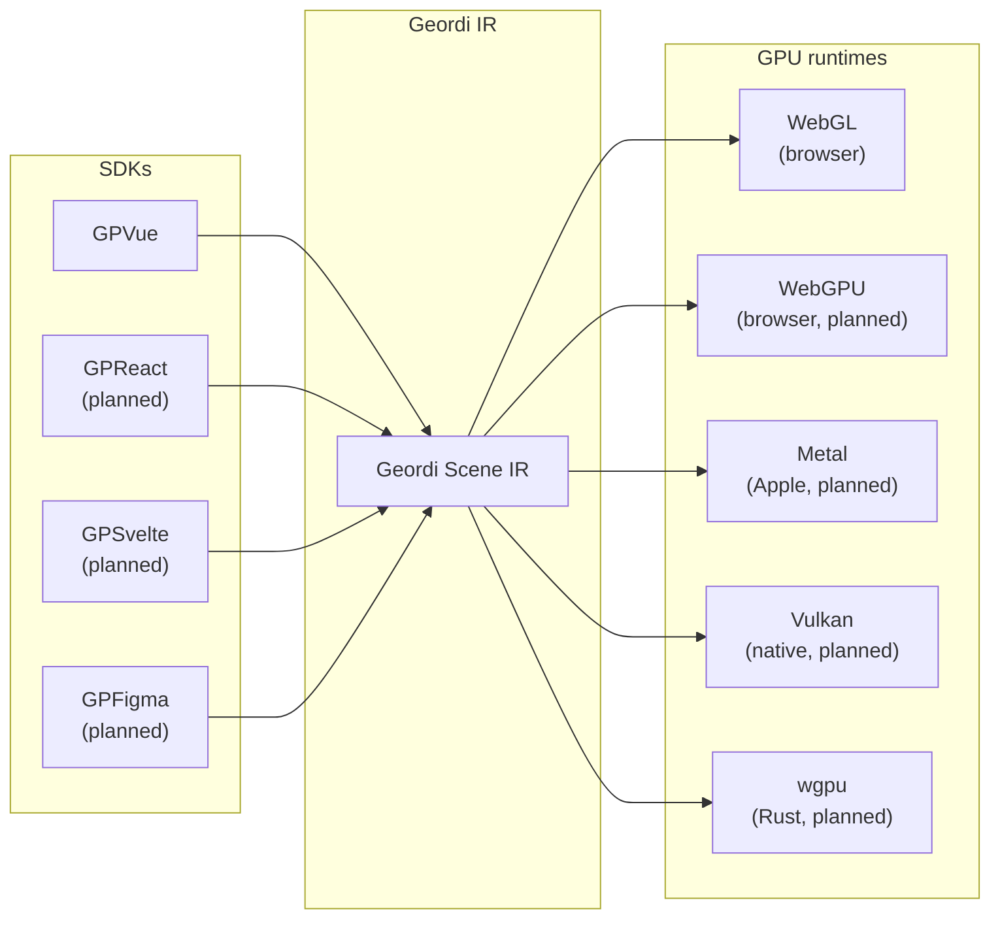
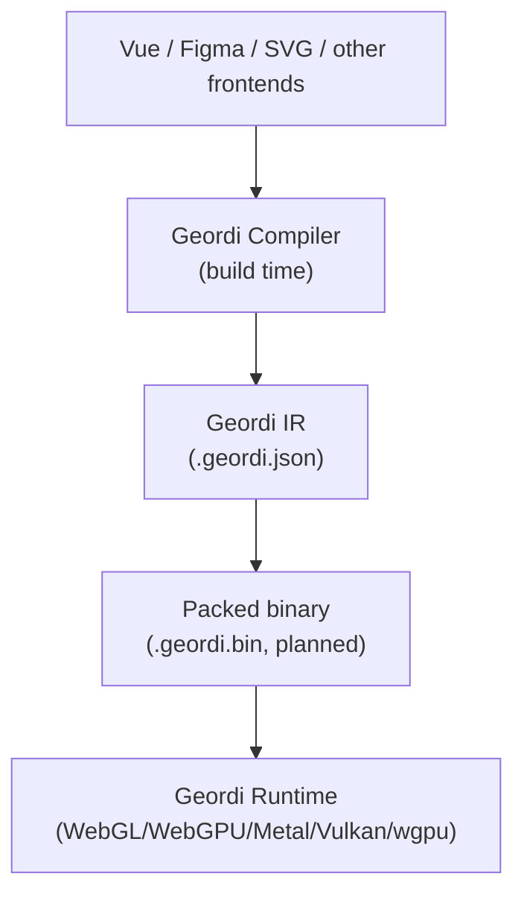

# Geordi

**Deterministic GPU scene IR for interactive vector UI**

Formerly SVJif, Geordi is a canonical intermediate representation for building
high-performance, GPU-native user interfaces with deterministic rendering.

Geordi is a compile target, not a framework. It sits between UI authoring tools
and GPU runtimes, providing a portable scene representation with explicit
geometry, explicit transforms, and reproducible output.

---

## Status

**v0.1.0-dev - active development**

Core compiler architecture is complete. The current implementation is focused on:

- GraphQL SDL to canonical AST parsing
- Semantic validation
- Deterministic artifact emission
- WebGL runtime scaffolding

See [BEARING.md](BEARING.md) for the current operating map.

---

## What is GPVue?

GPVue is the first planned developer-facing SDK built on Geordi. It compiles Vue
components into Geordi IR for deterministic GPU rendering.

At runtime:

- No CSS parsing
- No cascade
- No layout thrashing
- Deterministic subtree recomputation
- Direct GPU draw calls

---

## System Architecture



**Geordi is the stable contract. Runtimes are interchangeable.**

---

## Compilation Pipeline



---

## Core Principles

1. **Deterministic** - Same IR input always produces identical output.
2. **Explicit geometry** - Coordinate space, units, and transforms are fully defined.
3. **No runtime CSS** - Layout and styling are resolved before runtime rendering.
4. **Incremental layout VM** - Only dirty subtrees are recomputed.
5. **GPU-native rendering** - No DOM, no layout engine, no abstraction leakage.
6. **Fail loud** - Unsupported features are compile-time errors, not runtime surprises.

---

## Runtime Interface

All Geordi runtimes implement a shared contract:

```ts
interface GeordiRuntime {
  load(scene: GeordiScene): Promise<void>;
  render(): void;
  updateNode(id: string, updates: Partial<GeordiNode>): void;
  hitTest(x: number, y: number): HitResult | null;
  dispose(): void;
}
```

**Same scene. Same API. Any backend.**

Planned runtime packages:

- Browser: `@flyingrobots/geordi-runtime-webgl`, `@flyingrobots/geordi-runtime-webgpu`
- Apple platforms: `@flyingrobots/geordi-runtime-metal`
- Native cross-platform: `@flyingrobots/geordi-runtime-vulkan`
- Rust ecosystem: `@flyingrobots/geordi-runtime-wgpu`

---

## Supported CSS Subset

Geordi v0 design work is intentionally narrowing the supported surface area.
See [docs/V0_DESIGN_LAWS.md](docs/V0_DESIGN_LAWS.md) for the current design law.

Baseline areas under specification:

- Layout: flex, absolute positioning, intrinsic sizing
- Paint: solid color, opacity, borders, border radius
- Text: deterministic font packs, shaping, line breaking
- Assets: explicit resource identity and fixed material models
- Interaction: deterministic hit testing with host-owned event routing

---

## Repository Structure

```text
geordi/
  packages/
    core/              # @flyingrobots/geordi-core - IR types and domain models
    compiler-core/     # @flyingrobots/geordi-compiler-core - Compilation engine
    schema-graphql/    # @flyingrobots/geordi-schema-graphql - GraphQL SDL adapter
    wesley-generator/  # @flyingrobots/geordi-wesley-generator - Wesley integration
    runtime-webgl/     # @flyingrobots/geordi-runtime-webgl - WebGL runtime

  docs/
    ARCHITECTURE.md
    ERROR_CODES.md
    V0_DESIGN_LAWS.md
```

---

## Current Compiler Usage

```ts
import { compile } from '@flyingrobots/geordi-compiler-core';

const result = await compile({
  format: 'canonical-ast-json',
  source: '{"astVersion":"1","kind":"Scene","nodes":[],"scene":{"height":600,"id":"scene","width":800}}',
});

if (!result.ok) {
  console.error(result.diagnostics);
}
```

---

## Engineering Principles

- Apache 2.0 license
- Hexagonal architecture at package boundaries
- Strict TypeScript
- Strict linting with type-aware rules
- Custom error types for all thrown errors
- Encoding and JSON handling through explicit ports
- Tests define behavior; target 90% or better coverage

---

## License

Apache 2.0

---

## Contributing

Geordi is in early development. Issues, discussions, and small PRs are welcome as
the core stabilizes.
