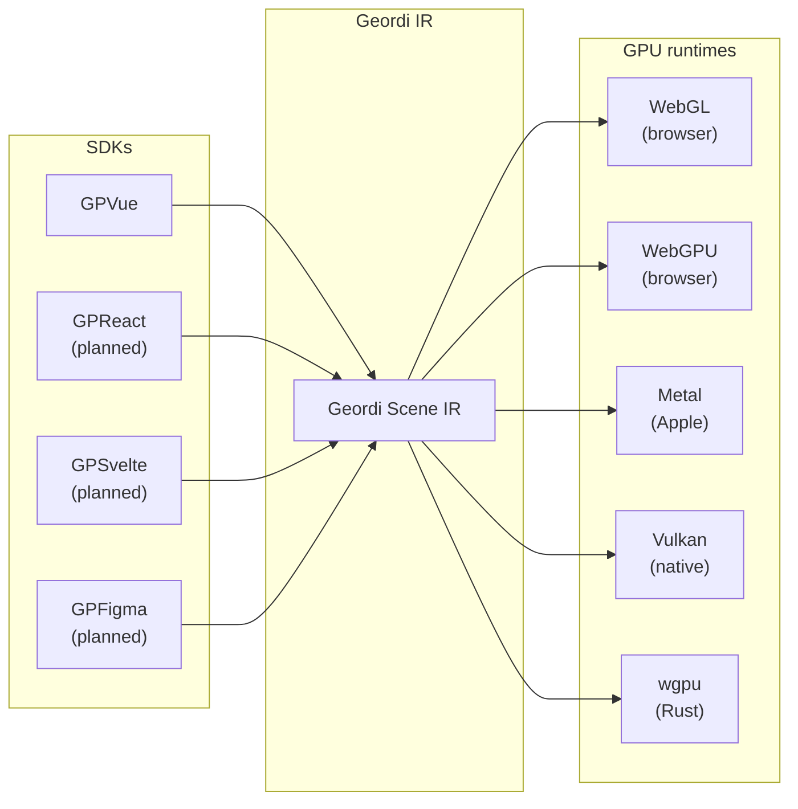
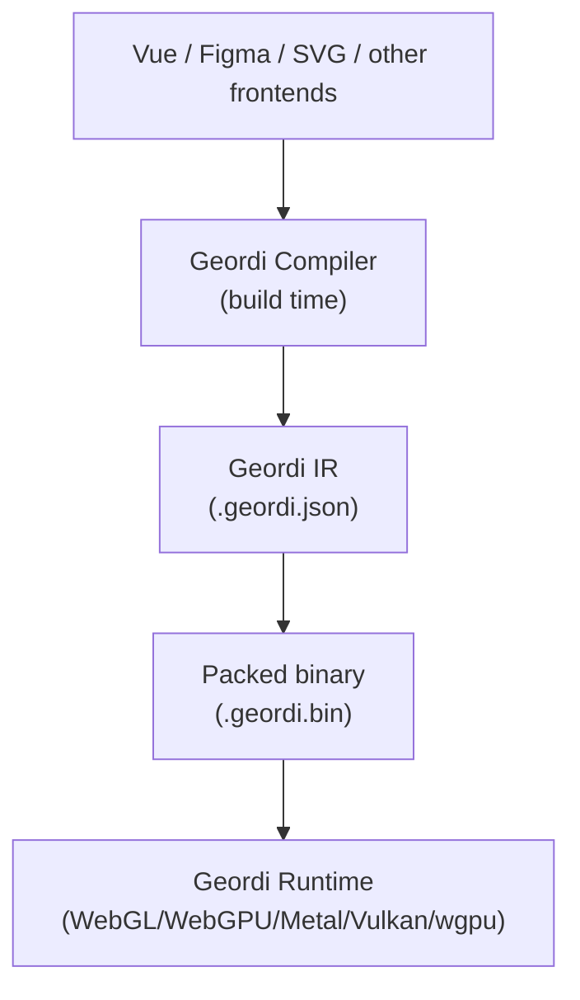

# Geordi

**Deterministic GPU scene IR for interactive vector UI**

Formerly SVJif (Scene Vector Jraphics Interface Format)

Geordi is a **canonical intermediate representation (IR)** for building high-performance, GPU-native user interfaces with deterministic rendering.

> No implicit layout rules. No runtime CSS cascade. No ambiguity.  
> Just explicit geometry, explicit transforms, and reproducible pixels.

---

## Status

**v0.1.0-dev — active development**

Core compiler architecture is complete. Now implementing:

- GraphQL → canonical AST parsing
- Semantic validation
- Full artifact emission pipeline

---

## What is Geordi?

Geordi is a **compile target**, not a framework.

It sits between UI authoring tools and GPU runtimes, providing a **deterministic, portable scene representation**.

Think:

- LLVM IR, but for UI
- WASM, but for rendering

Geordi does not replace the DOM or SVG—it replaces the *runtime ambiguity* of those systems when targeting high-performance rendering.

---

## What is GPVue?

**GPVue** is the first developer-facing SDK built on Geordi.

It compiles Vue components into Geordi IR for deterministic GPU rendering.

At runtime:

- No CSS parsing
- No cascade
- No layout thrashing

Only:

- Deterministic subtree recomputation
- Direct GPU draw calls

---

## System architecture



**Geordi is the stable contract. Runtimes are interchangeable.**

---

## Compilation pipeline



---

## Core principles

1. **Deterministic** – Same IR input always produces identical pixels.
2. **Explicit geometry** – Coordinate space, units, and transforms are fully defined.
3. **No runtime CSS** – Layout and styling are resolved at build time.
4. **Incremental layout VM** – Only dirty subtrees are recomputed.
5. **GPU-native rendering** – No DOM, no layout engine, no abstraction leakage.
6. **Fail loud** – Unsupported features are compile-time errors, not runtime surprises.

---

## Runtime interface

All Geordi runtimes implement a shared contract:

```ts
interface GeordiRuntime {
  load(scene: GeordiScene): Promise<void>;
  render(): void;
  updateNode(id: string, updates: Partial<GeordiNode>): void;
  hitTest(x: number, y: number): HitResult | null;
  dispose(): void;
}
```

**Same scene. Same API. Any backend.**

Runtimes:

- Browser: `@geordi/runtime-webgl`, `@geordi/runtime-webgpu`
- Apple platforms: `@geordi/runtime-metal`
- Native cross-platform: `@geordi/runtime-vulkan`
- Rust ecosystem: `@geordi/runtime-wgpu`

---

## Supported CSS subset (v0.1)

**Layout**

- `display`, `flex-*`, `width`, `height`, `padding`, `margin`, `gap`, `position`

**Paint**

- `background-color`, `color`, `border`, `border-radius`, `opacity`

**Text**

- `font-family`, `font-size`, `font-weight`, `line-height`, `text-align`

See `docs/css-subset.md` for full details.

---

## Repository structure

```text
geordi/
  packages/
    core/              # IR types, validation
    compiler/          # Compiler infrastructure
    cli/               # CLI tools

    runtime-webgl/     # WebGL (browser)
    runtime-webgpu/    # WebGPU (modern browser)
    runtime-metal/     # Metal (Apple native)
    runtime-wgpu/      # wgpu (Rust)
    runtime-vulkan/    # Vulkan (cross-platform)

    gpvue/             # Vue → Geordi
    gpreact/           # React → Geordi (planned)
    gpsvelte/          # Svelte → Geordi (planned)

  schemas/
    geordi.v0.1.json   # Geordi IR JSON Schema

  examples/
    gpvue-terminal/    # GPVue cloth terminal demo

  docs/
    spec.md            # Geordi specification
    runtime-api.md     # Runtime interface contract
```

---

## Quick start (preview)

### Vue developers (GPVue)

```bash
# Install GPVue
npm install @gpvue/vue

# Build your Vue component to Geordi IR
npx gpvue build Terminal.vue

# Run with GPU rendering
npx gpvue serve --gpu
```

### Format / tooling authors (Geordi core)

```bash
# Install Geordi CLI
npm install -g @geordi/cli

# Validate Geordi IR
geordi validate terminal.geordi.json

# Pack for production
geordi pack terminal.geordi.json -o terminal.geordi.bin

# Use the core types in your own compiler
import { GeordiScene } from '@geordi/core';
```

---

## Engineering principles

- Apache 2.0 license
- Hexagonal architecture (domain / application / infrastructure)
- Strict TypeScript
- Extremely strict linting (eslint:all + @typescript-eslint/all)
- Tests define behavior; target ≥ 90% coverage

---

## License

Apache 2.0

---

## Contributing

Geordi is in early development. Issues, discussions, and small PRs are welcome as the core stabilizes.
