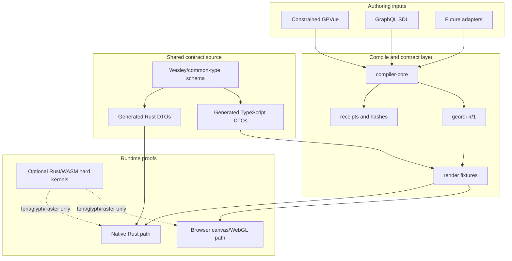

# Geordi

<p align="center">
  
</p>

**Deterministic scene IR and render proof tooling for portable GPU-native UI.**

Geordi is a compile target, artifact contract, and render-everywhere proof system. It sits between
UI authoring tools and runtimes, producing explicit scene artifacts with deterministic geometry,
asset identity, feature requirements, receipts, and validation boundaries.

Geordi is not a framework and not a DOM/CSS compatibility layer. The public claim is narrower and
more useful: a renderer should consume a versioned Geordi artifact, reject unsupported capabilities
loudly, and produce behavior that can be proven across runtimes.

## Current Status

**Version**: `0.1.0-dev`
**Active milestone**: Strict Positioned Glyph-Run Text
**Current operating map**: [BEARING.md](BEARING.md)

Completed proof layers:

- The rectangle render-everywhere proof loads one checked-in `geordi-ir/1` artifact in a browser
  harness and a native Rust harness, with exact pixel probes for the rectangle fixture.
- The Stanford bunny mesh proof loads one checked-in PLY asset, mesh manifest, and render descriptor
  in browser and native harnesses, with shared asset identity and deterministic sampled-frame
  metadata. It is intentionally not a pixel-identical 3D rasterization claim.
- The compiler core, GraphQL SDL adapter, GPVue fixture compiler path, render fixture contracts,
  WebGL package scaffold, and Rust native harnesses are present and covered by repo gates.
- The strict text proof (`geordi-strict-positioned-glyph-run/1`) loads one checked-in
  `geordi-strict-text-fixture/1`, verifies a content-addressed font pack and fixture-local
  `outlinePaths` evidence, draws glyphs without platform text APIs, and compares browser/native
  metadata and coarse pixel probes. The `geordi-text-prep` CLI produces a deterministic generated
  strict text fixture from pinned prepared glyph-run input, with a byte-stable generation plan.
  Shaping remains a text-prep compiler boundary; runtime renderers consume prepared artifacts only.

Active work:

- CI gate coverage for strict text: fixture validation gate, browser smoke gate, native smoke gate,
  and final drift/claim audit (S097–S100).
- The TypeScript/Rust DTO mirror is provisional. Shared serialized contracts must move to
  Wesley/common-type generation.

Current nonclaims:

- no compliant general text rendering;
- no CSS text;
- no platform-native text as a compliant path;
- no host font fallback;
- no runtime shaping in strict mode;
- no runtime kerning, ligature substitution, glyph substitution, wrapping, or fallback;
- no pixel-identical 3D rasterization claim for the bunny path;
- no required WASM dependency for ordinary TypeScript fixture validation.

## Start Here

| Need | Document |
| --- | --- |
| Product and architecture north star | [VISION.md](VISION.md) |
| Current slice, checklist, and active DAG | [BEARING.md](BEARING.md) |
| Current status summary | [docs/STATUS.md](docs/STATUS.md) |
| Compiler/package architecture | [docs/ARCHITECTURE.md](docs/ARCHITECTURE.md) |
| Product/runtime laws | [docs/V0_DESIGN_LAWS.md](docs/V0_DESIGN_LAWS.md) |
| TypeScript/Rust/WASM boundary policy | [docs/design/2026-05-typescript-rust-wasm-boundary.md](docs/design/2026-05-typescript-rust-wasm-boundary.md) |
| Shared TypeScript/Rust contract generation plan | [docs/design/2026-05-wesley-common-type-generation.md](docs/design/2026-05-wesley-common-type-generation.md) |
| Active strict text design | [docs/design/2026-05-strict-positioned-glyph-run-plan.md](docs/design/2026-05-strict-positioned-glyph-run-plan.md) |
| Render-everywhere runnable guide | [docs/render-everywhere.md](docs/render-everywhere.md) |
| Full source-to-runtime walkthrough | [docs/end-to-end.md](docs/end-to-end.md) |
| Stable compiler error codes | [docs/ERROR_CODES.md](docs/ERROR_CODES.md) |
| Rust gates | [docs/RUST_GATES.md](docs/RUST_GATES.md) |
| Completed-doc archive candidates | [docs/ARCHIVE_CANDIDATES.md](docs/ARCHIVE_CANDIDATES.md) |

## Architecture In One Screen



The current boundary rule is:

```text
TypeScript-native at the edges.
Rust-native at the rendering core.
Generated at the contract boundary.
WASM-backed only for hard deterministic kernels.
```

## Repository Structure

```text
geordi/
  packages/
    core/              # @flyingrobots/geordi-core - IR types, JSON port, feature profile
    compiler-core/     # @flyingrobots/geordi-compiler-core - compile orchestration
    schema-graphql/    # @flyingrobots/geordi-schema-graphql - GraphQL SDL adapter
    gpvue/             # @flyingrobots/geordi-gpvue - constrained GPVue fixture compiler
    render-fixture/    # @flyingrobots/geordi-render-fixture - shared fixture contracts
    runtime-webgl/     # @flyingrobots/geordi-runtime-webgl - browser runtime package
    text-prep/         # @flyingrobots/geordi-text-prep - pinned strict text prep CLI
    wesley-generator/  # @flyingrobots/geordi-wesley-generator - Wesley integration

  crates/
    geordi-ir/         # Rust IR and fixture DTOs/validators
    geordi-mesh/       # Rust mesh asset parsing and validation
    geordi-renderer/   # Native Rust renderer support

  examples/
    browser-render-everywhere/
    native-render-everywhere/

  fixtures/
    render-everywhere/

  docs/
    design/
```

## Common Commands

Install dependencies:

```bash
pnpm install
```

Run the TypeScript workspace gates:

```bash
pnpm typecheck
pnpm lint
pnpm test
```

Run documentation and repository hygiene gates:

```bash
pnpm test:docs
pnpm test:package-names
pnpm test:repo-sludge
pnpm test:placeholders
pnpm test:exports
```

Run Rust gates after changing Rust code:

```bash
cargo fmt --check
cargo test --workspace
cargo clippy --workspace --all-targets -- -D warnings
```

Run the render-everywhere smoke paths:

```bash
pnpm test:render-everywhere:gpvue
pnpm test:render-everywhere:bunny
pnpm test:render-everywhere:strict-text
pnpm test:render-everywhere:strict-text-generated
```

## Compiler Usage

```ts
import { compile } from '@flyingrobots/geordi-compiler-core';

const result = await compile({
  format: 'canonical-ast-json',
  source: '{"astVersion":"1","kind":"Scene","nodes":[],"scene":{"height":600,"id":"scene","width":800}}',
});

if (!result.ok) {
  console.error(result.diagnostics);
}
```

## Engineering Principles

- Public artifacts are versioned and validated.
- Unsupported features fail loudly; renderers do not silently approximate.
- Production JSON ingress and egress goes through explicit JSON ports.
- Feature requirements and numeric profiles are part of the artifact contract.
- Content-addressed assets and receipts make proofs reviewable.
- TypeScript and Rust behavior must agree through shared contracts and conformance fixtures.
- Hard algorithms may be centralized in Rust/WASM only when the determinism payoff justifies the
  packaging and runtime cost.
- No broad rendering claim is made before browser and native gates prove it.

## License

Apache 2.0
