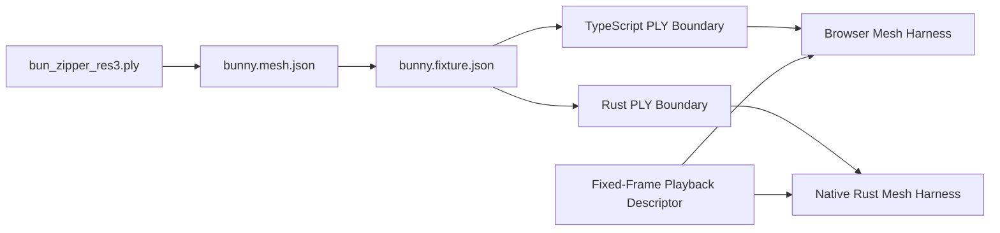

# Bunny Mesh Render-Everywhere Demo

**Status**: Draft
**Date**: 2026-05-24
**Parent Bearing**: [`../../BEARING.md`](../../BEARING.md)

This document defines the next render-everywhere milestone after the rectangle-only proof. The
target is a Stanford bunny mesh rendered in both browser and native Rust, rotating at a fixed rate
about one explicitly declared arbitrary axis.

The milestone is not a general 3D engine. It is a controlled proof that Geordi can extend its
portable artifact model from resolved 2D rectangles to deterministic mesh assets, camera profiles,
transform math, and sampled playback without weakening the current boundary discipline.

## Goal

The milestone should prove:

- one canonical mesh asset manifest;
- one Stanford bunny PLY asset by content hash;
- typed mesh parsing at every runtime boundary;
- browser and native Rust renderers loading the same mesh bytes;
- explicitly declared camera, projection, material, and transform profiles;
- deterministic sampled rotation frames for tests;
- live browser and native presentations rotating at the declared fixed rate.

## Non-Goals

The milestone must not claim:

- pixel-identical 3D rasterization across independent graphics backends;
- general text rendering;
- a full animation engine;
- arbitrary shader loading;
- arbitrary mesh-format support;
- runtime fallback behavior for missing or malformed assets.

## Architecture

The mesh manifest owns asset identity. The fixture owns render intent. The playback descriptor owns
time sampling. Renderers consume all three and fail loudly if any contract is unsupported.

## Demo Contract

The first bunny fixture should include:

- `fixtureVersion`: a render fixture schema identity;
- `id`: `render-everywhere:stanford-bunny`;
- `assetManifestPath`: fixture-local path to the mesh manifest;
- `assetHash`: `sha256:` hash of the committed PLY bytes;
- `meshProfile`: `geordi-ascii-ply-triangle-mesh/1`;
- `runtimeProfile.requires`: known Geordi mesh feature requirements;
- `camera`: deterministic view descriptor;
- `projection`: deterministic projection descriptor;
- `material`: fixed simple material profile;
- `playback`: deterministic sampled rotation descriptor.

The fixture may later point at a Geordi IR artifact, but the first half of this milestone should
keep mesh contracts independent from the existing rectangle-only `geordi-ir/1` scene artifact.

## Verification

The first verification phase should avoid pixel-equality claims. It should check:

- asset hash matches committed bytes;
- parsed vertex and face counts match manifest;
- vertex bounds match manifest;
- all numbers are finite;
- all faces reference valid vertex indices;
- camera/projection/playback descriptors validate;
- fixed-frame transform metadata matches in browser and Rust.

After static rendering exists, smoke tests can add:

- nonblank output;
- projected mesh bounds are inside the viewport;
- selected frame metadata matches expected angle and axis normalization;
- at least two sampled nonzero frames differ from frame zero.

## Failure Model

All failures must use custom error types. Context belongs in the error class name and typed fields,
not in ad hoc thrown strings. Boundary modules should distinguish:

- asset hash mismatch;
- invalid manifest schema;
- unsupported feature profile;
- unsupported PLY structure;
- malformed vertex or face data;
- invalid camera/projection/playback descriptors.

## Open Design Pressure

The risky parts are not file loading or drawing triangles. The risky parts are:

- numeric drift between JavaScript and Rust;
- matrix layout disagreements;
- coordinate handedness assumptions;
- implicit projection defaults;
- browser and native backend rasterization differences;
- wall-clock animation sneaking into deterministic tests.

Those risks are handled by the companion transform/playback law and by keeping tests fixed-frame.
