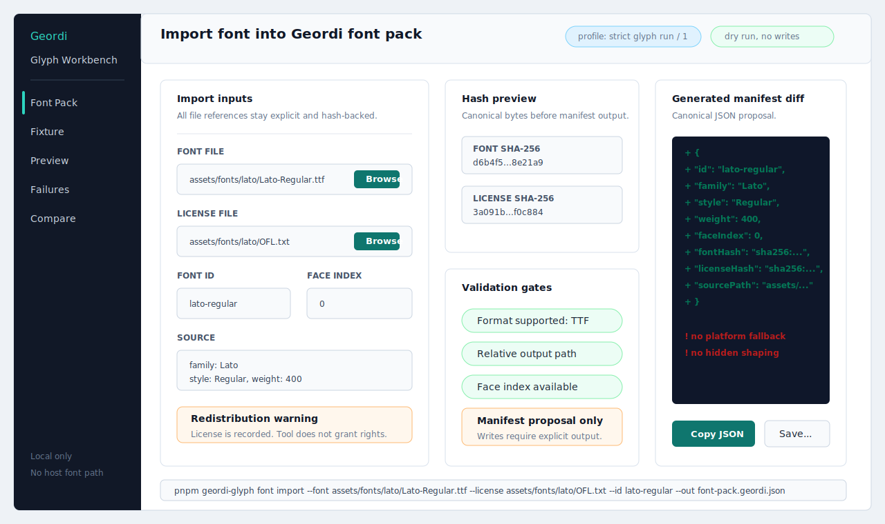
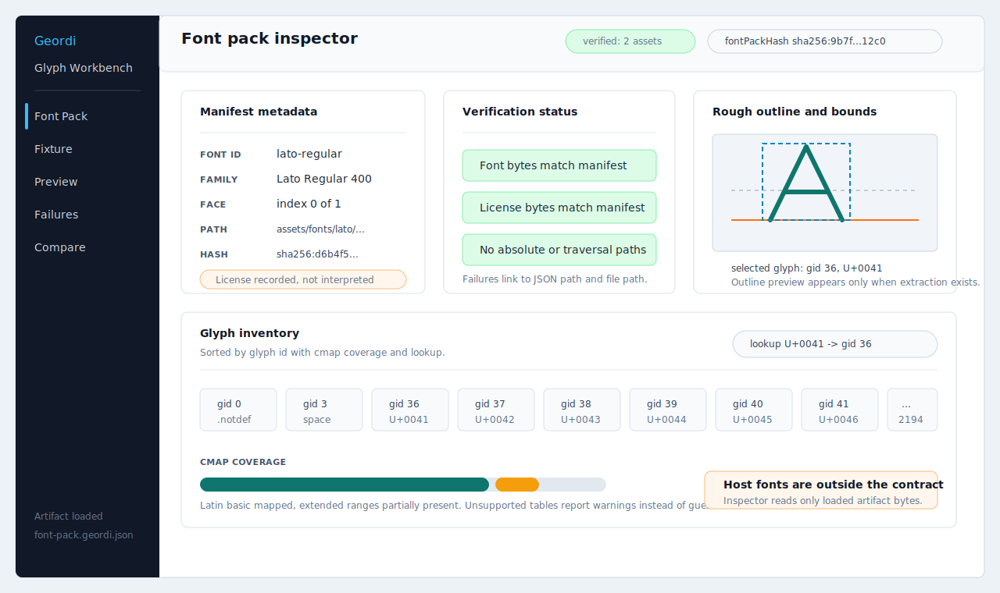
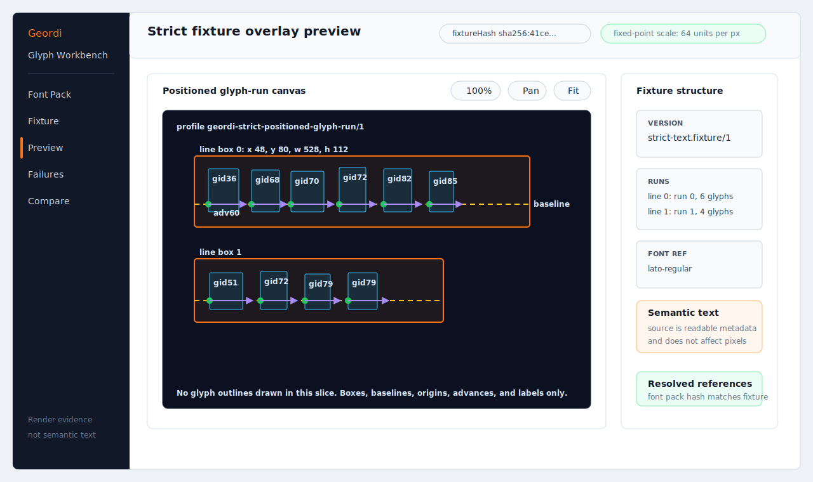
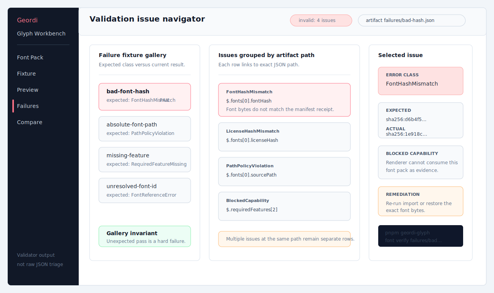
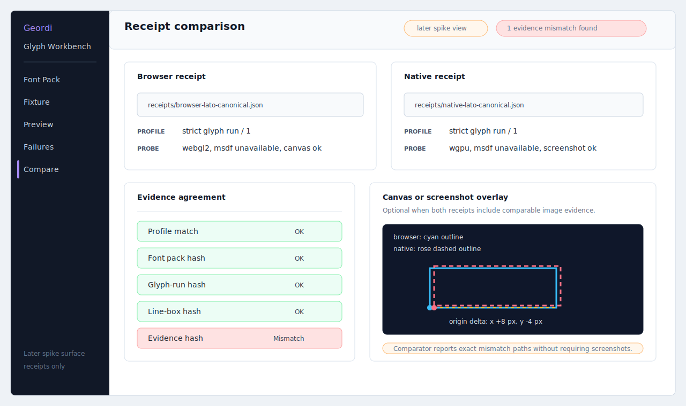

# Glyph Tooling Spike

**Status**: Proposed
**Date**: 2026-05-25
**Related milestone**: `geordi-strict-positioned-glyph-run/1`
**Planning budget**: two free planning slices plus a 15-slice implementation spike

This document proposes user-facing glyph tooling for Geordi. The goal is not to become a font
editor. The goal is to make strict text artifacts understandable, inspectable, importable,
previewable, and debuggable by humans.

Strict Geordi text turns platform text into evidence:

~~~text
font pack + positioned glyph runs + line boxes + glyph evidence + receipts
~~~

That model is correct but harsh. Users will need tools that explain what was imported, what glyphs
exist, what the renderer will draw, why validation failed, and how browser/native outputs relate.

## Free Slice 1: Market Brainstorm

This slice looked across design tools, font editors, game engines, browser tooling, and text
pipeline tools. The strongest lesson is that mature tools expose typography at several layers:
author intent, font metadata, glyph inventory, OpenType behavior, atlas/evidence output, and visual
preview.

| Tool Family | Examples | Font-Related Tooling | Lesson For Geordi |
| --- | --- | --- | --- |
| Design tools | Figma, Adobe Illustrator | Typography panels, variable font controls, text property inspection, OpenType feature controls, glyph/alternate insertion. | Designers expect live previews, selected-text inspection, feature toggles, and a visible link between what they picked and what appears. |
| Font editors | Glyphs, FontLab, RoboFont, FontForge | Glyph grids, outline editors, masters/variation axes, OpenType feature authoring, validation, export, scripting, extension ecosystems. | Geordi should not duplicate full font editing, but it should borrow glyph grids, validation surfacing, outline previews, and scriptable workflows. |
| Game engines | Unity TextMesh Pro, Unreal Font Editor | Imported font assets, font face assets, atlas generation, SDF/MSDF workflows, fallback/composite font models, runtime/offline caching modes. | Real-time renderers treat fonts as assets, not ambient system state. Geordi should make font packs and glyph evidence feel like first-class project assets. |
| Browser/dev tools | Chrome DevTools | Rendered-font inspection, local-font disabling, rendering diagnostics, layout/debug overlays. | Debuggers should answer “what did this actually use?” and “what changed?” without asking the user to infer from pixels. |
| Text pipeline libraries | HarfBuzz, fontTools, msdfgen | Shaping outputs glyph IDs/positions, subsetting optimizes font contents, SDF/MSDF tools generate renderable glyph evidence. | Geordi tooling should wrap deterministic pipeline steps with receipts, not hide them behind convenience UI. |

Research notes and source anchors:

- Figma exposes text properties, Dev Mode inspection, and variable font controls in its typography
  UI.
  Sources: [Figma text properties](https://help.figma.com/hc/en-us/articles/360039956634-Explore-text-properties),
  [Figma Dev Mode inspection](https://help.figma.com/hc/en-us/articles/22012921621015-Guide-).
- Adobe Illustrator exposes OpenType controls and glyph inspection/insertion through Type panels.
  Sources: [Illustrator OpenType panel](https://helpx.adobe.com/uk/illustrator/desktop/design-with-text/special-characters-glyphs/opentype-panel-overview.html),
  [Adobe OpenType overview](https://www.adobe.com/uk/products/type/opentype.html).
- Glyphs and FontLab emphasize full font production: glyph editing, OpenType feature generation,
  export, variable fonts, and testing.
  Sources: [Glyphs features](https://glyphsapp.com/features),
  [FontLab 8](https://www.fontlab.com/font-editor/fontlab-studio/).
- RoboFont and FontForge show the value of scriptability, open formats, lookups, validation, and
  advanced inspection.
  Sources: [RoboFont scripting](https://doc.robofont.com/documentation/topics/scripting-environment),
  [RoboFont generating fonts](https://www.robofont.com/documentation/tutorials/generating-fonts/),
  [FontForge lookups](https://fontforge.org/docs/ui/dialogs/lookups.html),
  [FontForge validation](https://fontforge.org/docs/ui/dialogs/validation.html).
- Unity and Unreal treat text rendering as an asset pipeline with font assets, face assets, atlas
  generation, and caching modes.
  Sources: [TextMesh Pro font assets](https://docs.unity.cn/Packages/com.unity.textmeshpro%402.2/manual/FontAssets.html),
  [TextMesh Pro SDF fonts](https://docs.unity.cn/Packages/com.unity.textmeshpro%404.0/manual/FontAssetsSDF.html),
  [Unreal Font Asset and Editor](https://dev.epicgames.com/documentation/unreal-engine/font-asset-and-editor-in-unreal-engine?lang=en-US).
- HarfBuzz, fontTools, and msdfgen map well to Geordi’s evidence contract: shaping gives glyph
  IDs/positions, subsetting controls font contents, and SDF/MSDF/outline tools produce renderable
  evidence.
  Sources: [HarfBuzz shaping](https://harfbuzz.github.io/shaping-and-shape-plans.html),
  [fontTools subset](https://fonttools.readthedocs.io/en/stable/subset/index.html),
  [msdfgen](https://github.com/Chlumsky/msdfgen).
- Chrome DevTools is a useful model for final-output inspection: it reports actual rendered fonts
  and includes rendering diagnostics.
  Sources: [Chrome rendered font inspection](https://developer.chrome.com/blog/devtools-answers-what-font-is-that),
  [Chrome Rendering tab](https://developer.chrome.com/docs/devtools/rendering).

## Free Slice 2: Proposal

Build a small Geordi Glyph Workbench and matching CLI/API surfaces that make strict text evidence
visible. The spike should prove five workflows:

1. Import a font into a verified Geordi font pack.
2. Inspect glyph inventory and font metadata.
3. Preview a strict text fixture with overlays.
4. Diagnose validation failures without reading raw JSON by hand.
5. Compare browser/native receipts to diagnose parity failures.

The workbench should treat the existing contract as the source of truth. It must not silently shape,
fallback, or use platform font APIs as a compliant path. Any “demo convenience” behavior must be
visibly labeled noncompliant.

## Product Shape

The first user-facing tool should be a local developer workbench:

~~~text
packages/glyph-tools/           CLI and shared application services
examples/glyph-workbench/       browser UI using the shared services
fixtures/render-everywhere/     font packs, strict text fixtures, receipts, failure fixtures
~~~

The workbench starts as a repo-local tool, not a published app. It can later become a GPVue-facing
debugger or an MCP-backed design assistant.

Repository topology:

~~~mermaid
flowchart LR
  subgraph Repo[geordi repo]
    GlyphTools[packages/glyph-tools]
    Workbench[examples/glyph-workbench]
    Fixtures[fixtures/render-everywhere]
    Docs[docs/design]
  end

  GlyphTools -->|exports application services| Workbench
  GlyphTools -->|reads and verifies| Fixtures
  Workbench -->|loads fixture paths through local adapter| Fixtures
  Docs -->|defines invariants and slice plan| GlyphTools
  Docs -->|captures mockups and PRD| Workbench
~~~

Execution surfaces:

~~~mermaid
flowchart TD
  CLI[pnpm geordi-glyph] --> AppServices[Glyph Tools Application Services]
  Browser[Local Browser Workbench] --> AppServices
  FutureMcp[Future MCP or design assistant] -. later .-> AppServices

  AppServices --> Domain[Pure Domain Model]
  AppServices --> Ports[Ports]
  Ports --> JsonPort[Canonical JSON Port]
  Ports --> FsPort[File System Port]
  Ports --> FontPort[Font Parser Port]
  Ports --> ReceiptPort[Receipt Comparator Port]

  Domain --> Reports[Typed Reports and View Models]
  Reports --> CLI
  Reports --> Browser
~~~

## North-Star Workflows

The workflows are intentionally artifact-first. A UI view may present friendlier labels, tables, and
overlays, but each visible claim must trace back to a loaded artifact, a hash, a parsed schema, or a
validator result.

Artifact relationship model:

~~~mermaid
erDiagram
  FONT_PACK ||--|{ FONT_ASSET : contains
  FONT_ASSET ||--|| LICENSE_ASSET : records
  FONT_ASSET ||--o{ GLYPH_INVENTORY_ENTRY : inspects
  STRICT_TEXT_FIXTURE ||--|{ LINE_BOX : declares
  STRICT_TEXT_FIXTURE ||--|{ GLYPH_RUN : declares
  GLYPH_RUN ||--|{ POSITIONED_GLYPH : contains
  GLYPH_RUN }o--|| FONT_ASSET : references
  STRICT_TEXT_FIXTURE ||--o{ VALIDATION_ISSUE : produces
  FONT_PACK ||--o{ VALIDATION_ISSUE : produces
  BROWSER_RECEIPT ||--o{ RECEIPT_HASH : records
  NATIVE_RECEIPT ||--o{ RECEIPT_HASH : records
  PARITY_COMPARISON ||--|{ RECEIPT_MISMATCH : reports
  PARITY_COMPARISON }o--|| BROWSER_RECEIPT : compares
  PARITY_COMPARISON }o--|| NATIVE_RECEIPT : compares

  FONT_PACK {
    string schemaVersion
    string profile
    string fontPackHash
    string relativePath
  }
  FONT_ASSET {
    string id
    string familyName
    string styleName
    int weight
    int faceIndex
    string fontHash
  }
  LICENSE_ASSET {
    string relativePath
    string licenseHash
    string declaredStatus
  }
  STRICT_TEXT_FIXTURE {
    string schemaVersion
    string profile
    string positionEncoding
    string fixtureHash
  }
  POSITIONED_GLYPH {
    int glyphId
    int xFixed
    int yFixed
    int advanceFixed
    int xOffsetFixed
    int yOffsetFixed
  }
  VALIDATION_ISSUE {
    string errorClass
    string jsonPath
    string blockedCapability
    string remediationCommand
  }
~~~

### Import

A user selects a font file and license file. The tool validates paths, hashes bytes, records
metadata, and proposes a `geordi-font-pack/1` manifest update.

Important UI:

- font file picker or path input;
- license file picker or path input;
- hash preview;
- face index preview;
- format support badge;
- redistribution/license warning;
- generated manifest diff.

Mockup:

CLI shape:

~~~bash
pnpm geordi-glyph font import \
  --font fixtures/render-everywhere/assets/fonts/lato/Lato-Regular.ttf \
  --license fixtures/render-everywhere/assets/fonts/lato/OFL.txt \
  --id lato-regular \
  --out fixtures/render-everywhere/assets/fonts/font-pack.geordi.json
~~~

Import sequence:

~~~mermaid
sequenceDiagram
  autonumber
  actor User
  participant UI as CLI or Workbench Import View
  participant App as FontImportService
  participant Fs as FileSystemPort
  participant Hash as HashPort
  participant Parser as FontInventoryPort
  participant Canon as CanonicalJsonPort

  User->>UI: Select font path, license path, id, faceIndex, output path
  UI->>App: importFontDryRun(request)
  App->>Fs: readRelativeFile(fontPath)
  Fs-->>App: font bytes or path policy issue
  App->>Fs: readRelativeFile(licensePath)
  Fs-->>App: license bytes or missing file issue
  App->>Hash: sha256(font bytes), sha256(license bytes)
  Hash-->>App: deterministic hashes
  App->>Parser: inspectFont(font bytes, faceIndex)
  Parser-->>App: format, face count, names, warnings
  App->>Canon: stringifyManifestProposal(proposal)
  Canon-->>App: canonical JSON diff model
  App-->>UI: FontImportProposal plus validation gates
  UI-->>User: Hash preview, warnings, generated manifest diff
~~~

### Inspect

A user opens a font pack and sees what Geordi knows:

- font id;
- file hash;
- face index;
- family/style/weight;
- license status;
- glyph count;
- cmap coverage;
- glyph id lookup;
- rough outline/bounds preview when outline extraction exists;
- feature/axis metadata later.

This is the “what is actually in my artifact?” view.

Mockup:

Inspector sequence:

~~~mermaid
sequenceDiagram
  autonumber
  actor User
  participant View as Font Pack Inspector
  participant App as FontPackInspectionService
  participant Json as CanonicalJsonPort
  participant Fs as FileSystemPort
  participant Verify as FontPackVerifier
  participant Font as FontInventoryPort

  User->>View: Open font-pack.geordi.json
  View->>App: inspectFontPack(path)
  App->>Json: parseFontPack(path)
  Json-->>App: typed FontPack or structural issues
  App->>Verify: verifyDeclaredAssets(fontPack)
  Verify->>Fs: read font and license relative paths
  Verify-->>App: hash status per asset
  App->>Font: inspectFont(bytes, faceIndex)
  Font-->>App: glyph count, cmap coverage, optional bounds
  App-->>View: FontPackInspectorViewModel
  View-->>User: Metadata, verification table, glyph inventory, warnings
~~~

### Preview

A user opens a strict text fixture and sees the exact positioned glyph-run layout:

- glyph boxes;
- line boxes;
- baselines;
- glyph IDs;
- advances;
- offsets;
- font id labels;
- fixed-point to px conversion;
- noncompliant semantic text clearly separated from render evidence.

This is the “what will the renderer consume?” view.

Mockup:

Strict fixture preview model:

~~~mermaid
classDiagram
  class StrictFixtureViewModel {
    +schemaVersion: string
    +profile: string
    +positionEncoding: string
    +fontReferences: FontReferenceStatus[]
    +lineBoxes: LineBoxView[]
    +glyphRuns: GlyphRunView[]
    +semanticTextStatus: SemanticTextStatus
  }
  class LineBoxView {
    +lineIndex: number
    +xPx: number
    +yPx: number
    +widthPx: number
    +heightPx: number
    +baselinePx: number
  }
  class GlyphRunView {
    +runIndex: number
    +lineIndex: number
    +fontId: string
    +glyphCount: number
    +glyphs: PositionedGlyphView[]
  }
  class PositionedGlyphView {
    +glyphId: number
    +originXPx: number
    +originYPx: number
    +advancePx: number
    +offsetXPx: number
    +offsetYPx: number
    +label: string
  }
  class OverlaySettings {
    +showLineBoxes: boolean
    +showBaselines: boolean
    +showOrigins: boolean
    +showAdvances: boolean
    +showGlyphLabels: boolean
    +zoom: number
    +panX: number
    +panY: number
  }
  StrictFixtureViewModel "1" *-- "many" LineBoxView
  StrictFixtureViewModel "1" *-- "many" GlyphRunView
  GlyphRunView "1" *-- "many" PositionedGlyphView
  StrictFixtureViewModel ..> OverlaySettings : rendered with
~~~

Preview sequence:

~~~mermaid
sequenceDiagram
  autonumber
  actor User
  participant View as Preview View
  participant App as StrictFixtureInspectionService
  participant Json as CanonicalJsonPort
  participant Validator as StrictFixtureValidator
  participant Mapper as PreviewModelMapper
  participant Canvas as OverlayRenderer

  User->>View: Open strict-text fixture
  View->>App: inspectFixture(path, activeFontPack)
  App->>Json: parseStrictFixture(path)
  Json-->>App: typed fixture or JSON path issues
  App->>Validator: validateReferencesAndEncoding(fixture, fontPack)
  Validator-->>App: issue list and resolved font references
  App->>Mapper: mapFixedPointToPixels(fixture)
  Mapper-->>App: StrictFixtureViewModel
  App-->>View: view model plus validation status
  View->>Canvas: drawOverlay(viewModel, settings)
  Canvas-->>User: Line boxes, baselines, origins, advances, labels
~~~

### Debug

A user opens a failure fixture or invalid artifact and gets a navigable report:

- error class;
- JSON path;
- human explanation;
- blocked capability;
- expected vs actual hash;
- linked artifact;
- suggested next command.

This is the “why did Geordi refuse to draw?” view.

Mockup:

Validation issue model:

~~~mermaid
classDiagram
  class ValidationReport {
    +artifactPath: string
    +artifactKind: ArtifactKind
    +schemaVersion: string
    +issues: ValidationIssue[]
    +reproductionCommand: string
  }
  class ValidationIssue {
    +errorClass: string
    +severity: IssueSeverity
    +jsonPath: string
    +message: string
    +blockedCapability: string
    +expected: string
    +actual: string
    +hint: string
  }
  class FailureFixtureCase {
    +id: string
    +path: string
    +expectedErrorClass: string
    +observedErrorClass: string
    +status: GalleryStatus
  }
  class IssueNavigatorViewModel {
    +selectedIssueId: string
    +groups: IssueGroup[]
    +copyableCommands: string[]
  }
  ValidationReport "1" *-- "many" ValidationIssue
  FailureFixtureCase "1" o-- "1" ValidationReport
  IssueNavigatorViewModel ..> ValidationReport : presents
~~~

Debug sequence:

~~~mermaid
sequenceDiagram
  autonumber
  actor User
  participant Gallery as Failure Fixture Gallery
  participant App as ValidationReportService
  participant Loader as ArtifactLoader
  participant Validators as Font and Fixture Validators
  participant Mapper as IssueNavigatorMapper

  User->>Gallery: Select bad-hash failure fixture
  Gallery->>App: validateArtifact(path)
  App->>Loader: loadAndClassify(path)
  Loader-->>App: FontPack, StrictFixture, Receipt, or malformed JSON issue
  App->>Validators: runArtifactValidators(artifact)
  Validators-->>App: issue list with JSON paths
  App->>Mapper: groupIssuesByArtifactAndPath(report)
  Mapper-->>App: IssueNavigatorViewModel
  App-->>Gallery: report plus expected-vs-observed gallery status
  Gallery-->>User: Error class, path, explanation, hashes, next command
~~~

### Compare

Later in the spike, a user loads browser/native receipts and compares:

- profile match;
- font pack hash match;
- glyph-run hash match;
- line-box hash match;
- evidence hash match;
- probe results;
- screenshot or canvas overlay when available.

This is the “did both runtimes consume the same evidence?” view.

Later-workflow mockup:

Receipt comparison sequence:

~~~mermaid
sequenceDiagram
  autonumber
  actor User
  participant View as Compare View
  participant App as ReceiptComparisonService
  participant Json as CanonicalJsonPort
  participant Comparator as ParityComparator
  participant Overlay as OptionalImageOverlay

  User->>View: Load browser receipt and native receipt
  View->>App: compareReceipts(browserPath, nativePath)
  App->>Json: parseReceipt(browserPath)
  Json-->>App: browser receipt or issue
  App->>Json: parseReceipt(nativePath)
  Json-->>App: native receipt or issue
  App->>Comparator: compare hashes, profile, probes, optional image evidence
  Comparator-->>App: match table and mismatch paths
  App-->>View: ReceiptComparisonViewModel
  opt comparable screenshots or canvas captures exist
    View->>Overlay: renderDifferenceOverlay(viewModel)
    Overlay-->>View: overlay pixels and origin deltas
  end
  View-->>User: Evidence agreement report
~~~

## Tool Architecture

~~~mermaid
flowchart TD
  FontFile[Font File] --> Importer[Font Importer]
  LicenseFile[License File] --> Importer
  Importer --> FontPack[font-pack.geordi.json]
  FontPack --> Inspector[Glyph Inspector]
  FontPack --> FixtureValidator[Strict Fixture Validator]
  StrictFixture[strict-text.fixture.json] --> FixtureValidator
  FixtureValidator --> PreviewModel[Preview Model]
  PreviewModel --> BrowserWorkbench[Browser Workbench]
  PreviewModel --> CLIReport[CLI Report]
  BrowserReceipt[Browser Receipt] --> Compare[Parity Comparator]
  NativeReceipt[Native Receipt] --> Compare
  Compare --> DebugReport[Debug Report]
~~~

Layering rule:

- Domain model: font packs, strict text fixtures, glyph inventory, validation reports.
- Ports: JSON, file system, font parser, renderer preview, receipt comparison.
- Adapters: Node CLI, browser UI, future MCP wrapper.
- No UI component may parse raw JSON directly; UI consumes domain/application results.

Component architecture:

~~~mermaid
flowchart TD
  subgraph Interfaces
    CliAdapter[Node CLI Adapter]
    BrowserAdapter[Workbench UI Adapter]
  end

  subgraph Application
    ImportService[FontImportService]
    PackService[FontPackInspectionService]
    FixtureService[StrictFixtureInspectionService]
    ValidationService[ValidationReportService]
    CompareService[ReceiptComparisonService]
  end

  subgraph Domain
    FontPackModel[Font Pack Model]
    StrictFixtureModel[Strict Fixture Model]
    InventoryModel[Glyph Inventory Model]
    ValidationModel[Validation Issue Model]
    ReceiptModel[Receipt Model]
  end

  subgraph Ports
    FileSystemPort[FileSystemPort]
    JsonPort[CanonicalJsonPort]
    FontParserPort[FontParserPort]
    HashPort[HashPort]
    OverlayPort[OverlayModelPort]
  end

  subgraph Adapters
    NodeFs[Node FS Adapter]
    BrowserLocal[Browser Local Artifact Adapter]
    FontParser[Replaceable TTF Parser Adapter]
    SvgCanvas[SVG or Canvas Overlay Adapter]
  end

  CliAdapter --> ImportService
  CliAdapter --> PackService
  CliAdapter --> FixtureService
  CliAdapter --> ValidationService
  CliAdapter --> CompareService
  BrowserAdapter --> ImportService
  BrowserAdapter --> PackService
  BrowserAdapter --> FixtureService
  BrowserAdapter --> ValidationService
  BrowserAdapter --> CompareService

  Application --> Domain
  Application --> Ports
  FileSystemPort --> NodeFs
  FileSystemPort --> BrowserLocal
  FontParserPort --> FontParser
  OverlayPort --> SvgCanvas
~~~

Domain and service class diagram:

~~~mermaid
classDiagram
  class FontImportService {
    +importFontDryRun(request: FontImportRequest) FontImportProposal
    +writeManifest(proposal: FontImportProposal, outPath: RelativePath) WriteReport
  }
  class FontPackInspectionService {
    +verifyFontPack(path: RelativePath) VerificationReport
    +inspectFontPack(path: RelativePath) FontPackInspectorViewModel
  }
  class StrictFixtureInspectionService {
    +inspectFixture(path: RelativePath, fontPack: FontPack) StrictFixtureViewModel
    +buildPreviewModel(fixture: StrictFixture) PreviewModel
  }
  class ValidationReportService {
    +validateArtifact(path: RelativePath) ValidationReport
    +runFailureGallery(root: RelativePath) FailureGalleryReport
  }
  class ReceiptComparisonService {
    +compareReceipts(left: RelativePath, right: RelativePath) ReceiptComparisonReport
  }
  class FileSystemPort {
    <<interface>>
    +readFile(path: RelativePath) Bytes
    +writeFile(path: RelativePath, bytes: Bytes) void
    +listFiles(path: RelativePath) RelativePath[]
  }
  class FontParserPort {
    <<interface>>
    +inspect(bytes: Bytes, faceIndex: number) FontInventory
  }
  class CanonicalJsonPort {
    <<interface>>
    +parse(bytes: Bytes, schema: SchemaId) ParseResult
    +stringify(value: CanonicalValue) Bytes
  }
  class HashPort {
    <<interface>>
    +sha256(bytes: Bytes) Hash
  }

  FontImportService --> FileSystemPort
  FontImportService --> FontParserPort
  FontImportService --> CanonicalJsonPort
  FontImportService --> HashPort
  FontPackInspectionService --> FileSystemPort
  FontPackInspectionService --> FontParserPort
  FontPackInspectionService --> HashPort
  StrictFixtureInspectionService --> CanonicalJsonPort
  ValidationReportService --> CanonicalJsonPort
  ReceiptComparisonService --> CanonicalJsonPort
~~~

Workbench state model:

~~~mermaid
stateDiagram-v2
  [*] --> Empty
  Empty --> FontPackLoaded: load font pack
  Empty --> FixtureLoaded: load fixture
  Empty --> FailureLoaded: load failure fixture
  FontPackLoaded --> FontPackVerified: hashes match
  FontPackLoaded --> ValidationFailed: hash/schema/path issue
  FixtureLoaded --> FixtureResolved: font refs and profile valid
  FixtureLoaded --> ValidationFailed: unresolved refs or bad encoding
  FixtureResolved --> PreviewReady: build overlay model
  FailureLoaded --> IssueNavigatorReady: validator emits report
  FontPackVerified --> GuidedPathReady: select fixture
  PreviewReady --> CompareReady: load receipts
  CompareReady --> ValidationFailed: receipt mismatch
  ValidationFailed --> IssueNavigatorReady: group issues by path
  IssueNavigatorReady --> Empty: clear artifacts
  PreviewReady --> Empty: clear artifacts
~~~

Slice dependency diagram:

~~~mermaid
flowchart TD
  G001[G001 scaffold and command namespace] --> G002[G002 import dry-run CLI]
  G001 --> G003[G003 verification CLI report]
  G002 --> G004[G004 font inventory reader boundary]
  G004 --> G005[G005 glyph inventory JSON report]
  G001 --> G006[G006 workbench shell]
  G003 --> G007[G007 font pack inspector view]
  G005 --> G007
  G006 --> G007
  G006 --> G008[G008 strict fixture inspector view]
  G008 --> G009[G009 glyph-run overlay preview]
  G003 --> G010[G010 validation issue navigator]
  G008 --> G010
  G010 --> G011[G011 failure fixture gallery]
  G009 --> G012[G012 receipt comparison report]
  G011 --> G012
  G007 --> G013[G013 import-to-fixture guided path]
  G009 --> G013
  G013 --> G014[G014 docs and screenshots]
  G012 --> G014
  G014 --> G015[G015 checkpoint and decision gate]
~~~

## 1. Feature Overview & Objectives:

Feature/product name: Geordi Glyph Workbench and Glyph Tools Spike.

Problem statement: strict Geordi text is intentionally evidence-heavy, but the current developer
experience requires humans to inspect raw JSON, hashes, glyph IDs, fixed-point coordinates,
validation failures, and runtime receipts by hand. This spike must turn those contracts into typed
CLI reports and a local browser workbench without weakening the contract or adding hidden platform
text behavior.

Target users/audience:

- Geordi core developers implementing `geordi-strict-positioned-glyph-run/1`.
- Rendering harness maintainers comparing browser and native output.
- Fixture authors who need to import font bytes, verify license/hash metadata, and debug strict text
  artifacts.
- Future GPVue/debugger integrators who need stable application services rather than UI-only logic.

Success metrics:

| KPI | Target For Spike | Measurement Source |
| --- | --- | --- |
| Raw JSON avoidance | A developer can answer all success-criteria questions in this document through CLI reports or workbench views for the canonical Lato fixture and at least three failure fixtures. | Golden CLI output, Playwright screenshots, and failure gallery report. |
| Determinism | Re-running import dry-run, verification, inventory, preview-model generation, and receipt comparison on unchanged inputs produces byte-identical JSON/report output. | Golden tests for `G002`, `G003`, `G005`, `G009`, and `G012`. |
| Contract enforcement | 100% of known invalid fixtures in the gallery fail with the expected error class; no browser/native host font fallback is accepted as compliant preview evidence. | Failure gallery hard-fail status and workbench smoke tests. |

## 2. Scope Definition:

In Scope:

| Slice | Build Scope |
| --- | --- |
| `G001` | `packages/glyph-tools` package scaffold, strict TypeScript config, root `pnpm geordi-glyph` command namespace, deterministic help/version output, custom error envelope. |
| `G002` | Font import dry-run command that validates relative paths, reads font/license bytes, computes hashes, accepts explicit metadata, detects id collision, and emits canonical manifest proposal JSON without writing by default. |
| `G003` | Font pack verification command that parses the font-pack schema, verifies font/license hashes, reports structural JSON-path failures, and returns distinct valid/invalid/internal exit codes. |
| `G004` | Replaceable font-inspection port plus first TTF adapter for format, face count, glyph count, cmap coverage, and loud unsupported-format errors. |
| `G005` | Deterministic glyph inventory JSON report with sorted glyph IDs, codepoint mappings when available, parser warnings, font hash, face index, and output limits for large fonts. |
| `G006` | Local browser workbench shell using repo frontend conventions, tabs for Font Pack, Fixture, Preview, Failures, Compare, loaded artifact hashes, and active profile status. |
| `G007` | Font Pack inspector view that presents manifest metadata, per-asset verification status, glyph inventory summary, JSON/file-path-linked failures, and explicit host-font exclusion. |
| `G008` | Strict fixture inspector view that presents fixture version/profile/encoding, required features, semantic text status, line boxes, runs, glyph counts, and unresolved font references. |
| `G009` | Debug overlay preview for strict fixture geometry: line boxes, baselines, glyph origins, advances, offsets, glyph labels, zoom, pan, and visible fixed-point conversion. |
| `G010` | Validation issue navigator grouping issues by artifact and JSON path, with error class, message, blocked capability, remediation hint, and copyable reproduction command. |
| `G011` | Failure fixture gallery executable from CLI and browser, showing expected failure class, observed result, invariant links, and hard failure on unexpected pass. |
| `G012` | Receipt comparison report for browser/native receipts covering profile, font pack hash, glyph-run hash, line-box hash, evidence hash, probe hashes, mismatch paths, and optional image overlay metadata. |
| `G013` | Guided import-to-fixture workflow that chains verification, fixture selection, reference validation, and overlay preview with explicit output paths for any write. |
| `G014` | Workbench/CLI docs, stable screenshots if Playwright output is reliable, nonclaims, command examples, and links to strict text design docs and `BEARING.md`. |
| `G015` | Spike checkpoint summarizing what should graduate, what should be discarded, residual risk, next recommended slices, and no broad text-support claims. |

Out of Scope:

- Full font editing, glyph outline editing, kerning editing, OpenType feature authoring, variable font
  authoring, or font export.
- Compliant host font fallback, browser-native text preview, implicit shaping, complex script shaping,
  or system font discovery.
- Production atlas packing, SDF/MSDF generation, glyph evidence rasterization, or final production
  renderer integration.
- GPVue authoring integration, multi-user hosted workbench, cloud storage, authentication, or external
  design-tool plugins.
- License legal interpretation; the tool records license file hashes and warnings but does not declare
  redistribution rights.
- Automatic mutation of fixtures or manifests without an explicit output path and user action.

## 3. Detailed User Stories:

| Story ID | Slice(s) | User Story |
| --- | --- | --- |
| `US-001` | `G001` | As a Geordi developer, I want a strict `geordi-glyph` command namespace so that all glyph tooling entry points share deterministic help, versioning, and error behavior. |
| `US-002` | `G002` | As a fixture author, I want to dry-run a font import with explicit metadata so that I can review the proposed font-pack manifest before any file is written. |
| `US-003` | `G003` | As a rendering harness maintainer, I want to verify a font pack and see exact hash/schema failures so that invalid font evidence never enters renderer tests. |
| `US-004` | `G004` | As a glyph tooling developer, I want font inspection behind a replaceable port so that parser choice does not leak into the domain model. |
| `US-005` | `G005` | As a fixture author, I want a sorted glyph inventory JSON report so that I can confirm glyph IDs and codepoint mappings without opening a font editor. |
| `US-006` | `G006` | As a Geordi developer, I want a local workbench shell with artifact tabs and hashes so that I can inspect strict text evidence visually. |
| `US-007` | `G007` | As a font-pack author, I want the workbench to show font metadata, license status, verification results, and inventory so that I can determine what Geordi actually knows about a font pack. |
| `US-008` | `G008` | As a strict fixture author, I want the workbench to show line boxes, glyph runs, required features, and font references so that I can debug fixture structure before rendering. |
| `US-009` | `G009` | As a renderer developer, I want a glyph-run overlay preview so that I can inspect positions, baselines, advances, and fixed-point conversion before glyph evidence rendering exists. |
| `US-010` | `G010` | As a developer debugging a failed artifact, I want validation issues grouped by artifact and JSON path so that I can fix the exact rejected field. |
| `US-011` | `G011` | As a QA engineer, I want a failure fixture gallery so that known invalid artifacts remain invalid and regressions are visible in CLI and UI. |
| `US-012` | `G012` | As a parity investigator, I want to compare browser and native receipts so that I can identify the exact evidence hash or probe mismatch. |
| `US-013` | `G013` | As a fixture author, I want a guided import-to-fixture workflow so that I can move from font import to overlay preview without hidden mutations. |
| `US-014` | `G014` | As a new contributor, I want accurate CLI/workbench docs and screenshots so that I can reproduce the spike workflows without tribal knowledge. |
| `US-015` | `G015` | As a technical lead, I want a checkpoint assessment so that the team can decide what becomes production work and what remains spike-only. |

## 4. Acceptance Criteria (BDD Format):

| Story ID | Given | When | Then |
| --- | --- | --- | --- |
| `US-001` | The repo is checked out and dependencies are installed. | A user runs `pnpm geordi-glyph --help`. | The command prints deterministic help containing available command groups and exits `0`. |
| `US-001` | The CLI receives an unknown command. | A user runs `pnpm geordi-glyph nope`. | The CLI exits with the custom invalid-command code and prints a stable error envelope with no stack trace by default. |
| `US-001` | The CLI is invoked with empty argv through the command parser unit test. | The parser runs. | It returns the same help command model as `--help` and does not throw raw `unknown` or `Any`-typed errors. |
| `US-002` | A valid TTF path, license path, id, face index, and metadata are provided. | A user runs `font import` without a write flag. | The tool prints canonical JSON containing font hash, license hash, face index, source metadata, and a dry-run marker, and it writes no files. |
| `US-002` | The output path is absolute or contains path traversal. | A user runs `font import --out /tmp/font-pack.geordi.json` or `../font-pack.geordi.json`. | The tool rejects the request with a path-policy error and no manifest proposal. |
| `US-002` | A target font id already exists in the destination manifest. | A user runs import with the colliding id. | The report identifies the existing id JSON path and refuses to generate a silently overwriting proposal. |
| `US-003` | A valid font pack references existing font/license files with matching hashes. | A user runs `font verify`. | The CLI prints a deterministic verification table, reports all assets valid, and exits with the valid code. |
| `US-003` | A font file's actual SHA-256 differs from the manifest. | A user runs `font verify` on the bad-hash fixture. | The CLI reports expected hash, actual hash, font id, source path, and `$.fonts[n].fontHash`, then exits with the invalid code. |
| `US-003` | The manifest contains structural JSON errors. | A user runs `font verify`. | The report includes schema error class, JSON path when available, and does not continue to hash verification for invalid structures. |
| `US-004` | The font-inspection adapter receives a supported TTF and face index. | The app calls `FontParserPort.inspect`. | It returns format, face count, glyph count, cmap ranges, parser warnings, and no shaping output. |
| `US-004` | The adapter receives unsupported or corrupt bytes. | The app calls `inspect`. | It returns a typed unsupported-format or corrupt-font issue and never guesses glyph coverage. |
| `US-004` | The domain model is compiled. | TypeScript checks package boundaries. | No domain file imports the concrete parser adapter directly. |
| `US-005` | A supported TTF and face index are inspected. | A user runs the inventory JSON command. | The output includes font hash, face index, sorted glyph entries, codepoint mappings where available, and deterministic warning ordering. |
| `US-005` | A font has more glyphs than the configured report limit. | A user runs inventory with the default limit. | The output truncates entries deterministically and includes a `truncated` count and next command hint. |
| `US-006` | The workbench dev server is running. | A user opens the browser workbench. | The shell renders tabs for Font Pack, Fixture, Preview, Failures, and Compare, with active profile and loaded artifact hash slots. |
| `US-006` | The viewport is narrow. | The Playwright smoke test loads the shell at the narrow breakpoint. | Navigation remains usable, text does not overflow controls, and no tab content overlaps. |
| `US-006` | The user switches tabs repeatedly. | The shell changes active tab. | Loaded artifact hashes remain visible and no raw JSON parsing occurs inside UI components. |
| `US-007` | A valid font pack is loaded. | The inspector view receives a `FontPackInspectorViewModel`. | It displays id, family, style, weight, path, hash, license path/hash, verification status, and source metadata. |
| `US-007` | A font pack contains an invalid path or hash. | The inspector renders verification results. | The failed row links to the JSON path and file path, and no host font lookup is attempted. |
| `US-008` | A strict fixture is loaded with valid font references. | The fixture inspector renders. | It shows schema version, profile, position encoding, required features, semantic text status, line boxes, runs, glyph counts, and font ids. |
| `US-008` | A fixture references an unknown font id. | The fixture validator runs. | The unresolved reference is flagged with the glyph-run JSON path and blocks preview from claiming renderer readiness. |
| `US-008` | `semanticText.source` is present. | The view renders semantic text metadata. | The UI states that semantic text does not affect pixels and keeps it separate from render evidence. |
| `US-009` | A valid strict fixture has positioned glyph runs. | The preview builds an overlay model. | The canvas or SVG overlay draws line boxes, baselines, origin markers, advance vectors, offsets, glyph labels, and font id labels. |
| `US-009` | A fixture uses fixed-point coordinates. | The preview renders numeric details. | The UI shows the fixed-point to px scale and computed px values for selected glyphs. |
| `US-009` | Glyph evidence outlines are not implemented yet. | The overlay renders. | The UI explicitly labels the view as geometry/debug overlay only and does not claim outline rendering. |
| `US-010` | A validation report contains multiple artifacts and paths. | The issue navigator renders. | Issues are grouped by artifact and JSON path, preserving separate issues at the same path. |
| `US-010` | An issue includes expected/actual hash fields. | The issue detail panel is selected. | The panel shows expected hash, actual hash, blocked capability, human explanation, remediation hint, and copyable CLI command. |
| `US-010` | The artifact is malformed JSON. | The validator runs. | The navigator still presents a top-level parse issue with a reproduction command and does not crash. |
| `US-011` | The failure gallery contains known invalid fixtures. | A user runs the gallery from CLI or browser. | Each fixture displays expected error class, observed result, status, and invariant documentation link. |
| `US-011` | A known failure fixture unexpectedly passes validation. | The gallery completes. | The CLI exits nonzero, the browser marks the fixture as hard failure, and the report identifies the fixture path. |
| `US-012` | Browser and native receipts have matching hashes. | A user compares them. | The report marks profile, font pack, glyph-run, line-box, evidence, and probe comparisons as matching. |
| `US-012` | Receipt evidence hashes differ. | A user compares the receipts. | The report identifies exact mismatch paths and expected/actual hash values without requiring screenshots. |
| `US-012` | Both receipts include comparable image evidence. | The compare view renders optional overlay. | The UI shows overlay metadata and pixel/origin deltas while keeping hash comparison primary. |
| `US-013` | A user starts guided import with a valid font and license. | The workflow completes import dry-run, verification, fixture selection, and preview. | The final summary lists each step, artifact hashes, warnings, and explicit output paths for any writes. |
| `US-013` | The guided path encounters an unresolved font id. | The validator runs before preview. | The workflow stops at reference validation, shows the issue navigator, and does not silently modify the fixture. |
| `US-014` | Docs are generated or edited. | A contributor follows README examples. | Commands are copy-pasteable, screenshots or mockups match implemented tab names, and nonclaims are visible. |
| `US-014` | A command name changes during the spike. | Docs hygiene tests or review run. | Stale command examples are detected before the slice is accepted. |
| `US-015` | All previous slices are complete or explicitly failed. | The checkpoint document is written. | It separates production-worthy code from throwaway spike code, records residual risks, and recommends next slices without broad text-support claims. |

## 5. Detailed Test Plan:

### Test Scenarios:

| ID | Slice(s) | Scenario | Input Fixture or Setup | Expected Result | Automation Level |
| --- | --- | --- | --- | --- | --- |
| `TS-001` | `G001` | CLI help determinism | Empty argv and `--help` | Stable help text, exit `0`, no environment-dependent ordering | Unit/golden |
| `TS-002` | `G001` | Unknown command error envelope | `pnpm geordi-glyph nope` | Custom invalid-command error, stable code, no default stack trace | Unit |
| `TS-003` | `G002` | Lato import dry-run | Valid Lato TTF, OFL, id, face index | Canonical manifest proposal with font/license SHA-256 and no writes | Golden |
| `TS-004` | `G002` | Missing license | Valid font, absent license path | Path/file error, no manifest proposal, invalid exit code | Negative |
| `TS-005` | `G002` | Unsafe output path | Absolute path and `../` path | Path-policy rejection before write | Security/negative |
| `TS-006` | `G002` | Existing id collision | Manifest already contains requested id | Collision report with JSON path | Edge |
| `TS-007` | `G003` | Valid font pack verification | Canonical Lato font pack | Verification table is byte-identical across runs | Golden |
| `TS-008` | `G003` | Bad font hash | `failures/bad-hash` | Expected/actual hashes and `$.fonts[n].fontHash` | Negative |
| `TS-009` | `G003` | Unreadable file | Permission-denied or missing file path | Internal/file error classification distinct from invalid artifact | Edge |
| `TS-010` | `G004` | TTF inventory adapter | Supported TTF bytes | Format, face count, glyph count, cmap ranges, warnings | Unit |
| `TS-011` | `G004` | Unsupported format | WOFF/OTF placeholder if unsupported | Loud unsupported-format issue, no guessed data | Negative |
| `TS-012` | `G004` | Corrupt font bytes | Truncated TTF | Corrupt-font issue, deterministic message | Negative |
| `TS-013` | `G005` | Inventory JSON ordering | Supported TTF | Sorted glyph IDs and codepoint mappings, stable JSON | Golden |
| `TS-014` | `G005` | Large font output limit | Font with many glyphs or synthetic adapter fixture | Deterministic truncation metadata | Stress |
| `TS-015` | `G006` | Workbench smoke render | Dev server plus default route | Tabs, active profile, empty hash slots visible | Playwright |
| `TS-016` | `G006` | Narrow viewport | Mobile/narrow viewport | Navigation usable, no overlap/overflow | Playwright visual |
| `TS-017` | `G007` | Valid font-pack inspector | Canonical font pack | Metadata, verification rows, glyph summary visible | Playwright/golden |
| `TS-018` | `G007` | Invalid path fixture | Absolute/path-traversal manifest | UI links path-policy failure to JSON path | Playwright |
| `TS-019` | `G008` | Valid strict fixture inspector | Canonical fixture A after `S041` | Version/profile/encoding/line/run/font refs visible | Playwright/golden |
| `TS-020` | `G008` | Empty glyph run | Fixture with zero glyphs | Edge warning, no crash, clear blocked capability if invalid | Edge |
| `TS-021` | `G009` | Overlay screenshot | Canonical fixture A | Line boxes, baselines, origins, advances, labels visible | Playwright visual |
| `TS-022` | `G009` | Negative offsets | Fixture with negative glyph offsets | Overlay renders markers in correct translated position | Edge |
| `TS-023` | `G009` | Hundreds of glyph markers | Synthetic large fixture | Interaction remains responsive within performance budget | Stress/perf |
| `TS-024` | `G010` | Issue grouping | Multi-issue font/fixture failure | Grouped by artifact and JSON path, duplicate paths preserved | Unit/UI |
| `TS-025` | `G010` | Malformed JSON | Invalid JSON artifact | Top-level parse issue and reproduction command | Negative |
| `TS-026` | `G011` | Gallery all failures | Failure fixture directory | Expected failures pass gallery; unexpected pass fails hard | CLI/UI |
| `TS-027` | `G012` | Identical receipts | Browser/native identical receipt pair | All comparison rows match | Golden |
| `TS-028` | `G012` | Changed font hash | Receipt pair with one altered font hash | Exact mismatch path and hashes | Negative |
| `TS-029` | `G012` | Missing optional future field | Receipt missing optional screenshot metadata | No hard failure; optional field noted | Edge |
| `TS-030` | `G013` | Guided Lato path | Font, license, font pack, strict fixture | Deterministic step summary and preview handoff | E2E |
| `TS-031` | `G013` | Read-only output path | Write step points to read-only location | Explicit write failure, no hidden mutation | Negative |
| `TS-032` | `G014` | Docs command freshness | README and spike examples | Commands match registered CLI names | Docs hygiene |
| `TS-033` | `G015` | Checkpoint quality gate | Completed spike state | Assessment includes worked/failed/graduation/risk sections | Review checklist |

### Happy Path Testing:

1. `G001` command namespace:
   - Install dependencies using the repo-standard command.
   - Run `pnpm geordi-glyph --help`.
   - Verify output contains `font import`, `font verify`, inventory, fixture, failures, and compare
     command groups once their slices exist.
   - Re-run the command twice and compare output bytes.

2. `G002-G005` font pack CLI path:
   - Run `font import` against `fixtures/render-everywhere/assets/fonts/lato/Lato-Regular.ttf` and
     its OFL license with `--id lato-regular`.
   - Confirm no output file is written in dry-run mode.
   - Save through the explicit write path only when that slice supports it.
   - Run `font verify` against the resulting or canonical font pack.
   - Run the glyph inventory report and confirm sorted glyph entries and parser warnings are stable.

3. `G006-G009` workbench inspection and preview path:
   - Start the local workbench using the repo frontend command chosen in `G006`.
   - Load the canonical font pack and confirm active profile plus font-pack hash.
   - Open the Font Pack tab and verify metadata, hash status, license status, glyph count, and cmap
     coverage.
   - Open the strict fixture once `S041` provides canonical fixture A.
   - Verify the Fixture tab shows line boxes, glyph runs, required features, semantic text status, and
     resolved font ids.
   - Open Preview and verify line boxes, baselines, glyph origins, advances, labels, zoom, and pan.

4. `G010-G012` failure and parity path:
   - Open the known bad-hash fixture in Failures.
   - Confirm the issue navigator shows error class, JSON path, expected/actual hash, blocked
     capability, remediation hint, and a copyable `pnpm geordi-glyph` command.
   - Run the failure gallery from CLI and browser and confirm all known failures report expected
     error classes.
   - Compare a matching browser/native receipt pair and confirm all hash rows match.
   - Compare a mismatching pair and confirm exact mismatch paths.

5. `G013-G015` guided path and closeout:
   - Run the guided import-to-fixture flow with Lato inputs.
   - Confirm each step has deterministic summary text and no write occurs without explicit output.
   - Verify docs include the command sequence, workbench run command, nonclaims, screenshots/mockups,
     and links to strict text design docs.
   - Review the checkpoint and verify it explicitly separates code to keep, code to delete, and next
     recommended slices.

### Negative/Edge Case Testing:

| Category | Cases | Expected Handling |
| --- | --- | --- |
| Invalid inputs | Missing font file, missing license file, unsupported extension, corrupt font bytes, malformed JSON, invalid schema version, duplicate font id, unknown font id, empty glyph run, non-integer fixed-point value, negative offsets. | Typed validation issue with stable error class, JSON path when available, remediation hint, nonzero invalid exit for CLI, visible issue row in workbench. |
| Path/security policy | Absolute paths, `../` traversal, symlink escaping fixture root if the adapter resolves symlinks, read-only output path, output path collision. | Reject before write for unsafe paths; report explicit file/path error; never normalize an unsafe path into an accepted one silently. |
| Broken dependencies | Font parser throws, file system read fails, canonical JSON parser fails, workbench artifact load fails, optional screenshot missing from receipt. | Convert to custom internal or artifact error; preserve user-facing command/report shape; optional receipt fields produce warnings, not crashes. |
| Timeouts and large inputs | Large TTF, large glyph inventory, hundreds of glyph markers, large issue list, large receipt arrays. | Deterministic truncation or pagination where specified; bounded render time; no UI lockup beyond performance budget; stress tests preserve stable ordering. |
| Concurrent operations | Two CLI imports targeting same output, two browser tabs loading different artifacts, repeated tab switching during validation, simultaneous gallery run and manual artifact load. | No hidden shared mutable state in domain services; writes require explicit path and should fail rather than overwrite stale assumptions; UI associates results with the active artifact hash. |
| Noncompliant behavior | Browser-native text preview, system font fallback, implicit shaping, guessed cmap coverage, silently ignored validation issue. | Must be labeled noncompliant if shown as demo convenience, and must never satisfy acceptance criteria for compliant preview or verification. |

### Non-Functional Testing:

| Area | Requirement | Test Method |
| --- | --- | --- |
| Performance | CLI import, verify, and inventory for the canonical Lato fixtures should complete fast enough for local pre-commit style use; target under 1 second per command on a typical developer laptop after dependency startup. | Timed CLI smoke tests with warm cache; record outliers in `G015`. |
| Performance | Workbench tab switching and overlay pan/zoom for canonical fixture A should remain interactive; stress fixture with hundreds of glyph markers should not freeze the main thread for more than a short visible pause. | Playwright interaction timings and stress fixture profiling. |
| Determinism | Canonical JSON, CLI tables, inventory ordering, issue ordering, and comparison reports must be byte-stable across repeated runs on the same platform and input bytes. | Golden tests and repeated-run diff checks. |
| Security | All file access must go through relative-path policy; no absolute/traversal writes; UI must escape artifact-provided strings to prevent local XSS; no remote network fetch is needed for compliant workflows. | Unit tests for path policy, UI rendering tests with hostile strings, dependency review for dev server exposure. |
| Accessibility | Workbench tabs, issue lists, controls, and copy buttons must be keyboard reachable; visible focus states required; canvas/SVG preview must have an equivalent structured table for glyphs and issues. | Keyboard-only Playwright tests, semantic role checks, color contrast review, screen-reader smoke pass where practical. |
| Reliability | Parser/adapter exceptions must not crash the CLI process without custom error handling or blank the workbench. | Fault-injection tests around ports and adapters. |
| Compatibility | Browser workbench should run in the repo-supported Chromium path first; additional browsers are optional during the spike. | Playwright Chromium smoke; note gaps in `G015`. |
| Observability | Reports must expose artifact path, artifact kind, schema/profile, hashes, JSON path, and reproduction command so failures can be debugged from CI logs. | Golden report assertions and failure gallery output review. |

## Nonclaims

The spike does not deliver:

- a full font editor;
- variable font authoring;
- OpenType feature authoring;
- complex script shaping;
- host font fallback;
- browser-native text as a compliant preview;
- production-grade atlas packing;
- accessibility editing;
- GPVue authoring integration.

It does deliver the first user-facing path for seeing and debugging strict glyph evidence.

## Fifteen-Slice Spike Plan

- [ ] **G001: Spike scaffold and command namespace**
- [ ] **G002: Font pack import dry-run CLI**
- [ ] **G003: Font pack verification CLI report**
- [ ] **G004: Font inventory reader boundary**
- [ ] **G005: Glyph inventory JSON report**
- [ ] **G006: Workbench shell**
- [ ] **G007: Font pack inspector view**
- [ ] **G008: Strict fixture inspector view**
- [ ] **G009: Glyph-run overlay preview**
- [ ] **G010: Validation issue navigator**
- [ ] **G011: Failure fixture gallery**
- [ ] **G012: Receipt comparison report**
- [ ] **G013: Import-to-fixture guided path**
- [ ] **G014: Workbench docs and screenshots**
- [ ] **G015: Spike checkpoint and next-decision gate**

### G001: Spike Scaffold And Command Namespace

Create the package and command namespace for user-facing glyph tools.

Acceptance:

- `packages/glyph-tools` exists with strict TypeScript settings.
- A root script exposes the tool, for example `pnpm geordi-glyph`.
- The command can print help and version information.
- No `Any`, no `unknown` leakage past JSON boundaries, and custom error types only.

Test plan:

- Unit: command parser accepts `--help`.
- Known fail: unknown command exits with a custom error.
- Edge: empty argv.
- Stress: help output remains deterministic.

### G002: Font Pack Import Dry-Run CLI

Add an import command that reads a font file and license file and emits a proposed manifest entry
without writing by default.

Acceptance:

- Computes font and license hashes.
- Accepts explicit `id`, `familyName`, `styleName`, `weight`, `faceIndex`, and source metadata.
- Emits canonical JSON.
- Refuses absolute/path-traversal output paths.

Test plan:

- Golden: Lato dry-run output.
- Known fail: missing license.
- Edge: existing id collision.
- Stress: repeated run gives identical output.

### G003: Font Pack Verification CLI Report

Expose the TypeScript font-pack parser and hash verifier through a CLI report.

Acceptance:

- Valid font pack prints a deterministic verification table.
- Bad hash fixture prints expected/actual values.
- Structural failures include JSON paths.
- Exit codes distinguish valid, invalid, and internal errors.

Test plan:

- Golden: Lato verification report.
- Known fail: `failures/bad-hash`.
- Edge: unreadable file.
- Stress: all failure fixtures.

### G004: Font Inventory Reader Boundary

Introduce a font-inspection port that can read basic font inventory without committing to shaping.

Acceptance:

- Reads format, face count if available, glyph count, and cmap coverage for supported TTF files.
- Uses a replaceable adapter; the domain model does not depend directly on one parser library.
- Fails loudly on unsupported format.
- Documents that glyph inventory is inspection metadata, not shaping.

Test plan:

- Golden: Lato inventory summary.
- Known fail: unsupported format.
- Edge: invalid TTF bytes.
- Stress: repeated parse hash-stable report.

### G005: Glyph Inventory JSON Report

Add a deterministic machine-readable glyph inventory report.

Acceptance:

- Emits glyph IDs and available codepoint mappings where the parser can provide them.
- Sorts entries deterministically.
- Includes font hash and face index.
- Includes warnings for unsupported tables rather than guessing.

Test plan:

- Golden: Lato small inventory snapshot.
- Known fail: corrupt font.
- Edge: codepoints with no glyph name.
- Stress: limit output for large fonts.

### G006: Workbench Shell

Create a browser workbench shell for local inspection.

Acceptance:

- Runs through Vite or the repo’s existing frontend pattern.
- Has tabs for Font Pack, Fixture, Preview, Failures, and Compare.
- Does not use browser-native text as a compliant preview.
- Shows active profile and loaded artifact hashes.

Test plan:

- Golden: Playwright smoke screenshot.
- Known fail: missing fixture path.
- Edge: narrow viewport.
- Stress: reload and tab switching.

### G007: Font Pack Inspector View

Display a loaded font pack manifest and verification results.

Acceptance:

- Shows font id, family/style/weight, path, hash, license, source.
- Shows verification status per font and license asset.
- Links failures to JSON path and file path.
- Keeps host fonts out of the contract.

Test plan:

- Golden: Lato inspector snapshot.
- Known fail: absolute-path fixture.
- Edge: duplicate id fixture.
- Stress: multiple fonts.

### G008: Strict Fixture Inspector View

Display strict text fixture metadata and glyph-run structure.

Acceptance:

- Shows fixture version, profile, position encoding, required features, semantic text status.
- Lists line boxes, runs, glyph counts, and font references.
- Flags unresolved references.
- Explains that `semanticText.source` does not affect pixels.

Test plan:

- Golden: canonical fixture A once S041 exists.
- Known fail: missing feature.
- Edge: empty glyph run.
- Stress: many runs.

### G009: Glyph-Run Overlay Preview

Render the strict fixture as a debug overlay before glyph evidence exists.

Acceptance:

- Draws line boxes, baselines, glyph origin markers, advances, and labels.
- Uses fixed-point conversion visibly.
- Provides zoom and pan.
- Does not claim glyph outline rendering.

Test plan:

- Golden: overlay screenshot.
- Known fail: non-integer coordinate fixture.
- Edge: negative offsets.
- Stress: hundreds of glyph markers.

### G010: Validation Issue Navigator

Build a UI component for validation failures.

Acceptance:

- Groups issues by artifact and JSON path.
- Shows error class, path, message, and remediation hint.
- Supports copyable CLI command for reproduction.
- Works for font pack and strict text failures.

Test plan:

- Golden: failure fixture issue list.
- Known fail: malformed JSON.
- Edge: multiple issues at same path.
- Stress: large issue list.

### G011: Failure Fixture Gallery

Expose known failure fixtures as a browsable contract gallery.

Acceptance:

- Lists each failure fixture, expected failure class, and current observed result.
- Marks unexpected pass as a hard failure.
- Can run from CLI and browser workbench.
- Links to docs explaining the invariant.

Test plan:

- Golden: gallery report.
- Known fail: intentionally modify expected class.
- Edge: missing fixture.
- Stress: run all failures.

### G012: Receipt Comparison Report

Compare two receipts or reports for deterministic evidence agreement.

Acceptance:

- Compares font pack, glyph-run, line-box, evidence, profile, and probe hashes when present.
- Reports exact mismatch paths.
- Does not require screenshots for the first pass.
- Keeps comparator schema versioned.

Test plan:

- Golden: identical receipt comparison.
- Known fail: changed font hash.
- Edge: missing optional future field.
- Stress: large receipt arrays.

### G013: Import-To-Fixture Guided Path

Add a guided workflow from font import to strict fixture inspection.

Acceptance:

- Guides users through font pack verification, fixture selection, reference validation, and overlay
  preview.
- Produces no hidden mutations.
- Every write requires an explicit output path.
- Emits deterministic summary text.

Test plan:

- Golden: guided Lato path report.
- Known fail: unresolved font id.
- Edge: read-only output path.
- Stress: repeated run.

### G014: Workbench Docs And Screenshots

Document how to run the CLI and workbench.

Acceptance:

- Adds README usage for import, verify, inspect, preview, and failure gallery.
- Adds screenshots or Playwright-generated images if stable.
- Documents nonclaims prominently.
- Links back to strict text design doc and BEARING.

Test plan:

- Docs hygiene.
- Known fail: stale command name.
- Edge: no local dev server.
- Stress: command examples remain copy-pasteable.

### G015: Spike Checkpoint And Next-Decision Gate

Close the spike with a written assessment.

Acceptance:

- Records what worked, what failed, and what should graduate to the main 100-slice plan.
- Separates throwaway spike code from production-worthy code.
- Recommends next slices for glyph evidence, shaping prep, or GPVue integration.
- Does not advertise broad text support.

Test plan:

- Docs hygiene.
- Known fail: broad text claim.
- Edge: incomplete implementation slice.
- Stress: compare against original spike goals.

## Success Criteria

The spike is successful if a user can answer these questions without reading raw JSON:

- Which font bytes does this fixture use?
- Are the font and license hashes valid?
- Which glyph IDs and positions will the renderer consume?
- Which line box owns a glyph run?
- Which validator rejected this artifact, and why?
- What command reproduces the failure?
- Do two receipts agree on the same evidence?

## Recommendation

Run this spike after S041 lands. The canonical strict fixture A gives the workbench something real to
inspect. Starting before S041 risks building UI against hypothetical fixture data. The font-pack
tools can start earlier, but preview and validation views become materially more useful once the
first strict text fixture exists.
