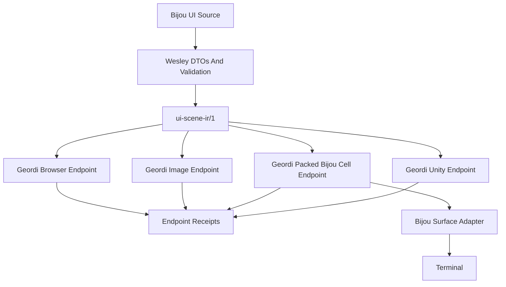
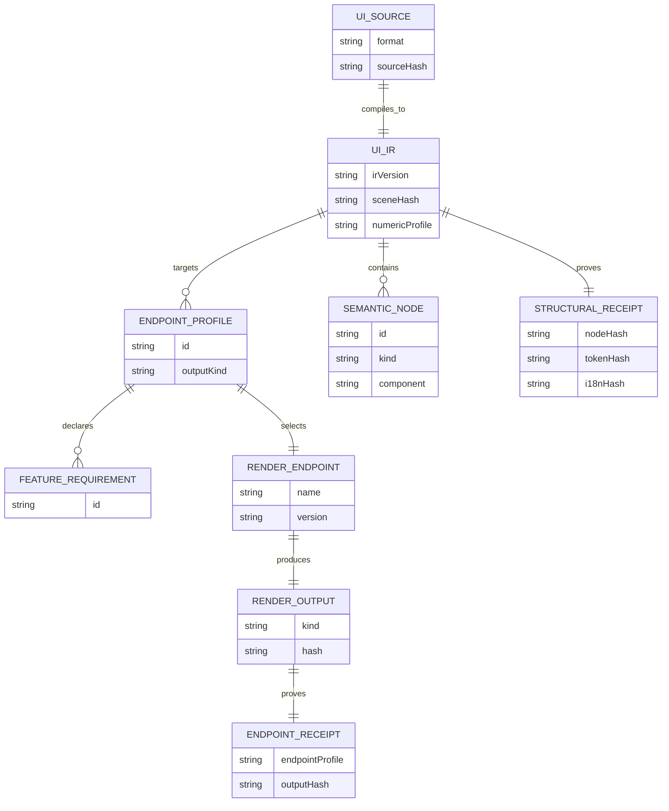

# Portable Bijou UI Render Endpoints

**Status**: Proposed
**Date**: 2026-06-10
**Companion Bijou design**:
`docs/design/DX-043-portable-bijou-blocks-and-multi-endpoint-ir.md` in the
Bijou repository.

This document records the Geordi-side implications of Bijou blocks and
components becoming a portable UI source-of-truth that can render through many
endpoints. It builds on the current render-everywhere doctrine in
[`../render-everywhere.md`](../render-everywhere.md) and the end-to-end compiler
walkthrough in [`../end-to-end.md`](../end-to-end.md).

It is a planning document only. It does not claim Geordi currently supports
Bijou UI IR, WebGPU parity, packed Bijou cells, Unity output, Figma import, or
browser Dogfood rendering.

## Decision Summary

Geordi should treat Bijou UI IR as a renderable semantic contract, not as a
terminal-only artifact.

The mature pipeline should allow:

```text
Bijou Blocks + Components GraphQL
  -> Wesley validation and generated DTOs
    -> ui-scene-ir/1
      -> Geordi browser endpoint
      -> Geordi image or video witness endpoint
      -> Geordi packed Bijou cell endpoint
      -> future GeordiUnityGameEngine endpoint
      -> Bijou terminal endpoint through Bijou-owned lowering
```

The reverse direction should also be possible for visual surfaces:

```text
Figma or external design source
  -> Geordi IR or compatible scene IR
    -> BijouPackedCellRenderer
      -> PackedBijouCells
        -> Bijou Surface
          -> terminal cells
```

The Geordi-side claim is not that every endpoint produces identical pixels or
cells. The claim is that every endpoint consumes explicit artifacts, declares
feature support, fails loudly before drawing unsupported features, and emits
receipts that make the render path inspectable.

## Sponsored Human

A developer wants one semantic UI source to produce browser previews, terminal
views, image/video witnesses, and future engine UI without hand-maintaining
parallel render intent for every platform.

## Sponsored Agent

An agent wants Geordi endpoint receipts that connect rendered pixels, packed
cells, or engine objects back to the same source node IDs, theme tokens,
localization keys, actions, bindings, and feature requirements.

## Hill

Geordi can consume a Bijou-owned UI scene IR and render it through at least two
endpoint profiles, with receipts proving that each endpoint consumed the same
semantic artifact and either supported or rejected every declared feature before
drawing.

## Relationship To Current Geordi Doctrine

The current render-everywhere proof is intentionally narrow:

```text
one canonical Geordi IR artifact
  -> browser canvas harness
  -> native Rust harness
  -> same artifact hash
  -> same rectangle pixel probes
```

That proof established the laws this design should reuse:

- runtimes consume explicit artifacts
- artifacts carry version, numeric profile, and feature requirements
- renderers fail loudly before drawing unsupported features
- receipts record deterministic provenance
- fixtures are shared across endpoints
- proof grows one supported feature subset at a time

Portable Bijou UI should follow the same law. The first proof should be small,
fixture-backed, and strict about claims and nonclaims.

## Ownership Boundaries

| Project | Owns | Does Not Own |
| --- | --- | --- |
| Bijou | Block/component semantics, terminal runtime behavior, `Surface`, cell semantics, focus/key/action contracts, localization and token usage contracts. | Browser renderer internals, GPU dispatch, image/video export, Unity scene adapters. |
| Geordi | Render endpoints, endpoint preparation, feature profiles, render fixtures, receipts, pixel probes, image/video witnesses, packed-cell renderer implementation. | Bijou component meaning, terminal input routing, app state authority. |
| Wesley | Schema validation, generated DTOs, drift checks, compile-time contract law. | Rendering, terminal presentation, GPU scheduling. |
| Bunny | Math, geometry, optics, primitive graphics contracts. | UI semantics, Geordi receipts, Bijou cell behavior. |
| Apps | Dogfood, jedit, or other product-specific source and wiring. | Reusable renderer contracts. |

The important rule:

```text
Geordi may render Bijou UI.
Geordi must not redefine what a Bijou component means.
```

## Target Endpoint Model

Geordi should distinguish endpoint profiles from semantic source profiles.

```text
source profile:
  bijou-ui.graphql
  geordi-scene3d.graphql
  figma-import/1

semantic artifact:
  ui-scene-ir/1
  geordi-ir/1
  geordi-scene3d-ir/1

endpoint profile:
  geordi-browser/1
  geordi-webgl/1
  geordi-webgpu/1
  geordi-image/1
  geordi-packed-bijou-cells/1
  geordi-unity/1
```

An endpoint profile must declare:

- supported IR versions
- supported numeric profiles
- supported feature requirements
- output kind
- target dimensions or sizing policy
- color profile
- text/glyph policy
- receipt shape
- failure behavior

## Endpoint Diagram



## Packed Bijou Cell Target

The packed-cell endpoint is the most interesting near-term Geordi/Bijou bridge
because it makes terminal cells a native render target.

The slow path is:

```text
GPU renders large RGBA frame
  -> CPU reads back image
    -> CPU samples image into terminal glyphs
      -> Bijou Surface
```

The intended live path is:

```text
Geordi renderer
  -> CPU, WASM, WebGPU, or native GPU backend
    -> PackedBijouCells
      -> Bijou Surface adapter
        -> terminal
```

For a GPU backend, the work distribution can be:

```text
for each terminal cell:
  sample or shade the cell's coverage grid
  resolve glyph or Braille dot mask
  choose foreground/background/style
  write one packed cell
```

The readback target becomes:

```text
cellCount * packedCellSize
```

not:

```text
pixelWidth * pixelHeight * 4
```

This is a real render target, not a post-processed screenshot.

## Packed Cell Contract

The initial target should be explicit and boring:

```ts
type PackedBijouCellTarget = {
  targetVersion: 'packed-bijou-cells/1';
  widthCells: number;
  heightCells: number;
  cellFormatId: string;
  sampleGrid: '1x1' | '2x4' | 'custom';
  sampleGridHash: string;
  colorPolicyId: string;
  glyphResolvePolicyId: string;
  cells: PackedBijouCell[];
  facts: RenderFrameFacts;
};

type PackedBijouCell = {
  char: string;
  fg?: Rgb;
  bg?: Rgb;
  modifiers?: string[];
  provenanceNodeId?: string;
  tokenRefs?: {
    fg?: string;
    bg?: string;
  };
};
```

The packed-cell format should be owned by Bijou or by a tiny shared
Geordi-Bijou contract package. Geordi can implement renderers that emit it, but
Geordi should not silently define Bijou cell semantics.

## Feature Profiles And Fail-Loud Rendering

Geordi's existing feature-profile law applies directly.

A Bijou UI artifact might require:

```text
bijou-ui/core/1
bijou-ui.layout.intent/1
bijou-ui.actions/1
bijou-ui.focus.graph/1
bijou-ui.i18n.refs/1
bijou-ui.theme.tokens/1
bijou-ui.markdown/1
bijou-ui.viewport.scroll/1
```

A browser endpoint may support most visual features but reject terminal-only
input features. A packed-cell endpoint may support visual output but reject
host-specific browser accessibility features. A Unity endpoint may support
layout and actions but reject terminal viewport semantics.

Correct behavior:

```text
read artifact requirements
compare against endpoint profile
if unsupported:
  fail before drawing
else:
  render and emit receipt
```

Incorrect behavior:

```text
drop unsupported focus/action/locale/token requirements
draw something plausible
claim success
```

## Receipts

Geordi should emit endpoint receipts that pair with Bijou structural receipts.

The shared structural receipt answers:

```text
Did endpoints consume the same semantic scene?
```

Endpoint receipts answer:

```text
What did this endpoint draw or produce?
```

Example:

```ts
type GeordiUiEndpointReceipt = {
  sourceHash: string;
  sceneHash: string;
  endpointProfile: string;
  endpointVersion: string;
  supportedRequirementsHash: string;
  consumedRequirements: string[];
  rejectedRequirements: string[];
  outputKind: 'canvas' | 'image' | 'packed-bijou-cells' | 'engine-scene';
  outputHash: string;
  sourceMapHash: string;
  probePolicyHash?: string;
  frameFactsHash?: string;
};
```

This is the debugging win for agents. An agent can inspect source maps,
requirements, output hashes, and target facts instead of guessing from
screenshots.

## Dogfood Render Everywhere Proof

Dogfood should become the flagship cross-endpoint proof:

```text
Dogfood source
  -> Dogfood UI IR
    -> Dogfood terminal endpoint
    -> Dogfood browser endpoint
    -> structural receipts
```

Geordi's role in this proof is not to own Dogfood behavior. Geordi should own a
browser or visual endpoint that can render the same semantic Dogfood pane or
page and emit a receipt.

The first Dogfood proof should be narrow:

- one nav pane or content pane
- one fixed viewport
- one locale
- one theme mode
- one endpoint receipt
- one structural receipt
- one negative fixture for unsupported features

## External Visual Sources

The reverse direction is also valuable:

```text
Figma
  -> Geordi import adapter
    -> Geordi IR or compatible scene IR
      -> BijouPackedCellRenderer
        -> terminal preview
```

This starts as visual portability, not interactive portability.

Visual import can preserve:

- frames
- groups
- rectangles
- text outlines or prepared glyph runs
- images
- colors
- approximate layout

Interactive import needs semantic enrichment:

- focusability
- actions
- state bindings
- localization keys
- theme token mapping
- scroll regions
- accessibility labels

The receipt should state which tier was proven.

## Future Engine Endpoint

The same endpoint model can support:

```text
Bijou Blocks -> IR -> GeordiUnityGameEngine
```

That endpoint would not be a terminal or browser renderer. It would lower
semantic UI nodes into an engine-native scene or UI graph while preserving node
identity, tokens, actions, and source maps.

The useful product claim is:

```text
Bijou-authored UI can drive game-engine UI when an engine endpoint supports the
declared target profile.
```

The nonclaim is:

```text
Unity output is automatically behavior-identical to terminal output.
```

Behavioral parity needs explicit input, focus, event, and state-loop contracts.

## Data Model



## Scope

The first Geordi-side implementation arc should include:

- one endpoint profile vocabulary draft
- one fixture that consumes a small Bijou UI IR artifact
- one browser visual endpoint or endpoint stub
- one packed-cell target schema fixture
- one endpoint receipt fixture
- one unsupported-feature failure fixture

## Non-Goals

The first arc should not:

- migrate Dogfood wholesale
- implement WebGPU
- implement Unity
- implement Figma import
- claim terminal/browser pixel parity
- make Geordi own Bijou component semantics
- make packed-cell output the only terminal path
- require GPU acceleration before a CPU reference exists

## Acceptance Criteria

- Geordi documents Bijou UI as a renderable semantic contract.
- Endpoint profiles distinguish browser, image, packed-cell, and future engine
  outputs.
- Unsupported requirements fail before drawing.
- Packed Bijou cells are named as a first-class render target.
- Receipts connect endpoint output back to source hash, scene hash, target
  profile, and feature requirements.
- Dogfood terminal/browser parity is named as the flagship proof.
- External visual import to terminal is classified as visual portability before
  interactive portability.

## Slice Plan

1. Land this design and the Bijou companion design.
2. Add endpoint profile vocabulary for `geordi-packed-bijou-cells/1`.
3. Add a packed-cell schema fixture.
4. Add a CPU reference packed-cell resolver for a tiny visual fixture.
5. Add a Bijou Surface adapter fixture or cross-repo contract stub.
6. Add endpoint receipt shape and canonical JSON rules.
7. Add unsupported feature failure fixture.
8. Add a Dogfood one-pane endpoint proof plan.
9. Add a browser endpoint stub for the same Dogfood pane.
10. Add future WebGPU packed-cell equivalence plan.

## Validation Plan

Initial documentation validation:

```bash
pnpm test:docs
git diff --check
```

Future implementation validation should look like:

```bash
pnpm test:render-everywhere:bijou-ui
pnpm test:render-everywhere:packed-cells
pnpm --filter @flyingrobots/geordi-gpvue test
cargo test -p geordi-ir
```

The first executable proof should compare hashes and receipts, not screenshots.

## Risks

### Risk: Endpoint Sprawl

Many endpoint names can dilute the first proof.

Mitigation: keep the first proof to browser and packed-cell fixtures.

### Risk: Packed Cells Duplicate Bijou Internals

A renderer target can accidentally copy private Bijou implementation details.

Mitigation: define a small public packed-cell contract with Bijou participation.

### Risk: Visual Import Overclaims Interactivity

Figma-to-terminal can prove visual approximation before it proves real app
behavior.

Mitigation: receipts must state visual, semantic, or interactive tier.

### Risk: GPU Becomes Semantic Truth

GPU output can be fast but should not define correctness.

Mitigation: CPU reference semantics and deterministic receipts remain the first
truth. GPU backends prove equivalence to the named reference under explicit
precision and readback policies.

## Recommended Next Step

Do not start with all endpoints. Start with one shared fixture:

```text
one tiny Bijou UI IR scene
  -> Geordi endpoint profile check
    -> browser visual witness
    -> packed-cell schema witness
    -> endpoint receipts
```

That keeps the work aligned with Geordi's render-everywhere law: one
deterministic artifact, explicit feature requirements, fail-loud rendering, and
small proofs that can grow one feature at a time.
