# End-to-End

This document explains Geordi from source input to rendered pixels. It assumes the reader has not seen this repository before.

Geordi is a deterministic scene pipeline. It takes an authoring representation, lowers that input into a canonical scene artifact, validates the artifact against explicit version and feature contracts, then renders the same artifact in different runtimes.

The important distinction is that Geordi is not a UI framework. It is a portable rendering contract. Frameworks and tools can compile into it. Runtimes can consume it. The contract between those two sides is `scene.geordi.json`.

## Current Status

The repository currently has three paths that are intentionally converging:

1. The compiler path:
   GraphQL SDL, or canonical AST JSON, is parsed into a canonical AST and emitted as Geordi IR.

2. The render-everywhere path:
   A shared rectangle-only fixture renders in a browser canvas and in a native Rust application,
   then both paths check deterministic pixel probes.

3. The mesh render-everywhere path:
   A checked-in Stanford bunny PLY asset is validated by hash, parsed in TypeScript and Rust,
   rendered as a wireframe in browser and native harnesses, and sampled at deterministic rotation
   frames.

The broader GPVue SDK is still planned. A constrained GPVue fixture compiler exists for the current
rectangle proof, while the bunny proof is intentionally asset-driven rather than core IR-driven.
That separation is important: the bunny path is proving asset identity, mesh parsing, camera,
projection, and playback law without pretending Geordi has a general mesh IR yet.

The rectangle proof follows this path:

```text
GPVue source
-> Geordi compiler
-> one canonical scene.geordi.json artifact
-> browser canvas render
-> native Rust render
-> same artifact hash
-> same runtime feature profile
-> same exact pixel probes
```

The bunny proof follows this path:

```text
Stanford bunny PLY bytes
-> bunny.mesh.json
-> bunny.fixture.json
-> TypeScript and Rust mesh parsers
-> deterministic fixed-rate playback frame
-> browser canvas wireframe render
-> native Rust wireframe render
-> same asset hash
-> same parsed mesh counts and bounds
-> same sampled-frame report
```

Today, the rectangle browser/native proof uses the fixture at
`fixtures/render-everywhere/hello-panel/scene.geordi.json`. The bunny proof uses the asset bundle at
`fixtures/render-everywhere/assets/stanford-bunny`.

## One-Screen Pipeline

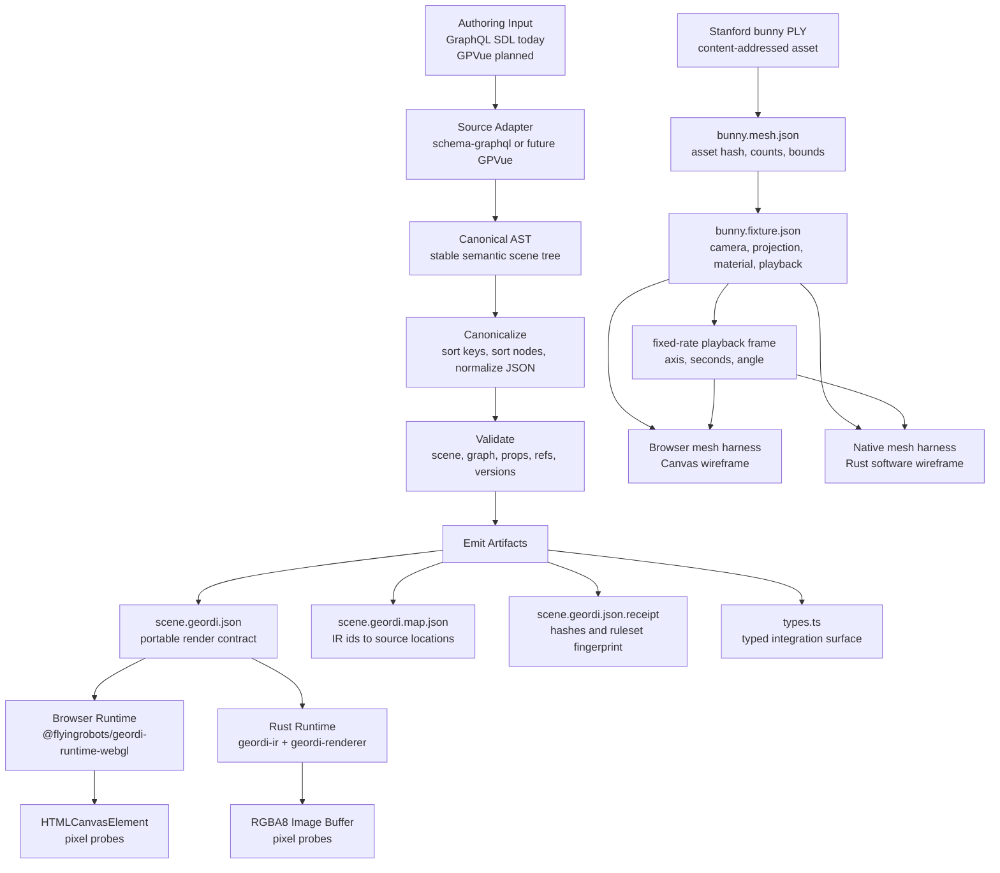
```mermaid
flowchart TD
  Author["Authoring Input<br/>GraphQL SDL today<br/>GPVue planned"]
  Adapter["Source Adapter<br/>schema-graphql or future GPVue"]
  Ast["Canonical AST<br/>stable semantic scene tree"]
  Normalize["Canonicalize<br/>sort keys, sort nodes, normalize JSON"]
  Validate["Validate<br/>scene, graph, props, refs, versions"]
  Emit["Emit Artifacts"]
  Ir["scene.geordi.json<br/>portable render contract"]
  SourceMap["scene.geordi.map.json<br/>IR ids to source locations"]
  Receipt["scene.geordi.json.receipt<br/>hashes and ruleset fingerprint"]
  Types["types.ts<br/>typed integration surface"]
  Browser["Browser Runtime<br/>@flyingrobots/geordi-runtime-webgl"]
  Native["Rust Runtime<br/>geordi-ir + geordi-renderer"]
  Canvas["HTMLCanvasElement<br/>pixel probes"]
  Image["RGBA8 Image Buffer<br/>pixel probes"]
  MeshAsset["Stanford bunny PLY<br/>content-addressed asset"]
  MeshManifest["bunny.mesh.json<br/>asset hash, counts, bounds"]
  MeshFixture["bunny.fixture.json<br/>camera, projection, material, playback"]
  Playback["fixed-rate playback frame<br/>axis, seconds, angle"]
  BrowserMesh["Browser mesh harness<br/>Canvas wireframe"]
  NativeMesh["Native mesh harness<br/>Rust software wireframe"]

  Author --> Adapter --> Ast --> Normalize --> Validate --> Emit
  Emit --> Ir
  Emit --> SourceMap
  Emit --> Receipt
  Emit --> Types
  Ir --> Browser --> Canvas
  Ir --> Native --> Image
  MeshAsset --> MeshManifest --> MeshFixture
  MeshFixture --> Playback
  MeshFixture --> BrowserMesh
  MeshFixture --> NativeMesh
  Playback --> BrowserMesh
  Playback --> NativeMesh
```

The central promise is that downstream renderers consume explicit artifacts with explicit contracts.
For the rectangle proof, the artifact is Geordi IR. For the bunny proof, the artifacts are a mesh
asset manifest plus a mesh fixture descriptor. The fixture descriptor owns the render intent: camera,
projection, material colors, and fixed-rate playback. A renderer may have a smaller feature profile
than an artifact requires. If a renderer does not support a required feature, it must fail loudly
before drawing.

## Vocabulary

`GraphQL SDL`
: A source authoring format supported today. Geordi directives like `@geordi_scene` and
  `@geordi_node` describe scene metadata and render nodes.

`Canonical AST`
: The compiler's normalized semantic model. It is still close to source intent and may contain
  source references. It is the compiler's internal domain object.

`Geordi IR`
: The portable artifact emitted as `scene.geordi.json`. Runtimes consume this. It declares an IR
  version, numeric profile, required feature set, scene metadata, and ordered nodes.

`Runtime Profile`
: The capabilities a renderer supports. For example, the browser runtime supports the baseline
  TypeScript feature set. The Rust MVP supports a smaller rectangle-only subset.

`Render Fixture`
: A test/demo bundle containing a manifest, IR artifact, receipt, and pixel probes. Fixtures are
  used to prove that a renderer draws expected pixels.

`Mesh Asset Manifest`
: A content-addressed description of a mesh asset. The bunny manifest records asset path, SHA-256,
  format, mesh profile, vertex count, face count, bounds, source, attribution, and vertex property
  names.

`Playback Frame`
: A deterministic sample of an otherwise live presentation. For the bunny proof, a frame index maps
  to seconds, rotation angle, authored axis, normalized axis, sample rate, and transform profile.

`Pixel Probe`
: A deterministic assertion that pixel `(x, y)` must equal exact RGBA bytes. Pixel probes are the
  first practical "same scene, same output" proof.

## Source Input: GraphQL SDL

The current source adapter is `@flyingrobots/geordi-schema-graphql`. It lets a GraphQL schema carry
scene declarations through directives.

Example:

```graphql
type Terminal @geordi_scene(v: "1", width: 800, height: 600) {
  bg: String
    @geordi_node(
      kind: Rect
      x: 0
      y: 0
      width: 800
      height: 600
      props: "{\"fill\":\"#1a1a1a\"}"
    )

  title: String
    @geordi_node(
      kind: Text
      x: 20
      y: 10
      props: "{\"content\":\"Terminal v0.3\",\"color\":\"#00ff00\"}"
    )
}
```

This is not meant to be the final human-friendly authoring surface. It is a practical adapter for
proving the compiler path. GPVue is expected to become the first richer application authoring
surface.

The GraphQL adapter does four things:

1. Parses SDL into a GraphQL `DocumentNode`.
2. Finds exactly one type marked with `@geordi_scene`.
3. Extracts fields marked with `@geordi_node`.
4. Converts extracted scene and node records into the canonical AST.

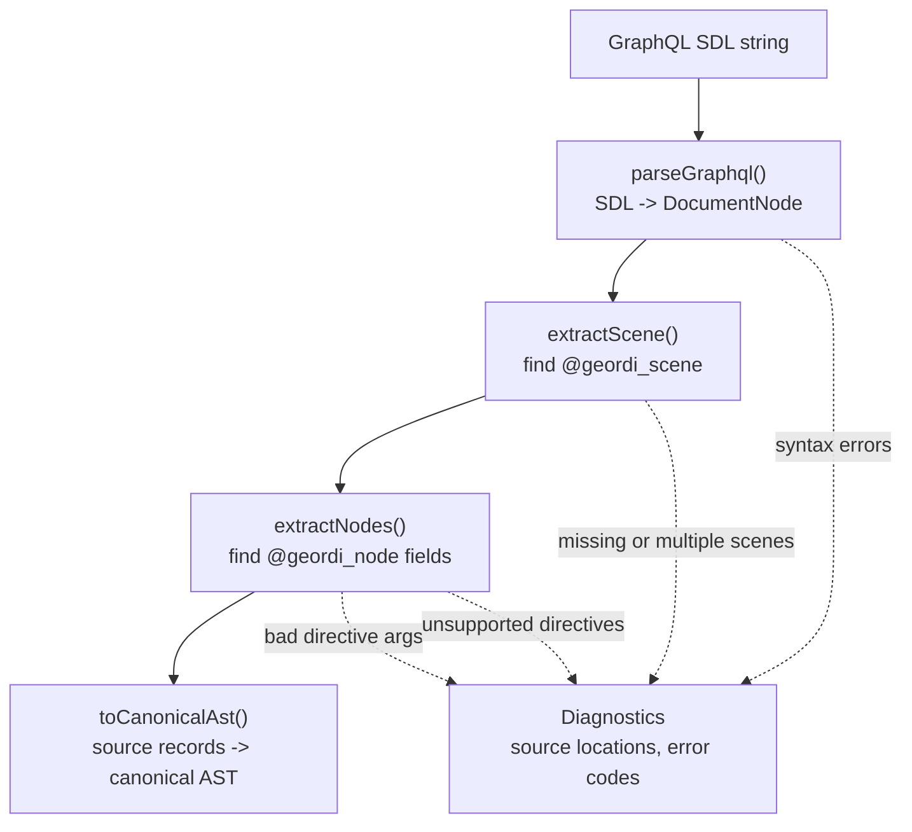
```mermaid
flowchart TD
  Sdl["GraphQL SDL string"]
  Parse["parseGraphql()<br/>SDL -> DocumentNode"]
  Scene["extractScene()<br/>find @geordi_scene"]
  Nodes["extractNodes()<br/>find @geordi_node fields"]
  Transform["toCanonicalAst()<br/>source records -> canonical AST"]
  Diagnostics["Diagnostics<br/>source locations, error codes"]

  Sdl --> Parse --> Scene --> Nodes --> Transform
  Parse -. syntax errors .-> Diagnostics
  Scene -. missing or multiple scenes .-> Diagnostics
  Nodes -. bad directive args .-> Diagnostics
  Nodes -. unsupported directives .-> Diagnostics
```

### Why GraphQL Is Behind a Port

`@flyingrobots/geordi-compiler-core` does not import the GraphQL adapter directly. Instead,
`parseInputToCanonicalAst()` accepts an optional `graphqlToCanonicalAst` dependency.

That shape matters because the compiler core is supposed to be the pure domain layer. It knows what a
canonical AST is. It knows how to validate and emit artifacts. It does not need to know how GraphQL,
GPVue, Figma, or another source adapter works.

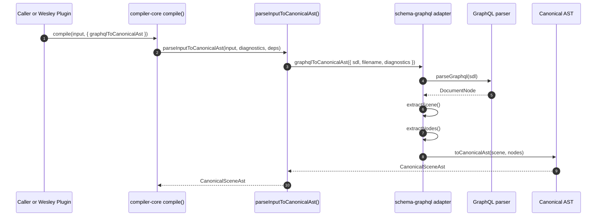
```mermaid
sequenceDiagram
  autonumber
  participant Caller as Caller or Wesley Plugin
  participant Core as compiler-core compile()
  participant Parse as parseInputToCanonicalAst()
  participant Gql as schema-graphql adapter
  participant GraphQL as GraphQL parser
  participant Ast as Canonical AST

  Caller->>Core: compile(input, { graphqlToCanonicalAst })
  Core->>Parse: parseInputToCanonicalAst(input, diagnostics, deps)
  Parse->>Gql: graphqlToCanonicalAst({ sdl, filename, diagnostics })
  Gql->>GraphQL: parseGraphql(sdl)
  GraphQL-->>Gql: DocumentNode
  Gql->>Gql: extractScene()
  Gql->>Gql: extractNodes()
  Gql->>Ast: toCanonicalAst(scene, nodes)
  Ast-->>Parse: CanonicalSceneAst
  Parse-->>Core: CanonicalSceneAst
```

The adapter boundary is what lets GPVue become another source adapter later without turning the
compiler core into a pile of framework-specific code.

## Compiler Core

The compiler core currently lives in `packages/compiler-core`. Its main orchestration entrypoint is
`compile()`.

At a high level:

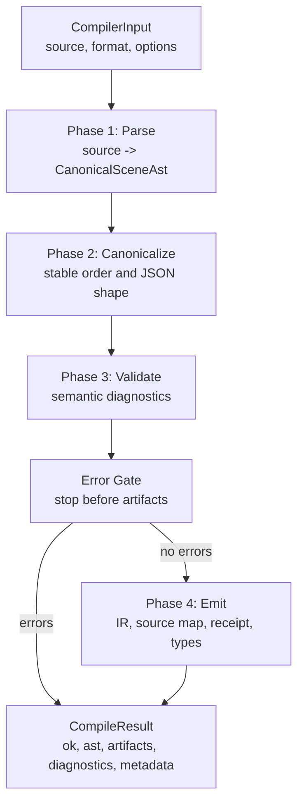
```mermaid
flowchart TD
  Input["CompilerInput<br/>source, format, options"]
  Parse["Phase 1: Parse<br/>source -> CanonicalSceneAst"]
  Canon["Phase 2: Canonicalize<br/>stable order and JSON shape"]
  Validate["Phase 3: Validate<br/>semantic diagnostics"]
  Gate["Error Gate<br/>stop before artifacts"]
  Emit["Phase 4: Emit<br/>IR, source map, receipt, types"]
  Result["CompileResult<br/>ok, ast, artifacts, diagnostics, metadata"]

  Input --> Parse --> Canon --> Validate --> Gate
  Gate -->|"errors"| Result
  Gate -->|"no errors"| Emit --> Result
```

### Compiler Input

The compiler accepts two source formats today:

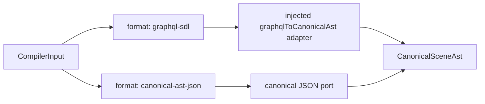
```mermaid
flowchart LR
  Input["CompilerInput"]
  Graphql["format: graphql-sdl"]
  CanonJson["format: canonical-ast-json"]
  GqlAdapter["injected graphqlToCanonicalAst adapter"]
  JsonPort["canonical JSON port"]
  Ast["CanonicalSceneAst"]

  Input --> Graphql --> GqlAdapter --> Ast
  Input --> CanonJson --> JsonPort --> Ast
```

`graphql-sdl` requires the GraphQL adapter dependency. `canonical-ast-json` is parsed directly by
the compiler JSON port.

### Canonical AST

The canonical AST is the compiler's stable semantic model.

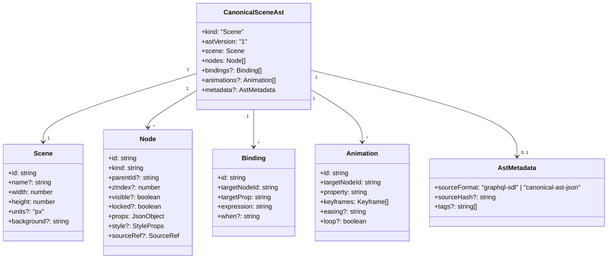
```mermaid
classDiagram
  class CanonicalSceneAst {
    +kind: "Scene"
    +astVersion: "1"
    +scene: Scene
    +nodes: Node[]
    +bindings?: Binding[]
    +animations?: Animation[]
    +metadata?: AstMetadata
  }

  class Scene {
    +id: string
    +name?: string
    +width: number
    +height: number
    +units?: "px"
    +background?: string
  }

  class Node {
    +id: string
    +kind: string
    +parentId?: string
    +zIndex?: number
    +visible?: boolean
    +locked?: boolean
    +props: JsonObject
    +style?: StyleProps
    +sourceRef?: SourceRef
  }

  class Binding {
    +id: string
    +targetNodeId: string
    +targetProp: string
    +expression: string
    +when?: string
  }

  class Animation {
    +id: string
    +targetNodeId: string
    +property: string
    +keyframes: Keyframe[]
    +easing?: string
    +loop?: boolean
  }

  class AstMetadata {
    +sourceFormat: "graphql-sdl" | "canonical-ast-json"
    +sourceHash?: string
    +tags?: string[]
  }

  CanonicalSceneAst "1" --> "1" Scene
  CanonicalSceneAst "1" --> "*" Node
  CanonicalSceneAst "1" --> "*" Binding
  CanonicalSceneAst "1" --> "*" Animation
  CanonicalSceneAst "1" --> "0..1" AstMetadata
```

The canonical AST is not yet the final render artifact. It can still carry things that are useful to
compiler tooling, such as `sourceRef`. Emitters strip or transform that data before runtime.

### Canonicalization

Canonicalization is where Geordi starts taking determinism seriously.

The compiler normalizes object keys and JSON values through the canonical JSON port. It also sorts
nodes, bindings, and animations in deterministic order. For nodes, the normalizer sorts by:

1. `zIndex`, with missing or non-finite values treated as `0` for sorting.
2. `kind`, using bytewise string comparison.
3. `id`, using bytewise string comparison.

This step is not about visual draw order yet. It is about ensuring semantically equivalent source
inputs settle into the same compiler domain representation.

### Validation

Validation returns diagnostics. User-facing compile problems do not throw. They are collected and
returned in `CompileResult.diagnostics`.

The current canonical AST validation rules are:

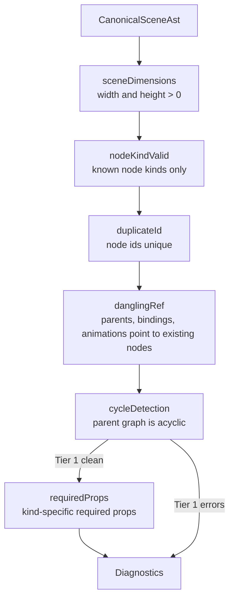
```mermaid
flowchart TD
  Ast["CanonicalSceneAst"]
  Dims["sceneDimensions<br/>width and height > 0"]
  Kind["nodeKindValid<br/>known node kinds only"]
  Dup["duplicateId<br/>node ids unique"]
  Ref["danglingRef<br/>parents, bindings, animations point to existing nodes"]
  Cycle["cycleDetection<br/>parent graph is acyclic"]
  Props["requiredProps<br/>kind-specific required props"]
  Out["Diagnostics"]

  Ast --> Dims --> Kind --> Dup --> Ref --> Cycle
  Cycle -->|"Tier 1 clean"| Props --> Out
  Cycle -->|"Tier 1 errors"| Out
```

Required props include:

- `Rect`: `width`, `height`
- `Text`: `content`
- `Image`: `src`
- `Ellipse`: `rx`, `ry`
- `Line`: `x2`, `y2`
- `Path`: `d`

Unsupported features are supposed to fail before artifact emission. For example, requesting
`emit.jsonSchema` or `emit.binaryPack` currently returns a not-implemented diagnostic rather than
silently producing partial output.

## Artifact Emission

When validation passes, the compiler emits an artifact map.

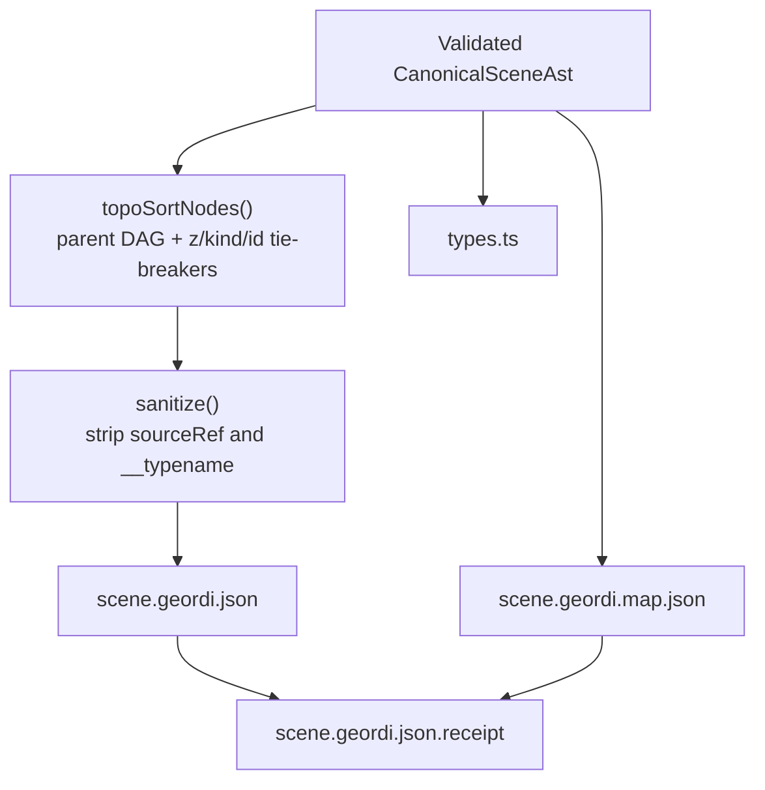
```mermaid
flowchart TD
  Ast["Validated CanonicalSceneAst"]
  Topo["topoSortNodes()<br/>parent DAG + z/kind/id tie-breakers"]
  Sanitize["sanitize()<br/>strip sourceRef and __typename"]
  IrJson["scene.geordi.json"]
  SourceMap["scene.geordi.map.json"]
  Receipt["scene.geordi.json.receipt"]
  Types["types.ts"]

  Ast --> Topo --> Sanitize --> IrJson
  Ast --> SourceMap
  IrJson --> Receipt
  SourceMap --> Receipt
  Ast --> Types
```

### `scene.geordi.json`

This is the runtime contract. A simplified rectangle fixture looks like this:

```json
{
  "irVersion": "geordi-ir/1",
  "numericProfile": "geordi-finite-binary64/1",
  "requires": [
    "geordi/core/1",
    "layout.resolved",
    "shape.rect",
    "paint.solid"
  ],
  "scene": {
    "id": "render-everywhere:hello-panel",
    "width": 640,
    "height": 360,
    "units": "px"
  },
  "nodes": [
    {
      "id": "background",
      "kind": "Rect",
      "props": {
        "x": 0,
        "y": 0,
        "width": 640,
        "height": 360,
        "fill": "#101820"
      }
    }
  ]
}
```

A renderer should not guess what version or features an artifact needs. It reads the `irVersion`,
`numericProfile`, and `requires` list, then checks those values against its runtime profile.

### Source Map

`scene.geordi.map.json` maps emitted IR node ids back to source locations when source references are
available. This is important for developer tooling. If a runtime, validator, or visual diff reports
that node `node_...` has a problem, tooling can point back to the SDL field or future GPVue source
span that produced it.

### Receipt

`scene.geordi.json.receipt` records hashes and compiler contract metadata:

- input hash
- IR hash
- source map hash
- feature requirements hash
- validation ruleset fingerprint
- IR version
- numeric profile
- comparator version
- hash algorithm

Receipts are useful because deterministic rendering requires provenance. It is not enough to say
"these pixels came from a file." The receipt says which compiler contract, feature set, and
validation rules produced that file.

## Deterministic JSON And Numbers

Geordi treats JSON as a boundary, not as an internal free-for-all.

The TypeScript JSON port:

- parses through a single `canonicalJsonPort`
- rejects invalid JSON with custom errors
- rejects non-finite numbers
- normalizes `-0` to `0`
- sorts object keys lexicographically
- omits properties whose value is `undefined`
- serializes through `JSON.stringify` after normalization

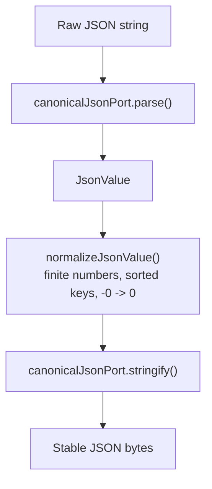
```mermaid
flowchart TD
  Raw["Raw JSON string"]
  Parse["canonicalJsonPort.parse()"]
  Valid["JsonValue"]
  Normalize["normalizeJsonValue()<br/>finite numbers, sorted keys, -0 -> 0"]
  Stringify["canonicalJsonPort.stringify()"]
  Bytes["Stable JSON bytes"]

  Raw --> Parse --> Valid --> Normalize --> Stringify --> Bytes
```

The current numeric profile is:

```text
geordi-finite-binary64/1
```

That means numbers are JSON numbers interpreted as finite IEEE-754 binary64 values. The profile does
not claim decimal fixed-point determinism, shader determinism, or cross-platform text metric
determinism. It says the IR accepts finite binary64 graphics numbers, and runtimes must validate the
subset they can draw.

The Rust MVP goes further for its rectangle renderer. It accepts parsed `f64` values but requires
scene dimensions and rectangle coordinates/sizes to be exactly representable as integer pixels before
drawing. If a value cannot be converted deterministically, it fails with a custom render error.

## Geordi IR As Entities

At runtime, `scene.geordi.json` is best understood as a small database of scene entities.

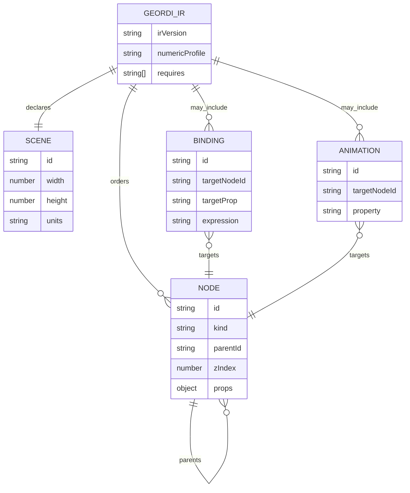
```mermaid
erDiagram
  GEORDI_IR ||--|| SCENE : declares
  GEORDI_IR ||--o{ NODE : orders
  GEORDI_IR ||--o{ BINDING : may_include
  GEORDI_IR ||--o{ ANIMATION : may_include
  NODE ||--o{ NODE : parents
  BINDING }o--|| NODE : targets
  ANIMATION }o--|| NODE : targets

  GEORDI_IR {
    string irVersion
    string numericProfile
    string[] requires
  }

  SCENE {
    string id
    number width
    number height
    string units
  }

  NODE {
    string id
    string kind
    string parentId
    number zIndex
    object props
  }

  BINDING {
    string id
    string targetNodeId
    string targetProp
    string expression
  }

  ANIMATION {
    string id
    string targetNodeId
    string property
  }
```

The order of `nodes` matters. It is the draw order for the current render-everywhere proof. Future
layout or compositing work may add more preparation phases, but they should preserve an explicit and
explainable render order.

## Feature Profiles And Fail-Loud Rendering

Feature profiles are the contract between IR and runtime. They prevent the renderer from silently
dropping unsupported behavior.

Known feature examples include:

- `geordi/core/1`
- `layout.resolved`
- `shape.rect`
- `shape.text`
- `paint.solid`
- `stroke.solid`
- `paint.opacity`
- `shape.cornerRadius`
- `text.raw-runtime-shaping`
- `text.fontPack`
- `text.glyphRuns`

The browser runtime currently supports the TypeScript baseline profile. The Rust render-everywhere
MVP supports only:

```text
geordi/core/1
layout.resolved
shape.rect
paint.solid
```

The unsupported fixture at `fixtures/render-everywhere/unsupported-strict-text` proves this rule. It
uses valid known IR requirements, including `text.fontPack`, but the current browser and Rust MVP
profiles do not support that requirement. The expected behavior is a custom unsupported-profile error
before drawing.

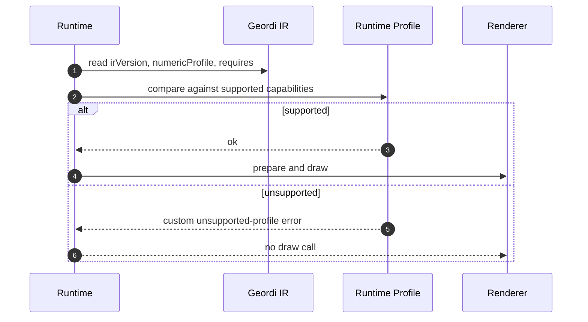
```mermaid
sequenceDiagram
  autonumber
  participant Runtime as Runtime
  participant IR as Geordi IR
  participant Profile as Runtime Profile
  participant Renderer as Renderer

  Runtime->>IR: read irVersion, numericProfile, requires
  Runtime->>Profile: compare against supported capabilities
  alt supported
    Profile-->>Runtime: ok
    Runtime->>Renderer: prepare and draw
  else unsupported
    Profile-->>Runtime: custom unsupported-profile error
    Runtime-->>Renderer: no draw call
  end
```

This is the "fail loud" rule in practice.

## Browser Rendering Path

The browser rendering path uses:

- `@flyingrobots/geordi-core` for IR validation and shared domain types
- `@flyingrobots/geordi-render-fixture` for fixture manifests and pixel probes
- `@flyingrobots/geordi-runtime-webgl` for rendering into an `HTMLCanvasElement`
- `examples/browser-render-everywhere` as the demo harness

Despite the package name, the current implementation is a Canvas 2D proof-of-concept. It prepares
Geordi IR into runtime nodes, then draws rectangles and text using a 2D canvas context. WebGL shaders
are planned later.

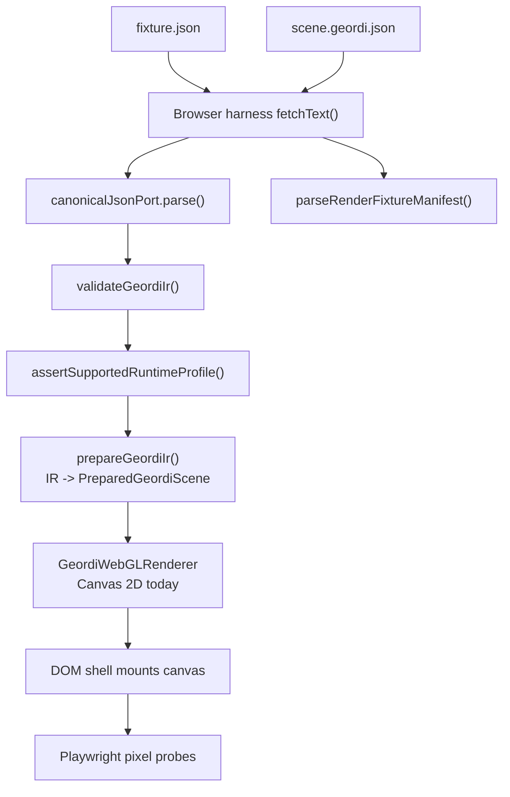
```mermaid
flowchart TD
  Manifest["fixture.json"]
  Scene["scene.geordi.json"]
  Fetch["Browser harness fetchText()"]
  Json["canonicalJsonPort.parse()"]
  ManifestParse["parseRenderFixtureManifest()"]
  IrValidate["validateGeordiIr()"]
  Profile["assertSupportedRuntimeProfile()"]
  Prepare["prepareGeordiIr()<br/>IR -> PreparedGeordiScene"]
  Canvas["GeordiWebGLRenderer<br/>Canvas 2D today"]
  Mount["DOM shell mounts canvas"]
  Probe["Playwright pixel probes"]

  Manifest --> Fetch --> ManifestParse
  Scene --> Fetch --> Json --> IrValidate --> Profile --> Prepare --> Canvas --> Mount --> Probe
```

### Browser Runtime Classes

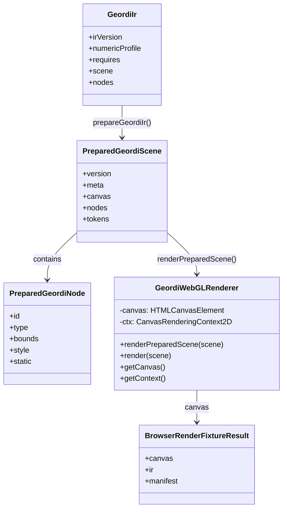
```mermaid
classDiagram
  class GeordiIr {
    +irVersion
    +numericProfile
    +requires
    +scene
    +nodes
  }

  class PreparedGeordiScene {
    +version
    +meta
    +canvas
    +nodes
    +tokens
  }

  class PreparedGeordiNode {
    +id
    +type
    +bounds
    +style
    +static
  }

  class GeordiWebGLRenderer {
    -canvas: HTMLCanvasElement
    -ctx: CanvasRenderingContext2D
    +renderPreparedScene(scene)
    +render(scene)
    +getCanvas()
    +getContext()
  }

  class BrowserRenderFixtureResult {
    +canvas
    +ir
    +manifest
  }

  GeordiIr --> PreparedGeordiScene : prepareGeordiIr()
  PreparedGeordiScene --> PreparedGeordiNode : contains
  PreparedGeordiScene --> GeordiWebGLRenderer : renderPreparedScene()
  GeordiWebGLRenderer --> BrowserRenderFixtureResult : canvas
```

### Browser Render Sequence

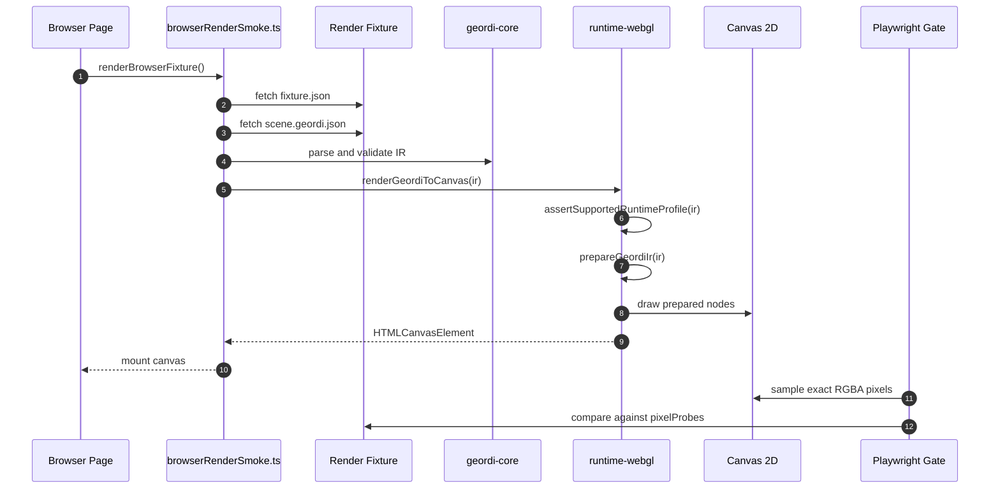
```mermaid
sequenceDiagram
  autonumber
  participant Page as Browser Page
  participant Harness as browserRenderSmoke.ts
  participant Fixture as Render Fixture
  participant Core as geordi-core
  participant Runtime as runtime-webgl
  participant Canvas as Canvas 2D
  participant Gate as Playwright Gate

  Page->>Harness: renderBrowserFixture()
  Harness->>Fixture: fetch fixture.json
  Harness->>Fixture: fetch scene.geordi.json
  Harness->>Core: parse and validate IR
  Harness->>Runtime: renderGeordiToCanvas(ir)
  Runtime->>Runtime: assertSupportedRuntimeProfile(ir)
  Runtime->>Runtime: prepareGeordiIr(ir)
  Runtime->>Canvas: draw prepared nodes
  Runtime-->>Harness: HTMLCanvasElement
  Harness-->>Page: mount canvas
  Gate->>Canvas: sample exact RGBA pixels
  Gate->>Fixture: compare against pixelProbes
```

The browser gate checks:

- the page loads
- exactly one Geordi canvas exists
- canvas dimensions match the fixture manifest
- output is nonblank
- every fixture pixel probe matches exact RGBA bytes

### Browser Bunny Mesh Path

The same browser demo can switch from the rectangle fixture to the Stanford bunny fixture. The bunny
canvas is deliberately not treated as a Geordi IR pixel-perfect proof yet. It is a mesh harness
proof:

1. Vite serves `bunny.fixture.json`, `bunny.mesh.json`, and `bun_zipper_res3.ply` as static
   assets.
2. The browser harness fetches those assets through the same fetch boundary used by the rectangle
   fixture.
3. `@flyingrobots/geordi-render-fixture` validates the mesh fixture descriptor, validates the mesh
   manifest, and parses the supported ASCII PLY subset.
4. The harness hashes the fetched PLY bytes with WebCrypto and compares the result to the manifest
   SHA-256.
5. A deterministic playback frame computes seconds, angle, authored axis, normalized axis, and
   transform profile from the descriptor playback law.
6. A Canvas 2D wireframe renderer draws the sampled frame.
7. `requestAnimationFrame` is presentation glue only. Tests use explicit frame indices.
8. The interactive page keeps the live report behind a collapsed `Bunny metadata` disclosure so the
   demo surface stays focused on the rendered mesh.

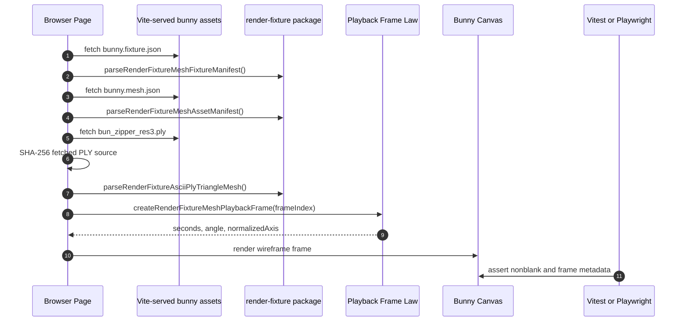
```mermaid
sequenceDiagram
  autonumber
  participant Page as Browser Page
  participant Assets as Vite-served bunny assets
  participant Fixture as render-fixture package
  participant Playback as Playback Frame Law
  participant Canvas as Bunny Canvas
  participant Gate as Vitest or Playwright

  Page->>Assets: fetch bunny.fixture.json
  Page->>Fixture: parseRenderFixtureMeshFixtureManifest()
  Page->>Assets: fetch bunny.mesh.json
  Page->>Fixture: parseRenderFixtureMeshAssetManifest()
  Page->>Assets: fetch bun_zipper_res3.ply
  Page->>Page: SHA-256 fetched PLY source
  Page->>Fixture: parseRenderFixtureAsciiPlyTriangleMesh()
  Page->>Playback: createRenderFixtureMeshPlaybackFrame(frameIndex)
  Playback-->>Page: seconds, angle, normalizedAxis
  Page->>Canvas: render wireframe frame
  Gate->>Canvas: assert nonblank and frame metadata
```

The browser bunny report contains the fields that make the native report comparable. In the
interactive harness, these fields are available under `Bunny metadata`:

```text
rendererName=browser-canvas-wireframe-mesh
fixtureId=render-everywhere:stanford-bunny
frame=0
seconds=0
angleRadians=0
normalizedAxis=0.4866642633922876,0.8111071056538126,0.32444284226152503
transformProfile=geordi-fixed-rate-rotation/1
vertices=1889
faces=3851
assetHash=sha256:975e7f9b160b4ea15b0e225e21b10828ebcf678df020d2f6a46aa408fdcf5cd6
```

## Native Rust Rendering Path

The Rust path uses:

- `crates/geordi-ir` for typed IR loading and validation
- `crates/geordi-renderer` for runtime profile checks and rectangle rendering
- `crates/geordi-mesh` for bunny asset hashing and ASCII PLY parsing
- `examples/native-render-everywhere` as the native app harness
- `minifb` for the native window shell

The Rust IR renderer is deliberately narrower than the TypeScript IR. It is rectangle-only so the
first native proof can be exact and explainable. The native bunny path is a separate mesh harness
inside the same example application. That separation keeps the core IR snapshot model honest while
the mesh playback law is still being proven.

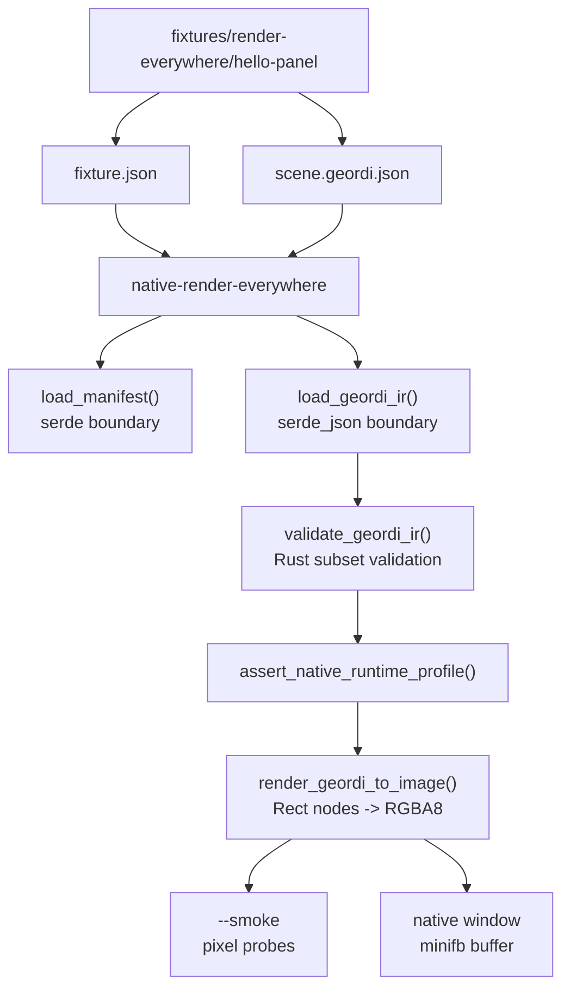
```mermaid
flowchart TD
  FixtureDir["fixtures/render-everywhere/hello-panel"]
  Manifest["fixture.json"]
  IrFile["scene.geordi.json"]
  NativeApp["native-render-everywhere"]
  ManifestLoad["load_manifest()<br/>serde boundary"]
  IrLoad["load_geordi_ir()<br/>serde_json boundary"]
  IrValidate["validate_geordi_ir()<br/>Rust subset validation"]
  Profile["assert_native_runtime_profile()"]
  Render["render_geordi_to_image()<br/>Rect nodes -> RGBA8"]
  Smoke["--smoke<br/>pixel probes"]
  Window["native window<br/>minifb buffer"]

  FixtureDir --> Manifest --> NativeApp --> ManifestLoad
  FixtureDir --> IrFile --> NativeApp --> IrLoad --> IrValidate --> Profile --> Render
  Render --> Smoke
  Render --> Window
```

### Rust Class Diagram

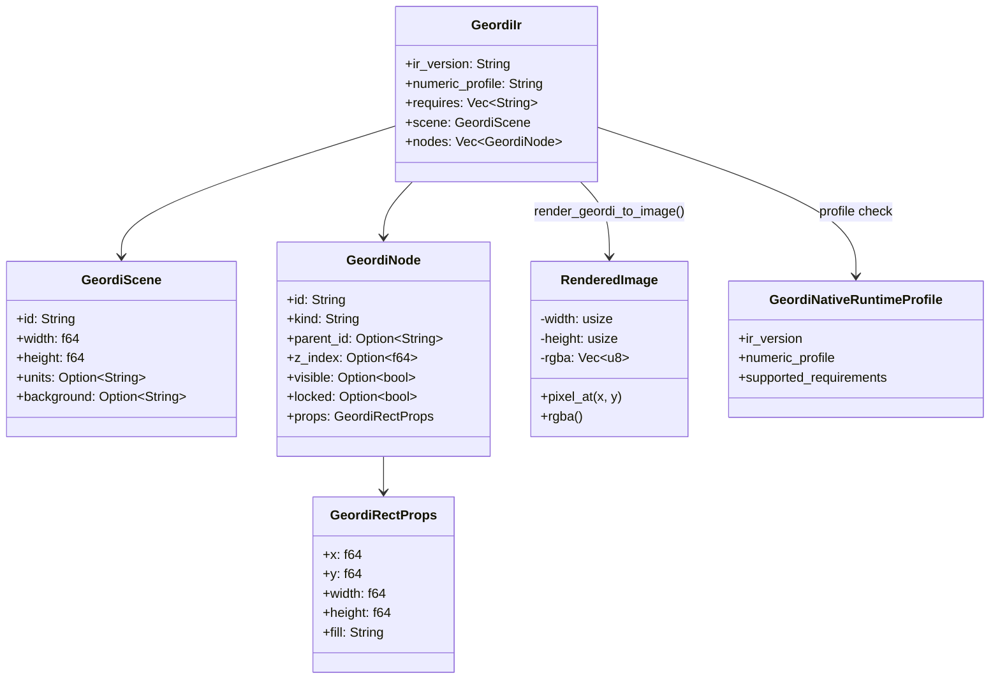
```mermaid
classDiagram
  class GeordiIr {
    +ir_version: String
    +numeric_profile: String
    +requires: Vec~String~
    +scene: GeordiScene
    +nodes: Vec~GeordiNode~
  }

  class GeordiScene {
    +id: String
    +width: f64
    +height: f64
    +units: Option~String~
    +background: Option~String~
  }

  class GeordiNode {
    +id: String
    +kind: String
    +parent_id: Option~String~
    +z_index: Option~f64~
    +visible: Option~bool~
    +locked: Option~bool~
    +props: GeordiRectProps
  }

  class GeordiRectProps {
    +x: f64
    +y: f64
    +width: f64
    +height: f64
    +fill: String
  }

  class RenderedImage {
    -width: usize
    -height: usize
    -rgba: Vec~u8~
    +pixel_at(x, y)
    +rgba()
  }

  class GeordiNativeRuntimeProfile {
    +ir_version
    +numeric_profile
    +supported_requirements
  }

  GeordiIr --> GeordiScene
  GeordiIr --> GeordiNode
  GeordiNode --> GeordiRectProps
  GeordiIr --> GeordiNativeRuntimeProfile : profile check
  GeordiIr --> RenderedImage : render_geordi_to_image()
```

### Native Sequence

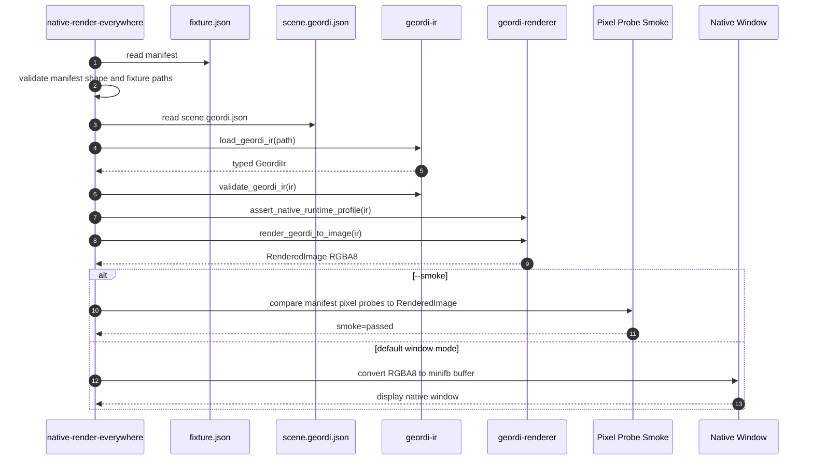
```mermaid
sequenceDiagram
  autonumber
  participant CLI as native-render-everywhere
  participant Manifest as fixture.json
  participant IR as scene.geordi.json
  participant IrCrate as geordi-ir
  participant Renderer as geordi-renderer
  participant Smoke as Pixel Probe Smoke
  participant Window as Native Window

  CLI->>Manifest: read manifest
  CLI->>CLI: validate manifest shape and fixture paths
  CLI->>IR: read scene.geordi.json
  CLI->>IrCrate: load_geordi_ir(path)
  IrCrate-->>CLI: typed GeordiIr
  CLI->>IrCrate: validate_geordi_ir(ir)
  CLI->>Renderer: assert_native_runtime_profile(ir)
  CLI->>Renderer: render_geordi_to_image(ir)
  Renderer-->>CLI: RenderedImage RGBA8
  alt --smoke
    CLI->>Smoke: compare manifest pixel probes to RenderedImage
    Smoke-->>CLI: smoke=passed
  else default window mode
    CLI->>Window: convert RGBA8 to minifb buffer
    Window-->>CLI: display native window
  end
```

The native smoke command is:

```bash
cargo run -p native-render-everywhere -- --smoke fixtures/render-everywhere/hello-panel
```

Expected success includes:

```text
smoke=passed
```

### Native Bunny Mesh Path

The native bunny path uses the same fixture descriptor, asset manifest, and PLY bytes as the browser
path. It does not load `scene.geordi.json`; it loads `bunny.fixture.json`, follows its
`assetManifestPath` to `bunny.mesh.json`, checks the PLY hash, parses the PLY through
`geordi-mesh`, computes a deterministic playback frame, and renders an RGBA8 wireframe buffer.

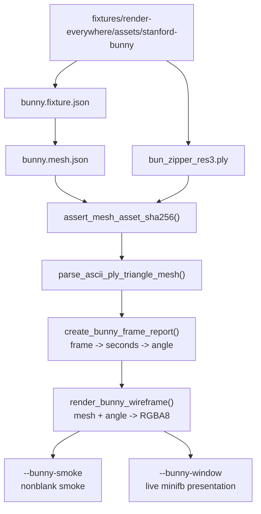
```mermaid
flowchart TD
  AssetDir["fixtures/render-everywhere/assets/stanford-bunny"]
  Fixture["bunny.fixture.json"]
  Manifest["bunny.mesh.json"]
  Ply["bun_zipper_res3.ply"]
  Hash["assert_mesh_asset_sha256()"]
  Parse["parse_ascii_ply_triangle_mesh()"]
  Frame["create_bunny_frame_report()<br/>frame -> seconds -> angle"]
  Render["render_bunny_wireframe()<br/>mesh + angle -> RGBA8"]
  Smoke["--bunny-smoke<br/>nonblank smoke"]
  Window["--bunny-window<br/>live minifb presentation"]

  AssetDir --> Fixture --> Manifest
  AssetDir --> Ply
  Manifest --> Hash
  Ply --> Hash --> Parse --> Frame --> Render
  Render --> Smoke
  Render --> Window
```

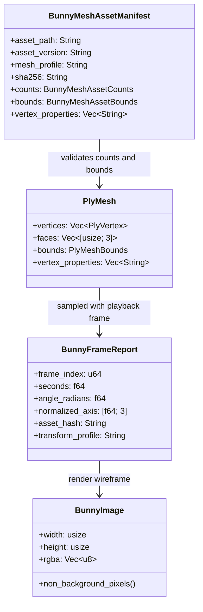
```mermaid
classDiagram
  class BunnyMeshAssetManifest {
    +asset_path: String
    +asset_version: String
    +mesh_profile: String
    +sha256: String
    +counts: BunnyMeshAssetCounts
    +bounds: BunnyMeshAssetBounds
    +vertex_properties: Vec~String~
  }

  class PlyMesh {
    +vertices: Vec~PlyVertex~
    +faces: Vec~[usize; 3]~
    +bounds: PlyMeshBounds
    +vertex_properties: Vec~String~
  }

  class BunnyFrameReport {
    +frame_index: u64
    +seconds: f64
    +angle_radians: f64
    +normalized_axis: [f64; 3]
    +asset_hash: String
    +transform_profile: String
  }

  class BunnyImage {
    +width: usize
    +height: usize
    +rgba: Vec~u8~
    +non_background_pixels()
  }

  BunnyMeshAssetManifest --> PlyMesh : validates counts and bounds
  PlyMesh --> BunnyFrameReport : sampled with playback frame
  BunnyFrameReport --> BunnyImage : render wireframe
```

The fixed-frame native smoke commands are:

```bash
cargo run -p native-render-everywhere -- --bunny-smoke fixtures/render-everywhere/assets/stanford-bunny
cargo run -p native-render-everywhere -- --bunny-smoke --frame 15 fixtures/render-everywhere/assets/stanford-bunny
cargo run -p native-render-everywhere -- --bunny-smoke --frame 60 fixtures/render-everywhere/assets/stanford-bunny
```

The live native window command is:

```bash
cargo run -p native-render-everywhere -- --bunny-window fixtures/render-everywhere/assets/stanford-bunny
```

Expected bunny smoke output includes:

```text
rendererName=rust-software-wireframe-mesh
fixtureId=render-everywhere:stanford-bunny
vertices=1889
faces=3851
frameIndex=60
seconds=1
angleRadians=0.7853981633974483
transformProfile=geordi-fixed-rate-rotation/1
smoke=passed
```

## Render Fixture Contract

Render fixtures are the bridge between "the renderer ran" and "the renderer drew the expected
pixels."

```mermaid
erDiagram
  RENDER_FIXTURE ||--|| SCENE_ARTIFACT : references
  RENDER_FIXTURE ||--|| RECEIPT : references
  RENDER_FIXTURE ||--|| RUNTIME_PROFILE : declares
  RENDER_FIXTURE ||--o{ PIXEL_PROBE : contains
  RUNTIME_PROFILE ||--o{ FEATURE_REQUIREMENT : requires

  RENDER_FIXTURE {
    string fixtureVersion
    string id
    string scenePath
    string receiptPath
    string artifactHash
  }

  SCENE_ARTIFACT {
    string path
    string irVersion
    string numericProfile
  }

  RECEIPT {
    string path
    string artifactHash
    string artifactHashAlg
  }

  RUNTIME_PROFILE {
    string irVersion
    string numericProfile
  }

  FEATURE_REQUIREMENT {
    string requirement
  }

  PIXEL_PROBE {
    string id
    number x
    number y
    number rgba
  }
```

The `hello-panel` manifest declares:

- canvas size: `640x360`
- artifact hash: SHA-256 of `scene.geordi.json`
- runtime requirements: `geordi/core/1`, `layout.resolved`, `shape.rect`, `paint.solid`
- exact pixel probes for background, panel, accent bar, title bar, button, and status indicator

The same fixture powers both:

- browser Playwright gate
- Rust `--smoke` mode

That shared contract is the first concrete proof that Geordi can render everywhere.

## Mesh Asset And Playback Contract

The bunny proof adds a second kind of fixture contract. It is not a `scene.geordi.json` render
fixture. It is a mesh asset plus a narrow playback law. The point is to prove that Geordi can carry
real graphics assets through explicit boundaries before the core IR grows a generalized mesh node.

```mermaid
erDiagram
  MESH_ASSET_MANIFEST ||--|| MESH_ASSET_BYTES : identifies
  MESH_ASSET_MANIFEST ||--|| MESH_COUNTS : declares
  MESH_ASSET_MANIFEST ||--|| MESH_BOUNDS : declares
  MESH_ASSET_MANIFEST ||--|| MESH_SOURCE : attributes
  MESH_ASSET_MANIFEST ||--o{ VERTEX_PROPERTY : declares
  MESH_PLAYBACK ||--|| PLAYBACK_AXIS : declares
  MESH_PLAYBACK ||--o{ PLAYBACK_FRAME : samples
  PLAYBACK_FRAME ||--|| FRAME_REPORT : emits

  MESH_ASSET_MANIFEST {
    string assetVersion
    string id
    string meshProfile
    string assetPath
    string sha256
    string faceProperty
  }

  MESH_ASSET_BYTES {
    string path
    string encoding
    string format
  }

  MESH_COUNTS {
    number vertices
    number faces
  }

  MESH_BOUNDS {
    number min
    number max
  }

  MESH_SOURCE {
    string url
    string retrieved
    string attribution
  }

  VERTEX_PROPERTY {
    string name
  }

  MESH_PLAYBACK {
    string kind
    number radiansPerSecond
    number sampleRate
  }

  PLAYBACK_AXIS {
    number x
    number y
    number z
  }

  PLAYBACK_FRAME {
    number frameIndex
    number seconds
    number angleRadians
  }

  FRAME_REPORT {
    string rendererName
    string assetHash
    string transformProfile
  }
```

The manifest is intentionally strict. It rejects:

- missing or malformed `sha256:` identity;
- nonlocal asset paths;
- unsupported mesh format or encoding;
- missing `x`, `y`, `z` vertex properties;
- nonpositive vertex or face counts;
- nonfinite bounds;
- zero rotation axes.

The playback law is also intentionally narrow:

```text
seconds = frameIndex / sampleRate
angleRadians = seconds * radiansPerSecond
normalizedAxis = axis / length(axis)
```

This makes frame `15` and frame `60` meaningful across runtimes. Host time is only a live
presentation source. Tests and CI use frame indices.

## End-to-End Data Model

The full pipeline has source entities, compiler entities, artifact entities, and runtime entities.

```mermaid
erDiagram
  SOURCE_DOCUMENT ||--|| CANONICAL_AST : parses_to
  CANONICAL_AST ||--o{ CANONICAL_NODE : contains
  CANONICAL_AST ||--o{ DIAGNOSTIC : validates_with
  CANONICAL_AST ||--|| IR_ARTIFACT : emits
  CANONICAL_AST ||--|| SOURCE_MAP_ARTIFACT : emits
  IR_ARTIFACT ||--|| RECEIPT_ARTIFACT : hashed_by
  SOURCE_MAP_ARTIFACT ||--|| RECEIPT_ARTIFACT : hashed_by
  IR_ARTIFACT ||--o{ RUNTIME : consumed_by
  RUNTIME ||--o{ RENDER_OUTPUT : produces
  RENDER_OUTPUT ||--o{ PIXEL_SAMPLE : sampled_by

  SOURCE_DOCUMENT {
    string format
    string filename
    string source
  }

  CANONICAL_AST {
    string astVersion
    string kind
    string sourceFormat
  }

  CANONICAL_NODE {
    string id
    string kind
    string parentId
    number zIndex
  }

  DIAGNOSTIC {
    string code
    string severity
    string message
  }

  IR_ARTIFACT {
    string path
    string irVersion
    string numericProfile
    string requires
  }

  SOURCE_MAP_ARTIFACT {
    string path
    string version
    string sourceFormat
  }

  RECEIPT_ARTIFACT {
    string path
    string irHash
    string inputHash
    string rulesetFingerprint
  }

  RUNTIME {
    string name
    string supportedProfile
  }

  RENDER_OUTPUT {
    string kind
    number width
    number height
  }

  PIXEL_SAMPLE {
    number x
    number y
    number rgba
  }
```

## Error Strategy

Geordi separates expected user problems from internal failures.

Compiler user errors become diagnostics:

- invalid SDL
- missing scene directive
- invalid directive argument type
- duplicate node id
- unsupported emit feature
- dangling parent reference
- missing required props

Runtime and boundary failures are custom error types:

- `GeordiJsonParseError`
- `GeordiJsonNonFiniteNumberError`
- `RenderFixtureInvalidManifestError`
- `RenderFixturePixelProbeError`
- `GeordiRuntimeUnsupportedProfileError`
- `GeordiRuntimeInvalidIrError`
- `GeordiIrParseError`
- `GeordiIrValidationError`
- `GeordiRenderError`
- `NativePixelProbeError`
- `RenderFixtureInvalidMeshAssetManifestError`
- `RenderFixtureInvalidPlaybackFrameError`
- `RenderFixturePlyHeaderError`
- `RenderFixturePlyVertexError`
- `RenderFixturePlyFaceError`
- `MeshAssetHashMismatchError`
- `NativeBunnyError`

The rule is that callers should see a Geordi-specific error or diagnostic, not a raw throw from a
dependency boundary.

```mermaid
flowchart TD
  Problem["Problem occurs"]
  UserInput["User/source problem?"]
  Diagnostic["Diagnostic<br/>CompileResult.ok = false"]
  Boundary["Boundary/runtime problem?"]
  CustomError["Custom Error Type"]
  Internal["Unexpected compiler fault"]
  InternalError["InternalCompilerError diagnostic"]

  Problem --> UserInput
  UserInput -->|"yes"| Diagnostic
  UserInput -->|"no"| Boundary
  Boundary -->|"yes"| CustomError
  Boundary -->|"no"| Internal --> InternalError
```

## Web And Rust Compared

```mermaid
flowchart LR
  IR["scene.geordi.json"]
  Mesh["bunny.mesh.json + bun_zipper_res3.ply"]

  subgraph Browser["Browser Runtime"]
    BValidate["validateGeordiIr()"]
    BProfile["GEORDI_WEBGL_RUNTIME_PROFILE"]
    BPrepare["prepareGeordiIr()"]
    BDraw["Canvas 2D draw calls"]
    BProbe["Playwright getImageData()"]
    BMesh["browser bunny wireframe canvas"]
  end

  subgraph Rust["Rust Runtime"]
    RLoad["load_geordi_ir()"]
    RValidate["validate_geordi_ir()"]
    RProfile["GEORDI_NATIVE_RUNTIME_PROFILE"]
    RDraw["RGBA8 software renderer"]
    RProbe["--smoke pixel_at()"]
    RMesh["native bunny wireframe buffer"]
  end

  IR --> BValidate --> BProfile --> BPrepare --> BDraw --> BProbe
  IR --> RLoad --> RValidate --> RProfile --> RDraw --> RProbe
  Mesh --> BMesh
  Mesh --> RMesh
```

They are not implemented the same way:

- Browser rectangle and bunny paths draw into `HTMLCanvasElement` instances.
- Rust rectangle and bunny paths draw into explicit RGBA8 buffers and can show them in native
  windows.
- Browser path currently supports a broader TypeScript baseline profile.
- Rust IR rendering intentionally supports a smaller rectangle-only MVP.
- The bunny path is a parallel mesh harness, not a general mesh IR runtime.

They are expected to agree on:

- IR version
- numeric profile
- required feature profile
- canvas dimensions
- artifact hash
- pixel probes for supported features
- bunny asset hash
- bunny mesh counts and bounds
- bunny sampled-frame metadata

That is platform agnosticism with a testable contract, not just a slogan. The rectangle proof uses
exact pixel probes. The bunny proof uses shared asset identity plus deterministic sampled-frame
metadata and nonblank render smoke until a cross-backend 3D raster law exists.

## What Happens In The Current Render-Everywhere Demo

The browser demo:

```bash
pnpm --filter @flyingrobots/geordi-example-browser-render-everywhere dev
```

The browser gate:

```bash
pnpm --filter @flyingrobots/geordi-example-browser-render-everywhere test:browser
```

The native smoke gate:

```bash
cargo run -p native-render-everywhere -- --smoke fixtures/render-everywhere/hello-panel
```

The native window:

```bash
cargo run -p native-render-everywhere -- fixtures/render-everywhere/hello-panel
```

The native bunny smoke gates:

```bash
cargo run -p native-render-everywhere -- --bunny-smoke fixtures/render-everywhere/assets/stanford-bunny
cargo run -p native-render-everywhere -- --bunny-smoke --frame 15 fixtures/render-everywhere/assets/stanford-bunny
cargo run -p native-render-everywhere -- --bunny-smoke --frame 60 fixtures/render-everywhere/assets/stanford-bunny
```

The native bunny live window:

```bash
cargo run -p native-render-everywhere -- --bunny-window fixtures/render-everywhere/assets/stanford-bunny
```

The shared fixture path:

```text
fixtures/render-everywhere/hello-panel
```

That folder contains:

```text
fixture.json
scene.geordi.json
scene.geordi.json.receipt
README.md
```

The bunny asset path:

```text
fixtures/render-everywhere/assets/stanford-bunny
```

That folder contains:

```text
README.md
STANFORD_RECONSTRUCTION_README.txt
bun_zipper_res3.ply
bunny.math-vectors.json
bunny.mesh.json
```

## What Is Most Interesting Architecturally

### 1. The Compiler Core Is Source-Agnostic

GraphQL is not baked into compiler-core. It is injected as a parser adapter. This is the key move
that keeps GPVue feasible. The compiler can accept a future GPVue adapter that emits the same
canonical AST shape.

### 2. IR Is A Contract, Not A Convenience Object

The IR carries its own version, numeric profile, and feature requirements. That means a renderer can
make a binary decision before drawing:

```text
I support this artifact exactly enough to render it.
```

or:

```text
I do not support this artifact, and I will fail before producing misleading pixels.
```

### 3. Determinism Starts Before Rendering

Rendering determinism is impossible if compilation emits unstable bytes. Geordi therefore
canonicalizes JSON, sorts nodes, hashes artifacts, and records receipts before any runtime sees the
scene.

### 4. Pixel Probes Are The First Cross-Runtime Oracle

Pixel-perfect rendering for every feature is a large target. The current strategy starts with exact
probes for a tiny feature subset. That is the right shape: grow the proof surface one supported
feature at a time.

### 5. Rust Is A Second Runtime, Not A Translation Layer

The Rust renderer does not call the browser renderer. It loads the same IR artifact independently,
validates it independently, and renders pixels independently. That is what makes it a meaningful
platform-agnostic proof.

### 6. Mesh Assets Are Boundary Contracts

The bunny work is valuable because it proves a different kind of determinism. The renderer is no
longer drawing only hand-authored rectangles. It is consuming a real asset with a source, a content
hash, a declared mesh profile, parsed numeric data, bounds, camera assumptions, projection
assumptions, and fixed-rate playback metadata. Every one of those facts crosses a boundary, and each
boundary either validates or fails loudly.

## Current Limitations

The current repo does not yet claim:

- a general GPVue application SDK
- full browser/native parity for text
- deterministic font shaping
- binary `.geordi` packing
- WebGPU, Metal, Vulkan, or wgpu rendering
- GPU shader parity
- full CSS layout semantics
- general runtime animation semantics
- pixel-identical 3D rasterization across browser and native backends
- general mesh nodes inside core Geordi IR

The current repo does claim:

- GraphQL SDL to canonical AST
- canonical AST validation
- deterministic JSON emission
- explicit IR version and numeric profile
- explicit feature requirements
- browser canvas rendering for supported baseline features
- native Rust rectangle rendering for the render-everywhere MVP subset
- exact browser pixel probes for the shared fixture
- exact Rust offscreen pixel probes for the shared fixture
- Stanford bunny asset identity by SHA-256
- TypeScript and Rust parsing of the supported ASCII PLY triangle subset
- browser and native wireframe bunny rendering
- browser and native fixed-frame and live rotating bunny presentations
- comparable bunny frame reports for sampled frames
- nonblank smoke coverage for static and nonzero bunny frames
- loud failure for unsupported runtime requirements

## Target End State

The intended mature pipeline looks like this:

```mermaid
flowchart TD
  GPVue["GPVue Component"]
  Compile["Geordi Compiler"]
  IR["Canonical Geordi IR"]
  Pack["Binary Pack<br/>planned"]
  Web["Browser GPU Runtime"]
  Native["Native Rust GPU Runtime"]
  Inspect["Debug and Explain Tools"]
  CI["Cross-Runtime Pixel Gates"]

  GPVue --> Compile --> IR
  IR --> Pack
  IR --> Web
  IR --> Native
  IR --> Inspect
  Web --> CI
  Native --> CI
```

The key invariant should stay the same even as the source adapters and renderers grow:

```text
One deterministic artifact.
Explicit feature requirements.
Renderers either prove support or fail before drawing.
Supported feature subsets produce deterministic pixels.
```
