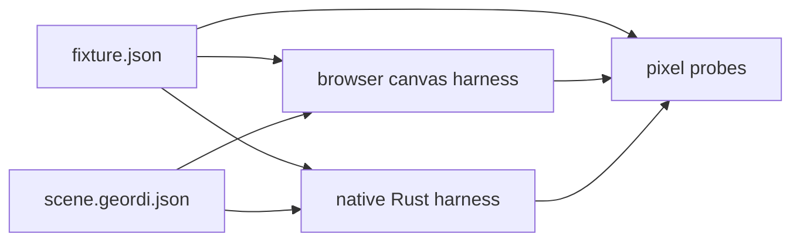

# Render Everywhere

This document is the runnable guide for the current Geordi render-everywhere proof.

The proof is intentionally narrow:

```text
one canonical Geordi IR artifact
-> browser canvas harness
-> native Rust harness
-> same artifact hash
-> same rectangle pixel probes
```

It also includes a separate mesh sanity path:

```text
one canonical Stanford bunny mesh asset
-> browser canvas wireframe harness
-> native Rust wireframe harness
-> same mesh hash
-> same fixed-rate playback metadata
-> coarse nonblank render smoke
```

It also includes the first strict text browser proof outside `geordi-ir/1`:

```text
one strict positioned glyph-run fixture
-> one content-addressed font pack
-> one fixture-local outline evidence pack
-> browser Canvas path rendering
-> metadata, probe-policy, and no-platform-text-API gates
```

The design background lives in
[`docs/design/2026-05-render-everywhere-demo.md`](./design/2026-05-render-everywhere-demo.md).
The full source-to-runtime walkthrough lives in [`docs/end-to-end.md`](./end-to-end.md).

## Current Claim

The current demo proves that the same checked-in `geordi-ir/1` artifact can be loaded by both a
browser runtime and a native Rust runtime. Both runtimes report the same fixture id, artifact hash,
IR version, numeric profile, feature requirements, and canvas dimensions. Both runtimes verify the
same exact RGBA pixel probes from the shared fixture manifest.

The bunny demo proves a different, deliberately weaker claim: both runtimes load the same checked-in
Stanford bunny PLY bytes, validate the same mesh manifest, report the same asset hash, parse the
same vertex and face counts, and compute comparable fixed-frame rotation metadata for the same
sampled frames. The bunny path is a mesh sanity proof, not a pixel-identical 3D rasterization proof.

The strict text browser demo proves another separate claim: the browser harness can load a checked-in
`geordi-strict-positioned-glyph-run/1` fixture, verify the content-addressed font pack and
fixture-local `outlinePaths` evidence, draw glyph outlines with Canvas path APIs, and prove through
tests that Canvas text APIs and `FontFace` are not used. This is not a general text-rendering claim
and it is not a `geordi-ir/1` text-node claim.

The shared fixture is:

```text
fixtures/render-everywhere/hello-panel
```

The shared scene artifact is:

```text
fixtures/render-everywhere/hello-panel/scene.geordi.json
```

The shared manifest is:

```text
fixtures/render-everywhere/hello-panel/fixture.json
```

The fixture also includes constrained GPVue source:

```text
fixtures/render-everywhere/hello-panel/source.gpvue
```

The manifest marks that source as compiler-backed by `@flyingrobots/geordi-gpvue`. The compiler can
reproduce the checked-in `scene.geordi.json`, receipt, and source map from this source. The
interactive browser and native demos consume the checked-in artifact directly. The root GPVue smoke
command compiles this source into a temporary fixture directory and points both runtime gates at the
emitted files.

Run the GPVue compiler gate:

```bash
pnpm --filter @flyingrobots/geordi-gpvue test
```

Expected result:

```text
6 passed
```

Run the full GPVue render-everywhere smoke:

```bash
pnpm test:render-everywhere:gpvue
```

This command compiles `source.gpvue` once into a temporary fixture directory, routes the browser
gate to that emitted `scene.geordi.json`, then runs the native Rust smoke gate against the same
temporary fixture directory.

The fixture currently reports:

```text
fixtureId=render-everywhere:hello-panel
artifactHash=sha256:30623d6141ba69c382c14c09eca9adedd40cb02644ff4ee9621de101da6b0082
irVersion=geordi-ir/1
numericProfile=geordi-finite-binary64/1
featureRequirements=geordi/core/1, layout.resolved, shape.rect, paint.solid
canvas=640x360
```

The shared bunny asset is:

```text
fixtures/render-everywhere/assets/stanford-bunny
```

The bunny asset manifest is:

```text
fixtures/render-everywhere/assets/stanford-bunny/bunny.mesh.json
```

The shared bunny render descriptor is:

```text
fixtures/render-everywhere/assets/stanford-bunny/bunny.fixture.json
```

Both browser and native bunny demos load this descriptor for camera, projection, material colors,
and fixed-rate rotation playback. Backend-specific harness code still owns presentation mechanics,
but it no longer owns parallel render-intent constants.

The bunny asset currently reports:

```text
fixtureId=render-everywhere:stanford-bunny
assetHash=sha256:975e7f9b160b4ea15b0e225e21b10828ebcf678df020d2f6a46aa408fdcf5cd6
meshProfile=geordi-ascii-ply-triangle-mesh/1
vertices=1889
faces=3851
transformProfile=geordi-fixed-rate-rotation/1
rotationAxis=[3,5,2]
sampledFrames=0,15,60
```

The strict text browser proof uses:

```text
fixtures/render-everywhere/strict-text/geordi.strict-text.geordi.json
fixtures/render-everywhere/strict-text/geordi.outline-evidence.geordi.json
fixtures/render-everywhere/strict-text/geordi.probe-policy.geordi.json
fixtures/render-everywhere/assets/fonts/font-pack.geordi.json
```

The browser `Text` panel currently reports:

```text
rendererName=browser-canvas-outline-glyphs
fixtureId=render-everywhere:strict-text:geordi
evidenceKind=outlinePaths
textProfile=geordi-strict-positioned-glyph-run/1
positionEncoding=geordi-fixed-26.6/1
glyphCount=6
drawGlyphCount=6
semanticTextAffectsPixels=false
```

## Non-Claims

The interactive browser and native demo commands do not compile GPVue while serving the page or
opening the native window. They load the checked-in `scene.geordi.json` directly. The root smoke
command, `pnpm test:render-everywhere:gpvue`, is the compile-then-render path that emits a temporary
fixture directory and feeds both runtime gates from it.

This demo does not claim general deterministic text. The strict text path is a separate prepared
artifact proof, outside `geordi-ir/1`, that renders positioned glyph evidence. It does not shape
strings, resolve host fonts, wrap lines, use CSS text, or provide a broad `shape.text` feature.
Semantic strings are metadata only and must not determine pixels.

This demo does not claim GPU shader parity. The browser package name includes `runtime-webgl`, but
the current browser implementation is a Canvas 2D proof path. The native Rust harness renders the
rectangle fixture through the Rust software renderer and presents it in a native window.

This demo does not claim images, gradients, hit testing, layout, general mesh nodes in core Geordi
IR, arbitrary animation curves, or GPU shader parity. The bunny path exercises mesh asset parsing
and fixed-rate playback in demo harnesses only. Those features still need explicit IR requirements,
runtime capability negotiation, and deterministic tests before they become part of a core
render-everywhere claim.

## Browser Harness

Harness doc:
[`examples/browser-render-everywhere/README.md`](../examples/browser-render-everywhere/README.md)

Run the browser harness:

```bash
pnpm --filter @flyingrobots/geordi-example-browser-render-everywhere dev
```

Open the Vite URL printed by the command. The page should show:

- heading: `Geordi Render Everywhere`
- a `Rectangles` / `Bunny` scene switcher
- a `Text` scene switcher entry
- the `Bunny` scene selected by default
- one visible canvas drawing the rotating Stanford bunny wireframe
- collapsed `Bunny metadata` and `Rectangle metadata` disclosure panels for debug fields
- the rectangle-only panel fixture after selecting `Rectangles`
- rectangle metadata including renderer `browser-canvas`, fixture id `render-everywhere:hello-panel`,
  artifact hash `sha256:30623d6141ba69c382c14c09eca9adedd40cb02644ff4ee9621de101da6b0082`,
  IR version `geordi-ir/1`, numeric profile `geordi-finite-binary64/1`, and feature requirements
  `geordi/core/1, layout.resolved, shape.rect, paint.solid`
- the strict positioned glyph-run canvas after selecting `Text`
- collapsed `Text metadata` including renderer `browser-canvas-outline-glyphs`,
  `render-everywhere:strict-text:geordi`, `outlinePaths`,
  `geordi-strict-positioned-glyph-run/1`, `geordi-fixed-26.6/1`, and
  `semanticTextAffectsPixels=false`

Run the browser gate:

```bash
pnpm --filter @flyingrobots/geordi-example-browser-render-everywhere test:browser
```

Expected result:

```text
1 passed
```

The Playwright gate samples the browser canvas at the exact coordinates declared in
`fixture.json`. A wrong pixel, missing canvas, unsupported feature, or fixture load failure is a hard
failure.

Run the browser bunny path:

```bash
pnpm --filter @flyingrobots/geordi-example-browser-render-everywhere dev
```

Expected behavior:

- the `Bunny` scene is selected by default;
- the canvas shows the Stanford bunny as a rotating wireframe mesh;
- the collapsed `Bunny metadata` disclosure reports `browser-canvas-wireframe-mesh`,
  `render-everywhere:stanford-bunny`, the bunny asset hash, and live frame metadata;
- right-clicking the bunny still shows browser image actions because it is rendered into an HTML
  canvas, not because the fixture is a PNG source asset.

The browser unit and Playwright gates sample deterministic frames and metadata. They do not require
host-time animation to land on a specific wall-clock frame.

Run the browser strict text proof through the Playwright gate:

```bash
pnpm --filter @flyingrobots/geordi-example-browser-render-everywhere test:browser
```

Expected strict text behavior:

- the gate switches to the `Text` panel;
- exactly one strict text canvas is visible;
- named probe-policy samples match exact fill or transparent expectations;
- nonblank pixels stay inside the evidence-derived allowed bounds;
- Canvas `fillText`, `strokeText`, `measureText`, and `FontFace` spies record zero calls;
- missing glyph evidence, unreferenced glyph evidence, line-box overflow, unsupported evidence
  paint, and unsupported fixture text paint fail before drawing.

## Native Rust Harness

Harness doc:
[`examples/native-render-everywhere/README.md`](../examples/native-render-everywhere/README.md)

Run the native smoke gate:

```bash
cargo run -p native-render-everywhere -- --smoke fixtures/render-everywhere/hello-panel
```

Expected output:

```text
Geordi native fixture loaded
rendererName=rust-software-rectangles
fixtureId=render-everywhere:hello-panel
fixtureVersion=geordi-render-fixture/1
artifactHash=sha256:30623d6141ba69c382c14c09eca9adedd40cb02644ff4ee9621de101da6b0082
irVersion=geordi-ir/1
numericProfile=geordi-finite-binary64/1
featureRequirements=geordi/core/1, layout.resolved, shape.rect, paint.solid
canvas=640x360
scene=render-everywhere:hello-panel
shortHash=30623d6141ba
smoke=passed
```

Run the native window demo:

```bash
cargo run -p native-render-everywhere -- fixtures/render-everywhere/hello-panel
```

Expected behavior:

- the same summary lines print to stdout;
- a native window opens;
- the window title contains `rust-software-rectangles`,
  `render-everywhere:hello-panel`, and `30623d6141ba`;
- the window draws the same rectangle-only panel fixture;
- pressing Escape closes the window.

Run manifest and load validation without opening a window:

```bash
cargo run -p native-render-everywhere -- --check fixtures/render-everywhere/hello-panel
```

Expected behavior:

- the same summary lines print to stdout;
- no native window opens;
- pixel probes are not run in `--check` mode.

Run native bunny validation without opening a window:

```bash
cargo run -p native-render-everywhere -- --bunny-check fixtures/render-everywhere/assets/stanford-bunny
```

Run native fixed-frame bunny smoke:

```bash
cargo run -p native-render-everywhere -- --bunny-smoke fixtures/render-everywhere/assets/stanford-bunny
cargo run -p native-render-everywhere -- --bunny-smoke --frame 15 fixtures/render-everywhere/assets/stanford-bunny
cargo run -p native-render-everywhere -- --bunny-smoke --frame 60 fixtures/render-everywhere/assets/stanford-bunny
```

Expected native bunny smoke output includes:

```text
Geordi native bunny fixture loaded
rendererName=rust-software-wireframe-mesh
fixtureId=render-everywhere:stanford-bunny
assetHash=sha256:975e7f9b160b4ea15b0e225e21b10828ebcf678df020d2f6a46aa408fdcf5cd6
vertices=1889
faces=3851
frameIndex=60
seconds=1
angleRadians=0.7853981633974483
transformProfile=geordi-fixed-rate-rotation/1
smoke=passed
```

Run the native bunny window demo:

```bash
cargo run -p native-render-everywhere -- --bunny-window fixtures/render-everywhere/assets/stanford-bunny
```

Expected behavior:

- the same bunny summary lines print to stdout;
- a native window opens;
- the window draws the Stanford bunny as a rotating wireframe mesh;
- pressing Escape closes the window.

## Shared Fixture Contract

Both harnesses consume the same fixture directory. There is no browser-specific scene and no
Rust-specific scene.



The manifest declares the artifact hash, runtime profile, canvas size, and pixel probes. A renderer
must reject the fixture before drawing if it cannot support every required feature. The manifest can
also describe authoring source. The current `hello-panel` source is `gpvue`, which makes the source
a compiler input while keeping the runtime path artifact-first.

The first proof uses only:

```text
geordi/core/1
layout.resolved
shape.rect
paint.solid
```

The bunny proof is intentionally outside this rectangle-only IR contract. It uses:

```text
geordi-mesh-asset/1
geordi-ascii-ply-triangle-mesh/1
geordi-fixed-rate-rotation/1
```

## Failure Fixture

The negative fixture is:

```text
fixtures/render-everywhere/unsupported-strict-text
```

It intentionally declares a known but unsupported feature requirement:

```text
text.fontPack
```

The correct behavior is failure before drawing. A runtime must not drop the unsupported requirement
and render a best-effort scene.

## Useful Gates

Run the browser unit and end-to-end gates:

```bash
pnpm --filter @flyingrobots/geordi-example-browser-render-everywhere test
pnpm --filter @flyingrobots/geordi-example-browser-render-everywhere test:browser
```

Run the native gates:

```bash
cargo test -p native-render-everywhere
cargo clippy -p native-render-everywhere --all-targets -- -D warnings
cargo run -p native-render-everywhere -- --smoke fixtures/render-everywhere/hello-panel
```

Run the bunny gates:

```bash
pnpm test:render-everywhere:bunny
```

This gate intentionally avoids interactive windows. It runs the TypeScript mesh fixture tests,
browser bunny unit tests, native Rust tests, native clippy, native bunny manifest validation, and
native fixed-frame smoke samples for frames `0`, `15`, and `60`.

Run the doc hygiene gate for this guide:

```bash
pnpm test:docs
```

Run the GPVue compiler gates:

```bash
pnpm --filter @flyingrobots/geordi-gpvue typecheck
pnpm --filter @flyingrobots/geordi-gpvue lint
pnpm --filter @flyingrobots/geordi-gpvue test
```

Run the end-to-end GPVue render-everywhere gate:

```bash
pnpm test:render-everywhere:gpvue
```

## Where This Goes Next

The constrained compiler is now wired into the smoke path:

```text
one GPVue source file
-> one canonical Geordi IR artifact
-> browser canvas harness
-> native Rust harness
-> same artifact hash
-> same rectangle pixel probes
```

The browser and native interactive demo commands still load the checked-in artifact directly. The
`pnpm test:render-everywhere:gpvue` gate is the command path that proves compile-then-render across
both runtimes.

The bunny mesh milestone is complete for its stated claim boundary. The next render-everywhere
checkpoint is strict text/font law:

```text
one content-addressed font pack
-> one deliberately tiny fixed string
-> browser text harness
-> native Rust text harness
-> explicit shaping, fallback, measurement, and claim boundaries
```
