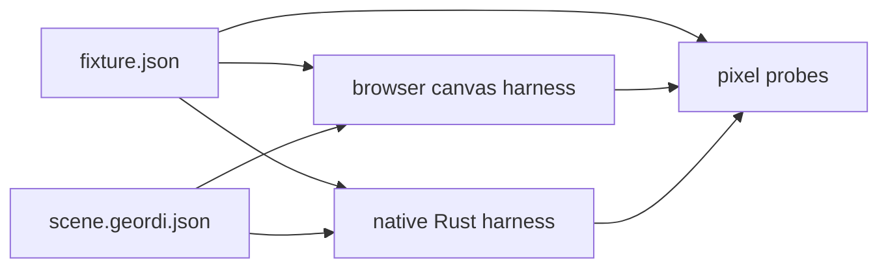

# Render Everywhere

This document is the runnable guide for the current Geordi render-everywhere proof.

The proof is intentionally narrow:

```text
one canonical Geordi IR artifact
-> browser canvas harness
-> native Rust harness
-> same artifact hash
-> same rectangle pixel probes
```

The design background lives in
[`docs/design/2026-05-render-everywhere-demo.md`](./design/2026-05-render-everywhere-demo.md).
The full source-to-runtime walkthrough lives in [`docs/end-to-end.md`](./end-to-end.md).

## Current Claim

The current demo proves that the same checked-in `geordi-ir/1` artifact can be loaded by both a
browser runtime and a native Rust runtime. Both runtimes report the same fixture id, artifact hash,
IR version, numeric profile, feature requirements, and canvas dimensions. Both runtimes verify the
same exact RGBA pixel probes from the shared fixture manifest.

The shared fixture is:

```text
fixtures/render-everywhere/hello-panel
```

The shared scene artifact is:

```text
fixtures/render-everywhere/hello-panel/scene.geordi.json
```

The shared manifest is:

```text
fixtures/render-everywhere/hello-panel/fixture.json
```

The fixture also includes constrained GPVue source:

```text
fixtures/render-everywhere/hello-panel/source.gpvue
```

The manifest marks that source as compiler-backed by `@flyingrobots/geordi-gpvue`. The compiler can
reproduce the checked-in `scene.geordi.json`, receipt, and source map from this source, but the
browser and native harnesses still consume the checked-in artifact directly until the final
end-to-end slice wires the compile step into the demo path.

Run the GPVue compiler gate:

```bash
pnpm --filter @flyingrobots/geordi-gpvue test
```

Expected result:

```text
5 passed
```

The fixture currently reports:

```text
fixtureId=render-everywhere:hello-panel
artifactHash=sha256:30623d6141ba69c382c14c09eca9adedd40cb02644ff4ee9621de101da6b0082
irVersion=geordi-ir/1
numericProfile=geordi-finite-binary64/1
featureRequirements=geordi/core/1, layout.resolved, shape.rect, paint.solid
canvas=640x360
```

## Non-Claims

This demo does not yet run GPVue compilation as part of the browser/native demo command path. The
compiler can reproduce the fixture artifact, but the runtime harnesses still load the checked-in
`scene.geordi.json` directly until the final end-to-end slice.

This demo does not claim deterministic text. Text is excluded from the first deterministic
browser/native proof because portable text requires a strict font pack, a shaping law, and a
line-breaking law. Until those exist, text is outside the pixel-identical render claim.

This demo does not claim GPU shader parity. The browser package name includes `runtime-webgl`, but
the current browser implementation is a Canvas 2D proof path. The native Rust harness renders the
rectangle fixture through the Rust software renderer and presents it in a native window.

This demo does not claim images, meshes, gradients, transforms, animation, hit testing, or layout.
Those features need explicit IR requirements, runtime capability negotiation, and deterministic
tests before they become part of a render-everywhere claim.

## Browser Harness

Harness doc:
[`examples/browser-render-everywhere/README.md`](../examples/browser-render-everywhere/README.md)

Run the browser harness:

```bash
pnpm --filter @flyingrobots/geordi-example-browser-render-everywhere dev
```

Open the Vite URL printed by the command. The page should show:

- heading: `Geordi Render Everywhere`
- renderer: `browser-canvas`
- fixture id: `render-everywhere:hello-panel`
- artifact hash:
  `sha256:30623d6141ba69c382c14c09eca9adedd40cb02644ff4ee9621de101da6b0082`
- IR version: `geordi-ir/1`
- numeric profile: `geordi-finite-binary64/1`
- feature requirements: `geordi/core/1, layout.resolved, shape.rect, paint.solid`
- one canvas drawing the rectangle-only panel fixture

Run the browser gate:

```bash
pnpm --filter @flyingrobots/geordi-example-browser-render-everywhere test:browser
```

Expected result:

```text
1 passed
```

The Playwright gate samples the browser canvas at the exact coordinates declared in
`fixture.json`. A wrong pixel, missing canvas, unsupported feature, or fixture load failure is a hard
failure.

## Native Rust Harness

Harness doc:
[`examples/native-render-everywhere/README.md`](../examples/native-render-everywhere/README.md)

Run the native smoke gate:

```bash
cargo run -p native-render-everywhere -- --smoke fixtures/render-everywhere/hello-panel
```

Expected output:

```text
Geordi native fixture loaded
rendererName=rust-software-rectangles
fixtureId=render-everywhere:hello-panel
fixtureVersion=geordi-render-fixture/1
artifactHash=sha256:30623d6141ba69c382c14c09eca9adedd40cb02644ff4ee9621de101da6b0082
irVersion=geordi-ir/1
numericProfile=geordi-finite-binary64/1
featureRequirements=geordi/core/1, layout.resolved, shape.rect, paint.solid
canvas=640x360
scene=render-everywhere:hello-panel
shortHash=30623d6141ba
smoke=passed
```

Run the native window demo:

```bash
cargo run -p native-render-everywhere -- fixtures/render-everywhere/hello-panel
```

Expected behavior:

- the same summary lines print to stdout;
- a native window opens;
- the window title contains `rust-software-rectangles`,
  `render-everywhere:hello-panel`, and `30623d6141ba`;
- the window draws the same rectangle-only panel fixture;
- pressing Escape closes the window.

Run manifest and load validation without opening a window:

```bash
cargo run -p native-render-everywhere -- --check fixtures/render-everywhere/hello-panel
```

Expected behavior:

- the same summary lines print to stdout;
- no native window opens;
- pixel probes are not run in `--check` mode.

## Shared Fixture Contract

Both harnesses consume the same fixture directory. There is no browser-specific scene and no
Rust-specific scene.



The manifest declares the artifact hash, runtime profile, canvas size, and pixel probes. A renderer
must reject the fixture before drawing if it cannot support every required feature. The manifest can
also describe authoring source. The current `hello-panel` source is `gpvue`, which makes the source
a compiler input while keeping the runtime path artifact-first.

The first proof uses only:

```text
geordi/core/1
layout.resolved
shape.rect
paint.solid
```

## Failure Fixture

The negative fixture is:

```text
fixtures/render-everywhere/unsupported-strict-text
```

It intentionally declares a known but unsupported feature requirement:

```text
text.fontPack
```

The correct behavior is failure before drawing. A runtime must not drop the unsupported requirement
and render a best-effort scene.

## Useful Gates

Run the browser unit and end-to-end gates:

```bash
pnpm --filter @flyingrobots/geordi-example-browser-render-everywhere test
pnpm --filter @flyingrobots/geordi-example-browser-render-everywhere test:browser
```

Run the native gates:

```bash
cargo test -p native-render-everywhere
cargo clippy -p native-render-everywhere --all-targets -- -D warnings
cargo run -p native-render-everywhere -- --smoke fixtures/render-everywhere/hello-panel
```

Run the doc hygiene gate for this guide:

```bash
pnpm test:docs
```

Run the GPVue compiler gates:

```bash
pnpm --filter @flyingrobots/geordi-gpvue typecheck
pnpm --filter @flyingrobots/geordi-gpvue lint
pnpm --filter @flyingrobots/geordi-gpvue test
```

## Where This Goes Next

The final slice wires the constrained GPVue compiler into the demo path. Once that lands, the
stronger claim becomes:

```text
one GPVue source file
-> one canonical Geordi IR artifact
-> browser canvas harness
-> native Rust harness
-> same artifact hash
-> same rectangle pixel probes
```

Until then, this document should describe the implemented artifact-first runtime proof exactly and
avoid claiming that the browser or native demo commands compile GPVue before rendering.
